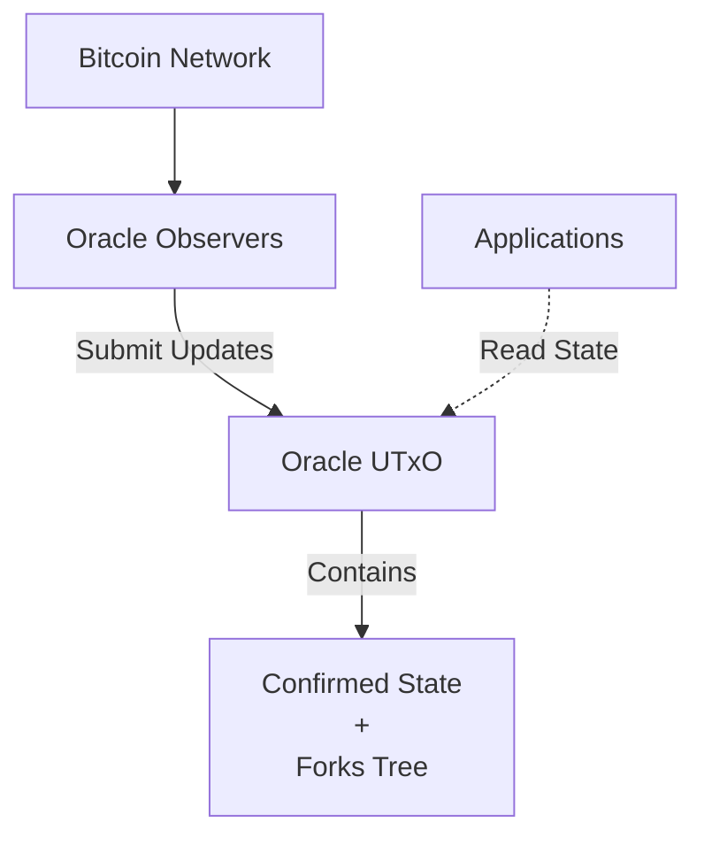
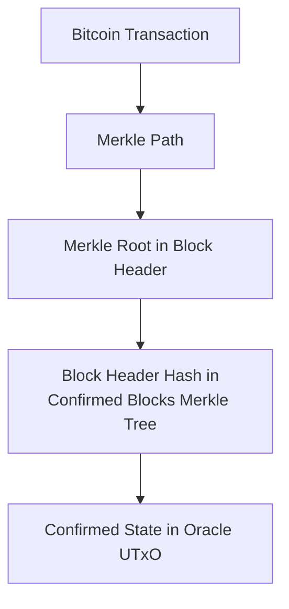
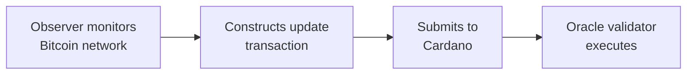
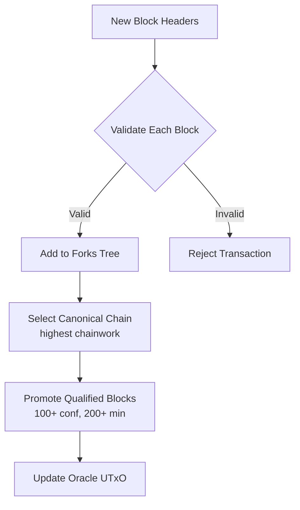
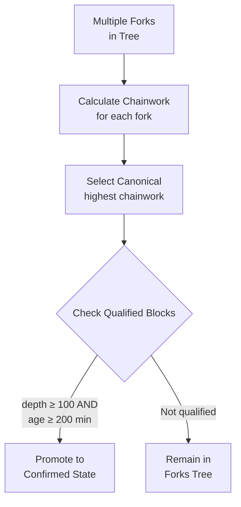

# Binocular: A Decentralized Bitcoin Oracle on Cardano

Alexander Nemish @ Lantr (<alex@lantr.io>)

*Draft v0.3*

## Abstract

Binocular is a Bitcoin oracle for Cardano that enables smart contracts to verify Bitcoin blockchain
state. Anyone can submit Bitcoin block headers to a single on-chain Oracle without registration or
bonding. The Cardano smart contract validates all blocks against Bitcoin consensus rules (
proof-of-work, difficulty, timestamps) and automatically selects the canonical chain. Blocks with
100+ confirmations and 200+ minutes on-chain aging are promoted to confirmed state, enabling
transaction inclusion proofs. Security relies on a 1-honest-party assumption and Bitcoin's
proof-of-work, with attack costs exceeding $46 million.

## Introduction

Cardano smart contracts cannot directly observe Bitcoin transactions, limiting cross-chain
applications like bridges, Bitcoin-backed assets, and decentralized exchanges. Binocular solves this
by implementing a Bitcoin oracle that validates block headers on-chain.

The protocol uses a single Oracle UTxO containing both confirmed Bitcoin state and a tree of
competing unconfirmed forks. Anyone can submit updates without permission. The on-chain validator
enforces Bitcoin consensus rules and automatically promotes qualified blocks. With at least one
honest party monitoring Bitcoin, the Oracle progresses with bounded latency (~17 hours for 100
confirmations).

Binocular enables applications to verify Bitcoin transaction inclusion proofs, opening possibilities
for secure cross-chain interoperability.

## Protocol Overview

*Note: See the Whitepaper for full technical details.*

Binocular uses a **single Oracle UTxO** containing the complete protocol state:

**The Oracle UTxO contains:**

- **Confirmed State**: Bitcoin blocks with 100+ confirmations (Merkle tree root)
- **Forks Tree**: Competing unconfirmed Bitcoin chains indexed by block hash

**How it works:**

1. Anyone submits Bitcoin block headers to the Oracle (no registration needed)
2. The on-chain validator validates each block (PoW, difficulty, timestamps)
3. Valid blocks are added to the forks tree
4. The validator automatically selects the canonical chain (highest chainwork)
5. Blocks meeting criteria (100+ confirmations AND 200+ minutes old) are promoted to confirmed state
6. All operations happen atomically in a single transaction

**Fork Competition**: Multiple forks coexist in the tree. The validator automatically selects the
canonical chain following Bitcoin's longest chain rule (highest cumulative chainwork).

**Challenge Period**: The 200-minute on-chain aging requirement prevents pre-computed attacks.
Attackers cannot mine 100+ blocks offline and immediately promote them - blocks must exist on-chain
for 200 minutes, giving honest parties time to submit the real Bitcoin chain.

### Transaction Inclusion Proofs

With verified Bitcoin block headers in confirmed state, applications can prove a Bitcoin transaction
exists:

### Key Concepts

- **Oracle UTxO**: Single on-chain UTxO holding all protocol state
- **Confirmed State**: Bitcoin blocks with 100+ confirmations and 200+ min aging
- **Forks Tree**: Tree data structure holding competing unconfirmed chains
- **Canonical Chain**: Automatically selected fork with highest chainwork
- **Block Promotion**: Automatic move of qualified blocks to confirmed state
- **Challenge Period**: 200-minute on-chain aging before blocks can be promoted
- **Chainwork**: Cumulative proof-of-work used for canonical chain selection

## How It Works

### 1. Submitting Bitcoin Blocks

Anyone can submit an update transaction containing new Bitcoin block headers:

**No registration or bonding required**. The transaction includes:

- One or more Bitcoin block headers
- Fork point (which block these extend from)

### 2. On-Chain Validation & Processing

The Oracle validator performs all operations atomically in a single transaction:

**Validation checks for each block:**

- **Proof-of-Work**: Block hash ≤ difficulty target
- **Difficulty**: Matches expected retarget (every 2016 blocks)
- **Timestamps**: Greater than median of last 11 blocks, not too far in future
- **Chain Continuity**: Previous block hash exists in forks tree or confirmed state
- **Version**: Block version ≥ 4

### 3. Automatic Fork Resolution & Promotion

**Fork Competition**: Multiple forks coexist in the tree, but only one is canonical at any time.

**Block Promotion**: Blocks are automatically promoted when:

- On the canonical chain (highest chainwork)
- At least 100 blocks deep from tip
- At least 200 minutes old (since added to forks tree)

The promoted block's hash is added to the confirmed blocks Merkle tree, enabling transaction
inclusion proofs.

## Security

### Economic Security: Attack Cost Analysis

To attack the Oracle and confirm invalid Bitcoin blocks, an adversary must mine 100+ Bitcoin blocks.
This is economically infeasible:

**Cost Breakdown (2025 estimates):**

- Bitcoin network hashrate: ~600 EH/s
- Mining 100 blocks requires >50% hashrate control
- Time: ~16.7 hours (1000 minutes)

**Direct Costs:**

- **Energy**: 300 million kWh × $0.05/kWh = **$15 million**
- **Opportunity cost**: Lost block rewards from honest
  mining = **$31 million** (100 blocks × 3.125 BTC × $100k)
- **Total: $46 million minimum**

**Alternative (Hardware Purchase):**

- Required hashrate: 600 EH/s = 600 million TH/s
- ASIC cost: $30/TH
- **Hardware cost: $18 billion** (plus energy)

**Realistic Attack Rewards:**

- Oracle manipulation for DApp exploit: < $10M
- Attack destroys Bitcoin value, making reward worthless

**Conclusion**: Attack cost ($46M - $18B) far exceeds any realistic reward (< $10M).

### Challenge Period Defense

The 200-minute on-chain aging requirement prevents pre-computed attacks:

**Attack Timeline:**

1. Attacker mines 100+ blocks offline (takes weeks/months)
2. Publishes to Oracle at time t₀
3. Cannot be promoted until t₀ + 200 minutes

**Honest Party Response:**

- Detects attack within monitoring interval (typically < 60 minutes)
- Submits real Bitcoin chain to Oracle
- Real chain has higher chainwork (continues from actual Bitcoin)
- Oracle automatically selects real chain as canonical
- Attack blocks become orphaned

**Response Window**: 200 - 60 - 5 (Cardano finality) = **135 minutes to spare**

### 1-Honest-Party Assumption

The protocol requires **at least one honest participant** who:

- Monitors the Bitcoin network
- Submits valid Bitcoin blocks to the Oracle
- Has access to canonical Bitcoin blockchain data

This is a minimal assumption - requires only that someone, somewhere, runs the freely available
observer software. Applications depending on the Oracle have natural incentives to ensure freshness.

## Key Features

### Permissionless Participation

- Anyone can submit Bitcoin blocks to the Oracle
- No registration, bonding, or special privileges required
- Only requirement: valid block headers and transaction fees

### On-Chain Bitcoin Validation

- Complete Bitcoin consensus validation in Plutus smart contract
- Enforces proof-of-work, difficulty adjustment, timestamp rules
- Efficient storage: only essential block data stored on-chain after validation
- No trusted authorities or off-chain dependencies
- Invalid blocks automatically rejected by validator

### Simplified Single-UTxO Architecture

- One Oracle UTxO contains all protocol state
- Atomic updates: validation, fork selection, and promotion in single transaction
- No coordination between multiple UTxOs
- Predictable transaction costs

### Automatic Processing

- **Canonical Selection**: Validator automatically picks highest chainwork fork
- **Block Promotion**: Qualified blocks automatically move to confirmed state
- **Fork Resolution**: Competition resolved through on-chain chainwork calculation
- No manual intervention or separate maturation transactions needed

### Security Properties

- **Safety**: Confirmed state never contains invalid Bitcoin blocks (enforced by validator)
- **Liveness**: Oracle progresses under 1-honest-party assumption (~17 hour latency)
- **Economic Security**: Attack costs $46M+ far exceed realistic rewards
- **Challenge Defense**: 200-minute aging prevents pre-computed attacks

## Future Work

### BiFROST Protocol Integration

**Binocular will be further developed and integrated into the BiFROST cross-chain bridge protocol**,
which aims to provide secure, decentralized asset bridges between Bitcoin and Cardano. Binocular's
trustless Bitcoin state verification serves as a foundational component for cross-chain bridges,
Bitcoin-backed stablecoins, and other interoperability applications.

### Planned Enhancements

**Participation Incentives**: Design explicit economic rewards for Oracle observers to strengthen
liveness guarantees beyond the minimal 1-honest-party assumption.

**Enhanced Tooling**: Build open-source observer infrastructure, monitoring dashboards, and
multi-platform support for running Oracle observers.

### Design Decisions

**Direct Block Validation vs NIPoPoWs**: Non-Interactive Proofs of Proof-of-Work (NIPoPoWs) were
considered for efficient light client support but rejected after research. Direct block validation
provides stronger security guarantees and simpler implementation, while NIPoPoW verification adds
significant on-chain complexity without clear benefits for the primary use case of transaction
inclusion proofs.

**No On-Chain Governance**: Protocol parameters (100 confirmations, 200-minute challenge period) are
fixed by design. Anyone can deploy an independent Oracle UTxO with different parameters if needed,
enabling experimentation without governance complexity.

## Conclusion

Binocular provides a Bitcoin oracle for Cardano with complete on-chain validation of Bitcoin
consensus rules. The protocol's single-UTxO architecture enables atomic updates with automatic
canonical chain selection and block promotion.

**Key achievements:**

- **Permissionless**: Anyone can submit blocks without registration or bonding
- **Secure**: $46M+ attack costs far exceed realistic rewards
- **Validated**: All Bitcoin consensus rules enforced on-chain (PoW, difficulty, timestamps)
- **Minimal Trust**: Requires only 1-honest-party assumption with ~17 hour latency

By enabling transaction inclusion proofs, Binocular opens possibilities for cross-chain bridges,
Bitcoin-backed assets, and decentralized exchanges between Bitcoin and Cardano ecosystems.

\newpage

## References

1. Satoshi Nakamoto, "Bitcoin: A Peer-to-Peer Electronic Cash System,"
    2008. https://bitcoin.org/bitcoin.pdf

2. Scalus: Scala to Plutus Compiler. https://scalus.org

3. Cardano Documentation. https://docs.cardano.org/

4. Bitcoin Developer Guide. https://developer.bitcoin.org/

5. Kiayias, A., Miller, A., Zindros, D., "Non-Interactive Proofs of Proof-of-Work," *FC
   2020*. https://eprint.iacr.org/2017/963.pdf

6. "Security of Cross-chain Bridges: Attack Surfaces, Defenses, and Open Problems," *RAID
   2024*. https://dl.acm.org/doi/10.1145/3678890.3678894

7. Budish, E., "The Economic Limits of Bitcoin and the Blockchain," *NBER Working Paper 24717*,
    2018.

8. Learn Me a Bitcoin. https://learnmeabitcoin.com/