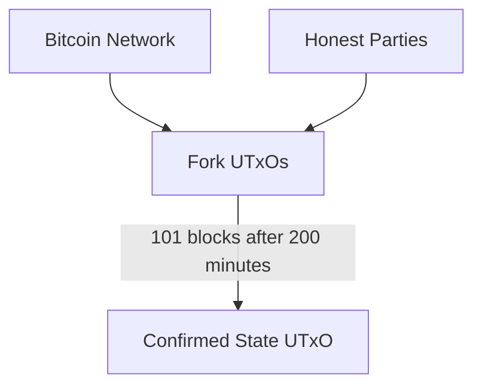
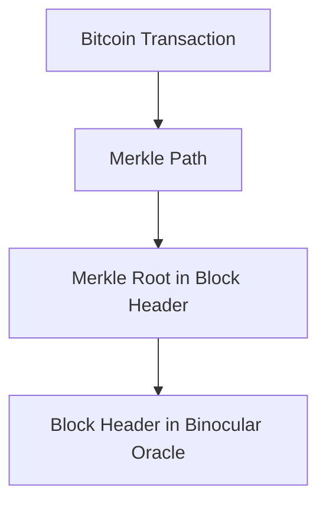
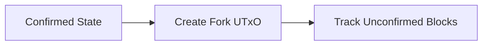
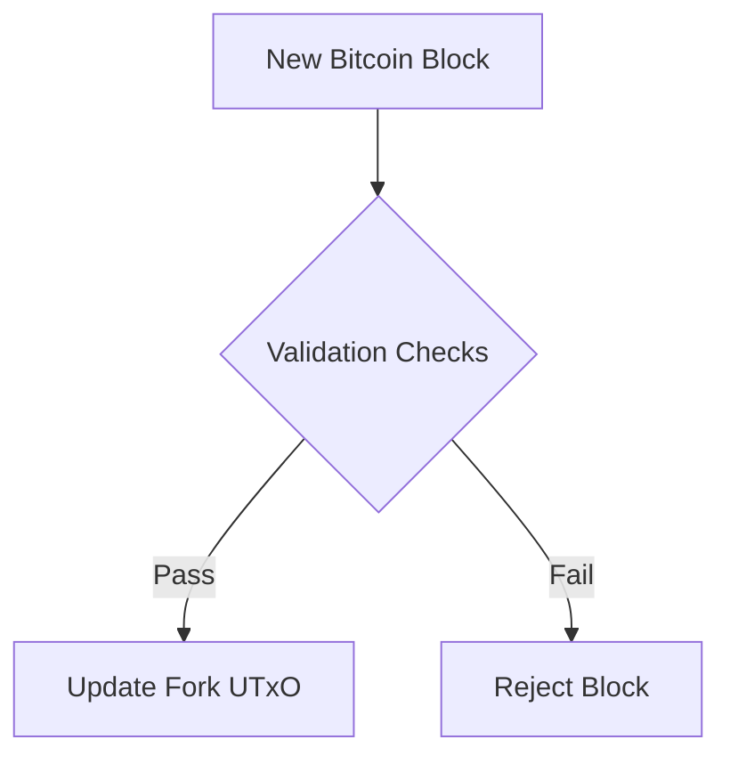
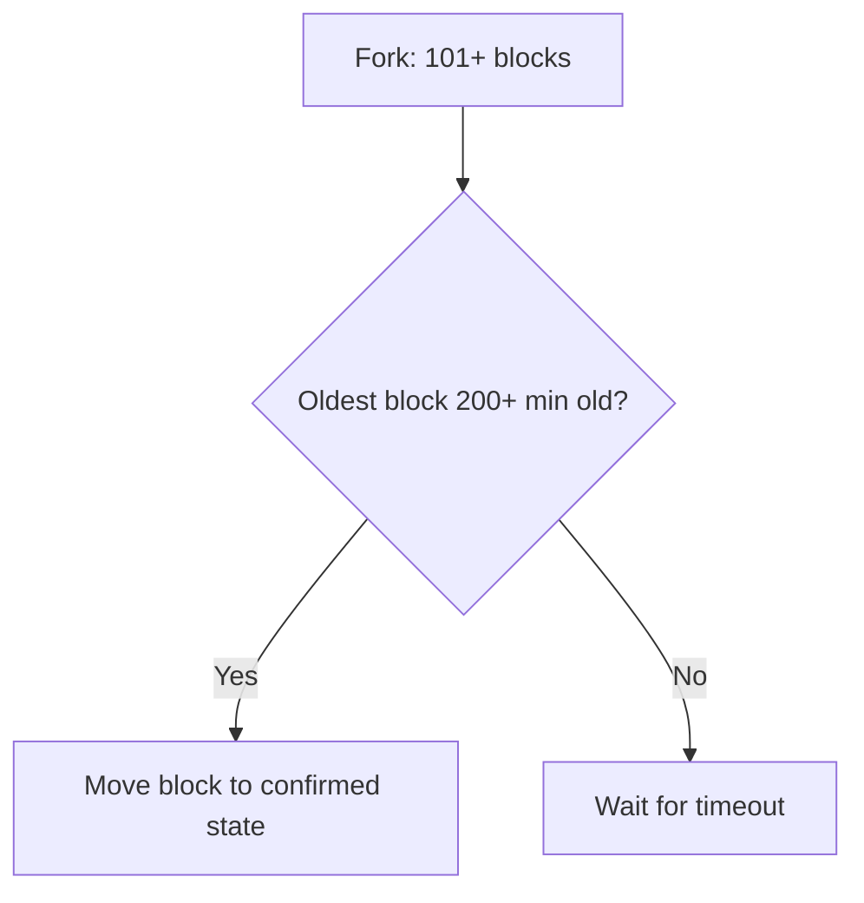

# Binocular: A Decentralized Optimistic Bitcoin Oracle on Cardano

Alexander Nemish @ Lantr (<alex@lantr.io>)

*Draft v0.2*

## Abstract

Binocular is a decentralized, optimistic, trustless and permissionless Bitcoin oracle built on the Cardano blockchain.
It enables Cardano smart contracts to access and verify Bitcoin state, opening up exciting possibilities like two-way
bridges between the Cardano and Bitcoin ecosystems, providing a source of entropy, and allowing derivation of Bitcoin
transaction inclusion proofs.

## Introduction

Cross-chain interoperability is critical for decentralized ecosystems. By providing a trust-minimized oracle for Bitcoin
state, Binocular extends Cardano's capabilities, enabling smart contracts to respond to Bitcoin events (block headers,
proof of work).

Binocular follows an optimistic model where honest participants update the oracle, while users are incentivized to
detect and report fraud.

## Protocol Overview

*Note: See the Whitepaper for full technical details.*

The core Binocular system consists of a two-tier architecture with confirmed and unconfirmed Bitcoin chain states:

- **The Confirmed State UTxO** holds the canonical Bitcoin chain state with a 100-block confirmation requirement.
- **Fork UTxOs** contain unconfirmed Bitcoin chain state that can be created by anyone to track new Bitcoin blocks.
- **Maturation Process** moves the oldest block from a qualified fork (101+ blocks, 200+ minutes old) to the confirmed state.
- **Challenge Period** provides 200 minutes for honest parties to create competing forks with higher chainwork.

Anyone can create fork UTxOs to track unconfirmed Bitcoin blocks. The system validates each block according to Bitcoin consensus rules including proof-of-work, difficulty adjustment, and timestamp verification.

Fork competition follows Bitcoin's longest chain rule - a fork can eliminate another fork by demonstrating higher cumulative chainwork, ensuring only the valid Bitcoin chain survives.

With access to verified Bitcoin block headers, applications can trustlessly derive inclusion proofs for Bitcoin
transactions. This is done by providing a merkle path demonstrating the transaction's inclusion in a block that is
recorded by the Oracle.

### Key Concepts

- **Confirmed State:** The canonical Bitcoin chain state with 100-block confirmation requirement.
- **Fork UTxOs:** Unconfirmed chain states that anyone can create to track new Bitcoin blocks.
- **Maturation Period:** 100-block confirmation requirement before blocks can move to confirmed state.
- **Challenge Period:** 200-minute timeout allowing honest parties to create competing forks.
- **Chainwork:** Measures cumulative proof of work for chain validation and fork competition.

## Workflow

### 1. Creating Fork UTxOs

- Anyone can create a fork UTxO extending from the confirmed state.
- Initial fork contains the confirmed chain state as starting point.
- No registration or bonding required for fork creation.

### 2. Updating Fork UTxOs

- Add new Bitcoin blocks to fork UTxOs as they appear.
- Validation checks for each block:
    - Valid proof of work (hash ≤ target).
    - Correct difficulty adjustment.
    - Valid timestamps.
    - Proper block height sequence.
    - Block hashes accumulated in Merkle tree.

### 3. Fork Competition

- Multiple forks can exist simultaneously.
- Higher chainwork fork can eliminate lower chainwork forks.
- Follows Bitcoin's longest chain rule.

### 4. Maturation Process

- Fork qualifies when it has 101+ blocks AND oldest block is 200+ minutes old.
- The 200-minute aging requirement prevents pre-computed attack forks from immediately updating the confirmed state.
- Any party can create a maturation transaction for qualified forks.
- Maturation transaction moves oldest unconfirmed block from fork to confirmed state.
- Updates both confirmed state UTxO and fork UTxO in a single transaction.

## Security Mechanisms

### Economic Security

- Cost of mining 100+ Bitcoin blocks exceeds potential attack rewards.
- No explicit bonding required, but economic incentives favor honest participation.

### Challenge Period

- 200-minute timeout provides sufficient time for honest parties to respond while being faster than Bitcoin's 10-minute blocks.
- Prevents pre-computed attacks: malicious parties cannot mine 100+ blocks offline and immediately update the confirmed state, as forks must exist on-chain for at least 200 minutes before qualification.
- Honest parties can create competing forks with higher chainwork to correct invalid states during this challenge window.

### Liveness Assumption

- At least one honest party actively maintains valid fork UTxOs.
- Honest parties have access to canonical Bitcoin chain data.

## Key Protocol Features

### Permissionless Participation

- Anyone can create and maintain fork UTxOs without bonding requirements.
- No registration or special privileges needed.

### Decentralized Verification

- Bitcoin consensus rules enforced on-chain via smart contract validation.
- No trusted authorities or centralized components.

### Manual Maturation Process

- Qualified forks (101+ blocks, 200+ minutes old) can be matured by anyone creating a transaction.
- Maturation transaction updates both confirmed state UTxO and fork UTxO simultaneously.
- Moves the oldest unconfirmed block from fork to confirmed state.
- 100-block confirmation requirement with 200-minute safety timeout enforced on-chain.

### Fork Competition

- Multiple competing forks can coexist until resolution.
- Higher chainwork forks naturally supersede lower chainwork forks.

## Conclusion

Binocular presents a trust-minimized approach to cross-chain interoperability by serving as a decentralized Bitcoin
Oracle for Cardano. Its optimistic design and robust economic incentives ensure accuracy while empowering developers to
build innovative cross-chain DApps.

\newpage

## References

1. Satoshi Nakamoto, "Bitcoin: A Peer-to-Peer Electronic Cash System," https://bitcoin.org/bitcoin.pdf

2. Scalus: https://scalus.org

3. NIPoPoW Paper: "Non-Interactive Proofs of Proof-of-Work," https://eprint.iacr.org/2017/963.pdf

4. Learn Me a Bitcoin: https://learnmeabitcoin.com/

5. Cardano Documentation: https://docs.cardano.org/

6. Bitcoin Developer Guide: https://developer.bitcoin.org/