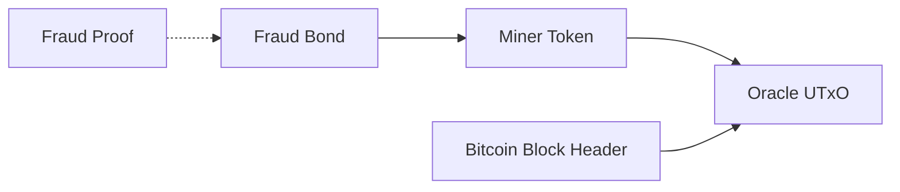
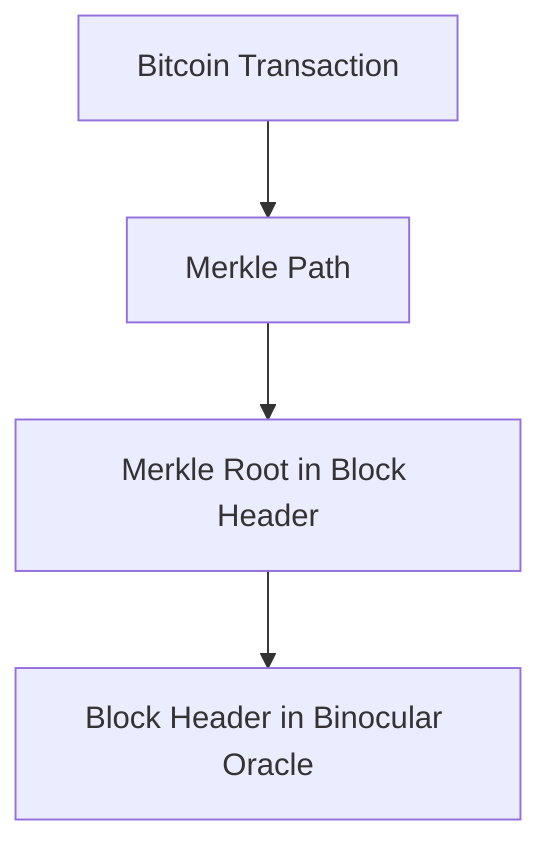
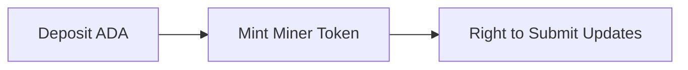
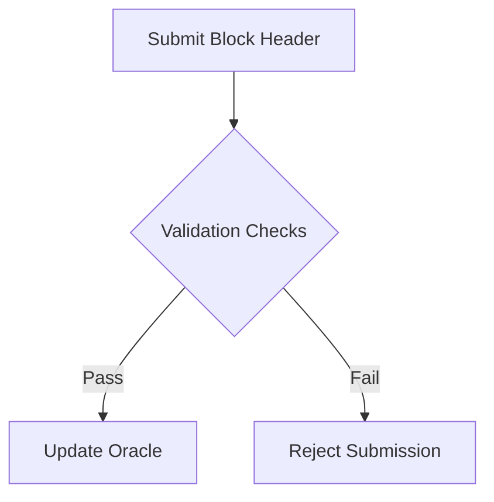

# Binocular: A Decentralized Optimistic Bitcoin Oracle on Cardano

Alexander Nemish @ Lantr

*Draft v0.1*

## Abstract

Binocular is a decentralized, optimistic, trustless and permissionless Bitcoin oracle built on the Cardano blockchain.
It enables Cardano smart contracts to access and verify Bitcoin state, opening up exciting possibilities like two-way
bridges between the Cardano and Bitcoin ecosystems, providing a source of entropy, and allowing derivation of Bitcoin
transaction inclusion proofs.

## Introduction

Cross-chain interoperability is critical for decentralized ecosystems. By providing a trust-minimized oracle for Bitcoin
state, Binocular extends Cardano's capabilities, enabling smart contracts to respond to Bitcoin events (block headers,
proof of work).

Binocular follows an optimistic model where honest participants update the oracle, while users are incentivized to
detect and report fraud.

## Protocol Overview

*Note: See the Whitepaper for full technical details.*

The core Binocular system consists of several interacting on-chain components:

- **The Fraud Bond** is a Cardano script locking each miner's security deposit. It can be reclaimed after a timeout or
  forfeited if fraud is proven.
- **Miner Tokens** represent each active Oracle Miner. They are minted when locking a Fraud Bond and burnt to reclaim
  it.
- The **Oracle UTxO** holds the latest block header provided by Miners. It is updated over time as Miners provide new
  block headers.

The off-chain Miner role monitors the Bitcoin chain and submits block header updates to the Oracle UTxO. The Binocular
contract validates that each update builds on the previous and increases the cummulative work proven.

Fraud Proofs involve submitting an alternative block header at the same height or in a specific timeframe with more
accumulated work, demonstrating an Oracle update was not part of Bitcoin's true canonical chain.

With access to verified Bitcoin block headers, applications can trustlessly derive inclusion proofs for Bitcoin
transactions. This is done by providing a merkle path demonstrating the transaction's inclusion in a block that is
recorded by the Oracle.

### Key Concepts

- **Miners:** Participants who update the oracle with valid block headers.
- **Fraud Proofs:** Evidence showing a submitted block header is invalid.
- **Chainwork:** Measures cumulative proof of work for chain validation.

## Workflow

### 1. Registering as a Miner

- Deposit ADA into the Fraud Bond Contract.
- Mint a Miner token representing update rights.
- Token metadata includes deposit timeout.

### 2. Submitting Oracle Updates

- Submit block headers to the Oracle UTXO.
- Validation checks:
    - Valid Miner token.
    - Block height is higher.
    - Timestamp is in the past.
    - Chainwork increased.
    - Coinbase transaction has a valid Merkle proof.

### 3. Verifying Proof of Work

- Compute "target" from block header's "bits" field.
- Ensure block header hash <= target.

### 4. Submitting Fraud Proofs

- Submit conflicting block header.
- Valid proofs include:
    - Header with same height but higher chainwork.
    - Same parent, earlier timestamp, and higher chainwork.
- Successful fraud proofs confiscate the bond.

## Security Mechanisms

### Fraud Bond

- Holds collateral to disincentivize invalid updates.
- Reclaimable only after the timeout period.

### Consensus Safety Assumptions

- Mining a Bitcoin block is costlier than the fraud bond.
- SHA256 and Ed25519 are secure.

### Optimistic Assumption

- Most miners are honest. If not, fraud-proof mechanisms correct the state.

## Key Protocol Features

### Permissionless Participation

- Anyone can become a miner by locking a deposit.

### Decentralized Verification

- Verification is decentralized, with no trusted authorities.

### Flexible Challenge Period

- Adjustable based on Miner token metadata.

## Conclusion

Binocular presents a trust-minimized approach to cross-chain interoperability by serving as a decentralized Bitcoin
Oracle for Cardano. Its optimistic design and robust economic incentives ensure accuracy while empowering developers to
build innovative cross-chain DApps.

## References

1. Satoshi Nakamoto, "Bitcoin: A Peer-to-Peer Electronic Cash System," https://bitcoin.org/bitcoin.pdf

2. Scalus: https://scalus.org

3. NIPoPoW Paper: "Non-Interactive Proofs of Proof-of-Work," https://eprint.iacr.org/2017/963.pdf

4. Learn Me a Bitcoin: https://learnmeabitcoin.com/

5. Cardano Documentation: https://docs.cardano.org/

6. Bitcoin Developer Guide: https://developer.bitcoin.org/