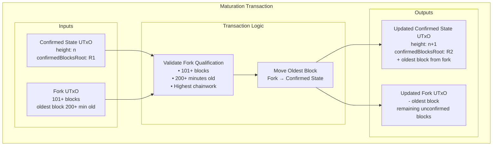

# Binocular: A Decentralized Optimistic Bitcoin Oracle on Cardano

Alexander Nemish @ Lantr (<alex@lantr.io>)

Draft v0.2

## Abstract

Binocular is a decentralized, optimistic, trustless and permissionless Bitcoin oracle built on the Cardano blockchain.
It enables Cardano smart contracts to access and verify Bitcoin state, opening up exciting possibilities like two-way
bridges between the Cardano and Bitcoin ecosystems, providing a source of entropy, and allowing derivation of Bitcoin
transaction inclusion proofs.

## Introduction

Cross-chain interoperability is critical for decentralized ecosystems. By providing a trust-minimized oracle for Bitcoin
state, Binocular extends Cardano's capabilities, enabling smart contracts to respond to Bitcoin events (block headers,
proof of work).

Binocular follows an optimistic model where honest participants update the oracle, while users are incentivized to
detect and report fraud.

## Overview

### Key Concepts

- **Confirmed State:** The canonical Bitcoin chain state with 100-block confirmation requirement.
- **Fork UTxOs:** Unconfirmed chain states that anyone can create to track new Bitcoin blocks.
- **Maturation Process:** Movement of blocks from unconfirmed to confirmed state after meeting criteria.
- **Challenge Period:** 200-minute timeout allowing honest parties to create competing forks.
- **Chainwork:** Measures cumulative proof of work for chain validation and fork competition.

The Binocular Oracle maintains a two-tier architecture:

1. **Confirmed State UTxO**: Contains the canonical Bitcoin chain state with blocks that have achieved 100+ confirmations
2. **Fork UTxOs**: Multiple UTxOs tracking unconfirmed Bitcoin blocks, created permissionlessly by anyone

Anyone can create fork UTxOs to track unconfirmed Bitcoin blocks extending from the confirmed state. The system validates each block according to Bitcoin consensus rules and accumulates block hashes in a Merkle tree structure.

**Fork Competition**: Multiple forks can coexist until one demonstrates higher chainwork, following Bitcoin's longest chain rule.

**Maturation Criteria**: A fork qualifies to move its oldest block to confirmed state when:
- Fork contains 101+ blocks (100 confirmations + 1 new block)
- Oldest unconfirmed block is at least 200 minutes old

The maturation process updates both the confirmed state UTxO and the fork UTxO, maintaining the two-tier separation.

## Design

### Confirmed State UTxO

The Confirmed State UTxO is a unique UTxO containing the datum with confirmed Bitcoin chain state:

```scala
case class ChainState(
    blockHeight: BigInt,           // Current confirmed block height
    blockHash: ByteString,         // Hash of the current confirmed block
    currentTarget: ByteString,     // Current difficulty target in compact bits format
    blockTimestamp: BigInt,        // Timestamp of the current confirmed block
    recentTimestamps: List[BigInt], // Last 11 block timestamps for median time calculation
    previousDifficultyAdjustmentTimestamp: BigInt, // For difficulty adjustment calculations
    confirmedBlocksRoot: ByteString // Merkle tree root of confirmed block hashes
)
```

The Confirmed State UTxO can be spent when:
1. A maturation transaction is created for a qualifying fork
2. Fork contains 101+ blocks AND oldest block is 200+ minutes old
3. Fork has the highest chainwork among competing forks
4. Transaction moves the oldest block from fork to confirmed state

### Fork UTxOs

Fork UTxOs contain unconfirmed Bitcoin chain state extending from the confirmed state. Anyone can create fork UTxOs without registration or bonding requirements.

Fork UTxO datum contains:
- Current unconfirmed chain state
- Merkle tree of unconfirmed block hashes
- Cumulative chainwork calculation
- Creation timestamp for maturation tracking

### Updating Fork UTxOs

Fork UTxO updates validate each new Bitcoin block according to consensus rules:

1. **Proof of Work Validation**
   - Block header hash ≤ target derived from bits field
   - Proper difficulty target calculation

2. **Chain Continuity**
   - Block height increases sequentially
   - Previous block hash matches chain state
   - Timestamp validation against median time

3. **Difficulty Adjustment**
   - Validates difficulty retarget every 2016 blocks
   - Ensures adjustment follows Bitcoin's algorithm

4. **Merkle Tree Updates**
   - Accumulates new block hash in confirmed blocks root
   - Maintains efficient inclusion proof structure

### Fork Competition

Multiple fork UTxOs can coexist, tracking different potential Bitcoin chain extensions. Fork competition resolves through chainwork comparison:

- Higher chainwork fork can eliminate lower chainwork fork
- Follows Bitcoin's longest chain rule
- Automatic resolution without external arbitration

### Maturation Process

The maturation process moves blocks from unconfirmed to confirmed state through manual transactions:

1. **Qualification Check**: Fork has 101+ blocks AND oldest block is 200+ minutes old
2. **Pre-computed Attack Prevention**: The 200-minute aging requirement ensures forks must exist on-chain for challenge, preventing malicious parties from mining blocks offline and immediately updating confirmed state
3. **Chainwork Verification**: Fork has highest chainwork among competitors
4. **Transaction Creation**: Any party can create a maturation transaction for qualified forks
5. **State Update**: Transaction moves oldest unconfirmed block from fork to confirmed state
6. **UTxO Updates**: Single transaction updates both confirmed state UTxO and fork UTxO simultaneously



## Security Assumptions

### Economic Security

- **100-Block Reorganization Cost**: The cost of mining 100+ Bitcoin blocks exceeds any potential attack rewards from manipulating the oracle state
- **Honest Majority**: At least one honest party actively maintains valid fork UTxOs with access to canonical Bitcoin chain data

### Liveness Assumptions

- **Honest Participation**: At least one honest party monitors the Bitcoin network and creates/maintains valid fork UTxOs
- **Network Access**: Honest parties have reliable access to Bitcoin network data for validation
- **Challenge Response**: Honest parties can respond within the 200-minute challenge period to correct invalid states

### Attack Prevention

- **Pre-computed Attack Mitigation**: The 200-minute aging requirement prevents malicious parties from pre-computing 100+ block forks offline and immediately using them to corrupt the confirmed state
- **On-chain Exposure**: All forks must exist on-chain for at least 200 minutes, providing a challenge window for honest parties to detect and counter invalid forks
- **Challenge Window**: Sufficient time for honest parties to create competing forks with higher chainwork to override malicious attempts

## Limitations & Future Work

### Current Limitations

**Participation Incentives**: The current design relies on honest parties voluntarily maintaining fork UTxOs without explicit rewards. Future work could explore incentive mechanisms to ensure consistent participation.

### Future Enhancements

**Incentive Layer**: Design economic incentives for fork UTxO maintenance, potentially through Cardano Treasury funding or staking rewards.

**Light Client Integration**: Explore integration with Bitcoin light clients to reduce external dependencies for validation.

**Dynamic Parameters**: Implement governance mechanisms to adjust maturation periods and timeouts based on network conditions.

## Conclusion

Binocular presents a trust-minimized approach to cross-chain interoperability by serving as a decentralized Bitcoin
Oracle for Cardano. Its optimistic design and robust economic incentives ensure accuracy while empowering developers to
build innovative cross-chain DApps.

\newpage

## References

1. Satoshi Nakamoto, "Bitcoin: A Peer-to-Peer Electronic Cash System," https://bitcoin.org/bitcoin.pdf

2. Scalus: https://scalus.org

3. NIPoPoW Paper: "Non-Interactive Proofs of Proof-of-Work," https://eprint.iacr.org/2017/963.pdf

4. Learn Me a Bitcoin: https://learnmeabitcoin.com/

5. Cardano Documentation: https://docs.cardano.org/

6. Bitcoin Developer Guide: https://developer.bitcoin.org/