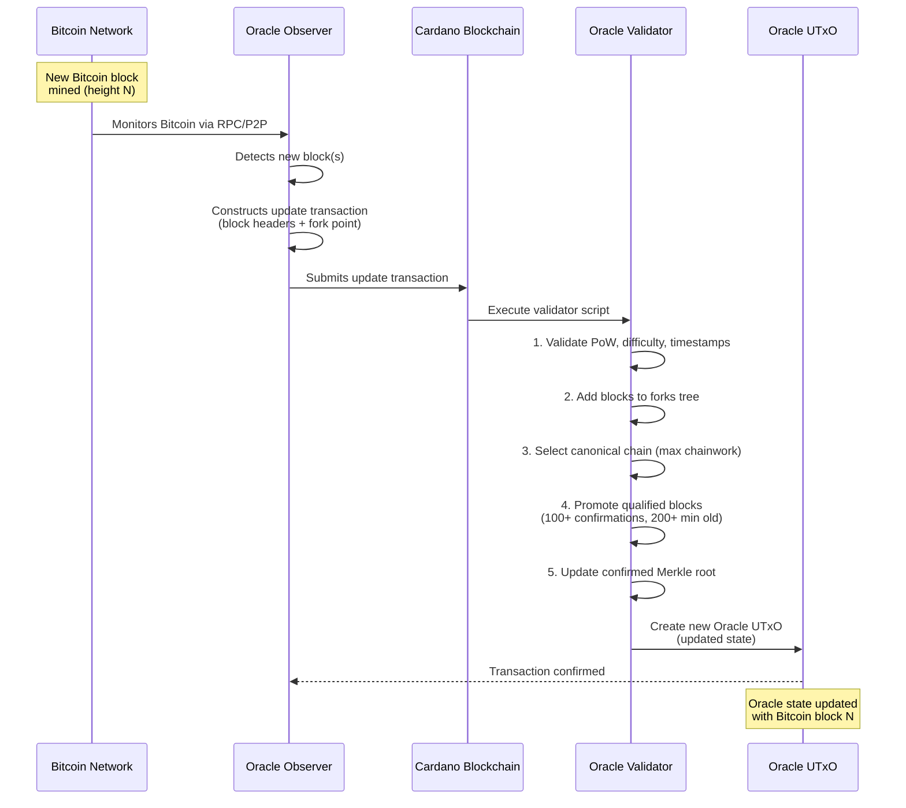
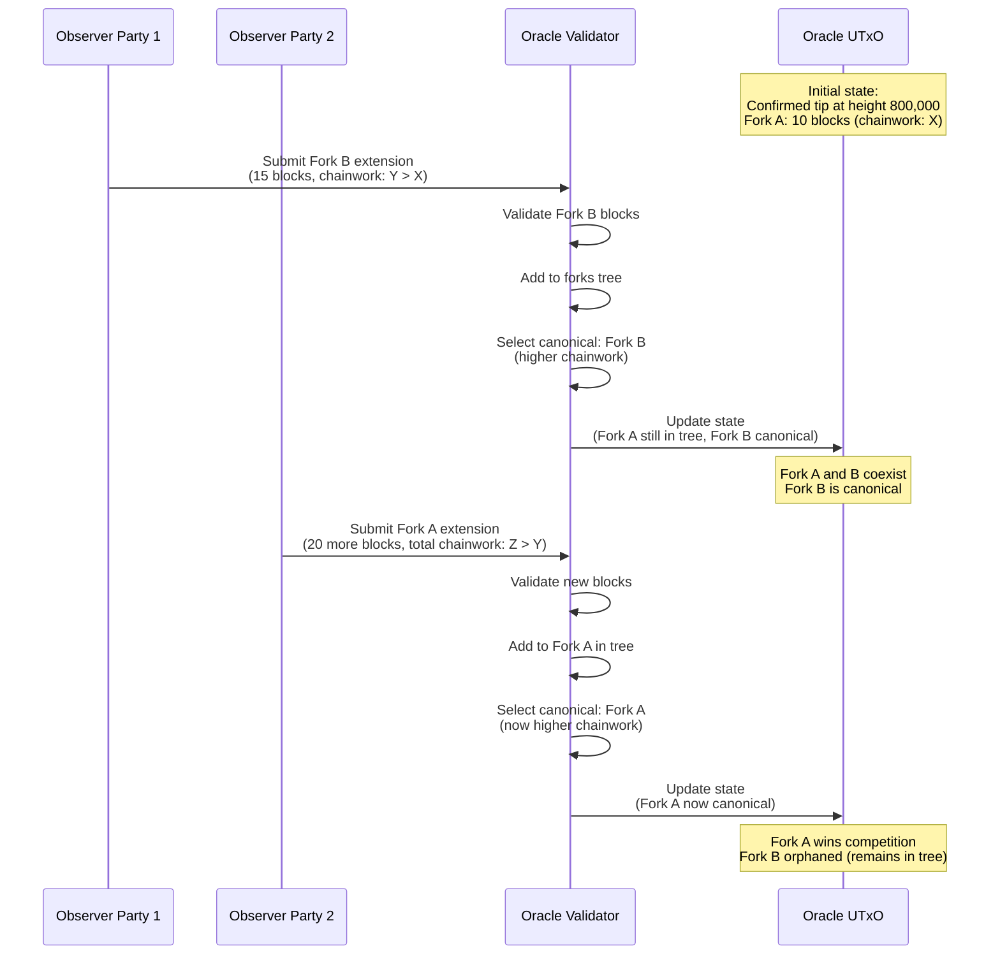
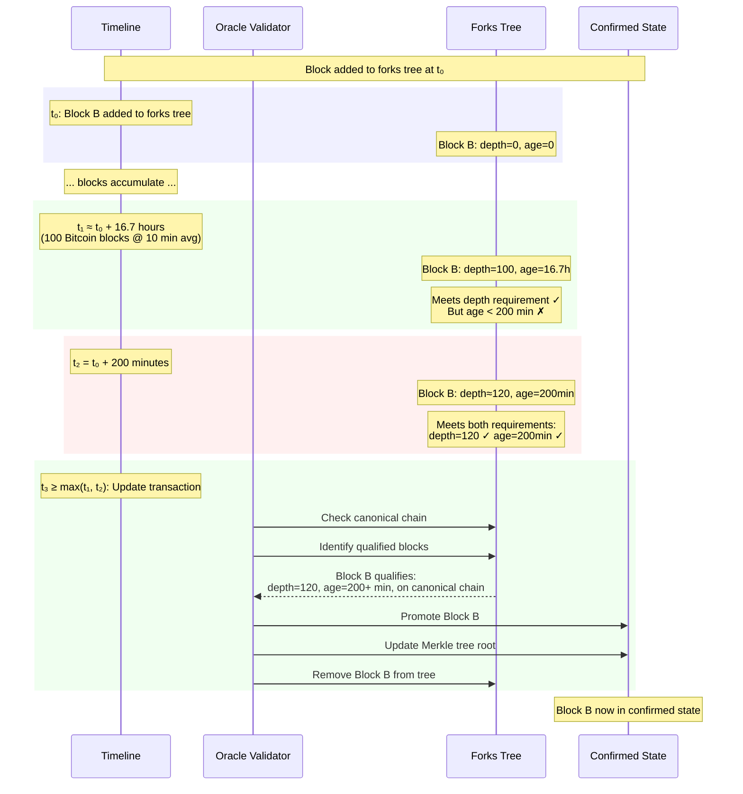
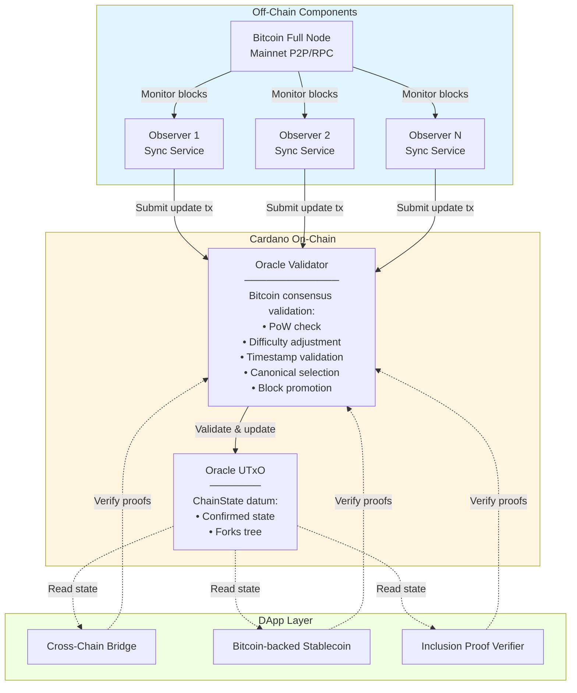
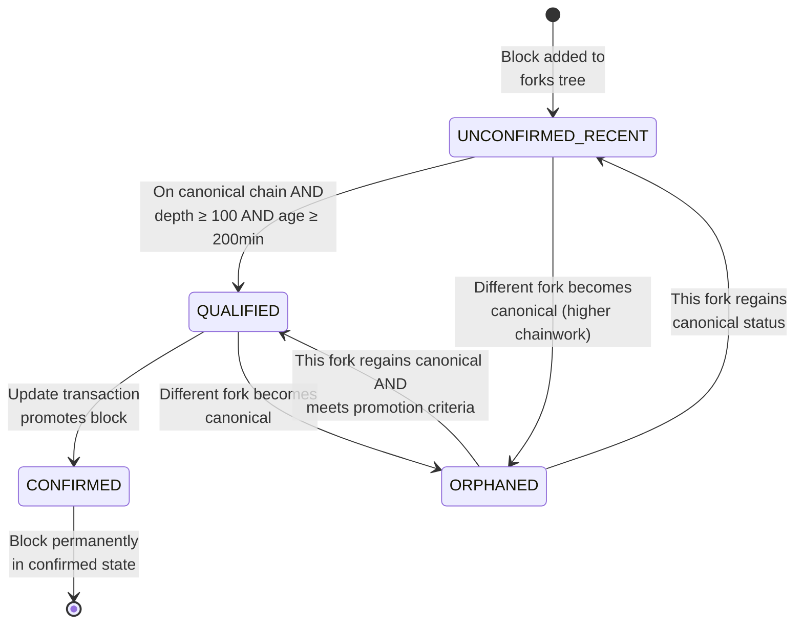

# Binocular: A Decentralized Optimistic Bitcoin Oracle on Cardano

Alexander Nemish @ Lantr (<alex@lantr.io>)

Draft v0.3

## Abstract

Binocular is a Bitcoin oracle for Cardano that enables smart contracts to access and verify Bitcoin
blockchain state. The protocol allows anyone to submit Bitcoin block headers to a single on-chain
Oracle UTxO without registration or bonding requirements. All blocks are validated against Bitcoin
consensus rules (proof-of-work, difficulty adjustment, timestamp constraints) enforced by a Plutus
smart contract. The Oracle maintains a tree of competing forks and automatically selects the
canonical chain using Bitcoin's chainwork calculation. Blocks achieving 100+ confirmations and 200+
minutes of on-chain aging are promoted to the confirmed state, providing a Merkle tree root that
enables transaction inclusion proofs. Security relies on a 1-honest-party assumption and Bitcoin's
proof-of-work security, with economic analysis showing that mining 100 Bitcoin blocks costs
significantly more than any potential oracle manipulation reward.

## Introduction

Cross-chain interoperability requires reliable access to external blockchain state. Cardano smart
contracts currently cannot directly observe or verify Bitcoin transactions, limiting potential
applications like cross-chain bridges, Bitcoin-backed stablecoins, and decentralized exchanges.
Binocular addresses this by implementing a Bitcoin oracle that validates block headers on-chain
using Cardano's extended UTxO model.

### Problem

Existing cross-chain oracles typically rely on trusted intermediaries, multi-signature committees,
or external validators. These approaches introduce additional trust assumptions beyond the security
of the underlying blockchains. A Bitcoin oracle should ideally inherit Bitcoin's security properties
while operating within Cardano's smart contract environment.

### Contribution

Binocular makes the following contributions:

1. **On-chain Bitcoin Validation**: Complete implementation of Bitcoin consensus validation (
   proof-of-work, difficulty adjustment, median-time-past, timestamp validation) in Plutus using
   Scalus, enabling Cardano smart contracts to verify Bitcoin block headers without external trust.

2. **Permissionless Participation**: Anyone can submit Bitcoin blocks to the Oracle without
   registration, bonding, or special privileges. The validator contract enforces all validation
   rules, rejecting invalid blocks automatically.

3. **Simplified Single-UTxO Architecture**: A single Oracle UTxO contains both the confirmed state (
   Merkle tree of blocks with 100+ confirmations) and a tree of competing unconfirmed forks. Updates
   atomically select the canonical chain and promote qualified blocks.

4. **Challenge Period Mechanism**: Blocks must exist on-chain for 200 minutes before promotion to
   confirmed state, providing time for honest parties to counter pre-computed attacks while
   maintaining liveness.

5. **Security Analysis**: Formal proofs of safety and liveness properties, along with quantitative
   economic analysis demonstrating attack infeasibility.

The protocol operates under a 1-honest-party assumption: at least one participant monitors the
Bitcoin network and submits valid blocks to the Oracle. This assumption is minimal - requiring only
that someone, somewhere, runs the freely available software.

## Overview

### Key Concepts

- **Oracle UTxO**: A single on-chain UTxO containing the complete Oracle state (confirmed blocks and
  forks tree).
- **Confirmed State**: Bitcoin blocks that have achieved 100+ confirmations and 200+ minutes of
  on-chain aging, stored as a Merkle tree root.
- **Forks Tree**: A tree data structure holding competing unconfirmed Bitcoin block chains, indexed
  by block hash.
- **Canonical Chain Selection**: Automatic selection of the highest chainwork fork following
  Bitcoin's longest chain rule.
- **Block Promotion**: Blocks meeting confirmation and aging criteria are automatically moved from
  the forks tree to confirmed state.
- **Challenge Period**: 200-minute on-chain aging requirement before blocks can be promoted,
  preventing pre-computed attacks.
- **Chainwork**: Cumulative proof-of-work calculation used to determine the canonical chain.

### Architecture

The Binocular Oracle uses a simplified single-UTxO design:

**Oracle UTxO State**:

```
ChainState {
  // Confirmed state (blocks with 100+ confirmations, 200+ min old)
  blockHeight, blockHash, currentTarget, blockTimestamp,
  recentTimestamps[11], previousDifficultyAdjustmentTimestamp,
  confirmedBlocksRoot,  // Merkle tree of confirmed blocks

  // Forks tree (competing unconfirmed chains)
  forksTree  // Tree of BlockNodes indexed by block hash
}
```

### Protocol Operation

**1. Submitting Blocks**

Anyone can submit an update transaction containing:

- New Bitcoin block header(s)
- Fork point specification (which block the new blocks extend)

The on-chain validator performs atomic operations:

- Validates each block against Bitcoin consensus rules (PoW, difficulty, timestamps)
- Adds valid blocks to the forks tree
- Selects the canonical chain (highest chainwork)
- Promotes blocks meeting criteria (100+ confirmations AND 200+ min old) to confirmed state
- Updates the confirmed blocks Merkle tree root

**2. Fork Competition**

Multiple competing forks coexist in the forks tree. The canonical chain is determined by:

- Cumulative chainwork calculation (sum of difficulty targets)
- Follows Bitcoin's longest chain rule
- Selection happens automatically on every update

**3. Block Promotion (Maturation)**

Blocks are promoted when they satisfy both criteria:

- **Confirmation Depth**: 100+ blocks deep in the canonical chain
- **On-chain Aging**: 200+ minutes since the block was added to the forks tree

The 200-minute requirement prevents pre-computed attacks: an attacker cannot mine 100+ blocks
offline and immediately promote them, as they must first exist on-chain for the challenge period.

## Protocol Specification

This section provides complete technical specifications for all data structures and algorithms
implemented in the Binocular Oracle.

### Data Structures

The Oracle maintains a single UTxO with the following datum structure:

```scala
case class ChainState(
   // Confirmed state
   blockHeight: BigInt, // Current confirmed block height
   blockHash: ByteString, // Hash of current confirmed block
   currentTarget: ByteString, // Difficulty target (compact bits format)
   blockTimestamp: BigInt, // Timestamp of current confirmed block
   recentTimestamps: List[BigInt], // Last 11 timestamps (newest first) for median time
   previousDifficultyAdjustmentTimestamp: BigInt, // For difficulty retarget calculations
   confirmedBlocksRoot: ByteString, // Merkle tree root of confirmed block hashes

   // Forks tree
   forksTree: Map[ByteString, BlockNode] // Block hash → BlockNode mapping
)

case class BlockNode(
    prevBlockHash: ByteString, // 32-byte hash of previous block (for chain walking)
    chainwork: BigInt, // Cumulative proof-of-work from genesis
    addedTimestamp: BigInt, // When this block was added on-chain (for 200-min rule)
    children: List[ByteString] // Hashes of child blocks (for tree navigation)
)

case class BlockHeader(
    bytes: ByteString // Raw 80-byte header
)
```

**BlockHeader Fields** (extracted from `bytes`):

- `version` (bytes 0-3): Block version
- `prevBlockHash` (bytes 4-35): Hash of previous block
- `merkleRoot` (bytes 36-67): Merkle root of transactions
- `timestamp` (bytes 68-71): Block timestamp (Unix epoch seconds)
- `bits` (bytes 72-75): Difficulty target (compact format)
- `nonce` (bytes 76-79): Proof-of-work nonce

### Bitcoin Consensus Constants

The following constants match Bitcoin Core's `chainparams.cpp` and `validation.cpp`:

```scala
UnixEpoch: BigInt = 1231006505 // Bitcoin genesis block timestamp
TargetBlockTime: BigInt = 600 // 10 minutes (nPowTargetSpacing)
DifficultyAdjustmentInterval: BigInt = 2016 // Retarget every 2016 blocks
MaxFutureBlockTime: BigInt = 7200 // 2 hours (MAX_FUTURE_BLOCK_TIME)
MedianTimeSpan: BigInt = 11 // For median-time-past (CBlockIndex::nMedianTimeSpan)
PowLimit: BigInt = 0x00000000ffffffffffffffffffffffffffffffffffffffffffffffffffffffff
MaturationConfirmations: BigInt = 100 // Blocks needed for promotion
ChallengeAging: BigInt = 200 * 60 // 200 minutes in seconds
```

### Core Algorithms

This section documents all validation and state transition algorithms implemented in the on-chain
validator (BitcoinValidator.scala).

#### Algorithm 1: Compact Bits to Target Conversion

Converts Bitcoin's 4-byte compact "bits" representation to a 256-bit target value. Matches
`arith_uint256::SetCompact()` in Bitcoin Core's `arith_uint256.cpp`.

**Mathematical Specification:**

Given compact bits $c$ as 4 bytes $[c_0, c_1, c_2, c_3]$ (little-endian):

- Exponent: $e = c_3$
- Coefficient: $m = c_0 + c_1 \cdot 256 + c_2 \cdot 256^2$

Target value:
$$
T = \begin{cases}
m / 256^{3-e} & \text{if } e < 3 \\
m \cdot 256^{e-3} & \text{if } e \geq 3
\end{cases}
$$

With overflow checks: $m \leq 0x007fffff$ and $T \leq \text{PowLimit}$.

**Pseudocode:**

```
Function compactBitsToTarget(compact: ByteString) → BigInt:
  Input: 4-byte compact bits (little-endian)
  Output: 256-bit target value

  exponent ← compact[3]
  coefficient ← LE_to_int(compact[0:3])

  require coefficient ≤ 0x007fffff, "Negative bits"

  if exponent < 3 then
    target ← coefficient / 256^(3 - exponent)
  else
    // Check overflow: exponent too large for coefficient size
    if coefficient ≠ 0 and (
       exponent > 34 or
       (coefficient > 0xff and exponent > 33) or
       (coefficient > 0xffff and exponent > 32)
    ) then
      fail "Bits overflow"

    target ← coefficient × 256^(exponent - 3)

  require target ≤ PowLimit, "Bits over PowLimit"
  return target
```

**Implementation Reference:** BitcoinValidator.scala:120-137

#### Algorithm 2: Target to Compact Bits Conversion

Inverse operation: converts 256-bit target to 4-byte compact representation. Matches
`arith_uint256::GetCompact()` in `arith_uint256.cpp`.

**Mathematical Specification:**

Given target $T$, find exponent $e$ and coefficient $m$ such that:
$$
T \approx m \cdot 256^{e-3}
$$

where $m$ fits in 3 bytes and the most significant bit of $m$ is 0 (positive number encoding).

**Pseudocode:**

```
Function targetToCompactBits(target: BigInt) → ByteString:
  Input: 256-bit target value
  Output: 4-byte compact bits

  if target = 0 then return 0

  // Convert to 32-byte array to find significant bytes
  targetBytes ← toBigEndianBytes(target, 32)

  // Find number of significant bytes (from MSB)
  nSize ← findMostSignificantByteIndex(targetBytes) + 1

  // Extract compact representation
  if nSize ≤ 3 then
    nCompact ← target × 256^(3 - nSize)
  else
    nCompact ← target / 256^(nSize - 3)

  // Ensure positive encoding (MSB = 0)
  if nCompact ≥ 0x800000 then
    nCompact ← nCompact / 256
    nSize ← nSize + 1

  // Pack: [3-byte coefficient][1-byte exponent]
  return intToBytes(nCompact + nSize × 0x1000000, 4)
```

**Implementation Reference:** BitcoinValidator.scala:145-186

#### Algorithm 3: Block Header Hash

Computes double SHA-256 hash of block header. Matches `CBlockHeader::GetHash()` in Bitcoin Core's
`primitives/block.h`.

**Mathematical Specification:**

$$
H = \text{SHA256}(\text{SHA256}(\text{header\_bytes}))
$$

**Pseudocode:**

```
Function blockHeaderHash(header: BlockHeader) → ByteString:
  return SHA256(SHA256(header.bytes))
```

**Implementation Reference:** BitcoinValidator.scala:89-90

#### Algorithm 4: Proof-of-Work Validation

Validates that block header hash meets the difficulty target. Matches `CheckProofOfWork()` in
`pow.cpp:140-163`.

**Mathematical Specification:**

Given block header $h$ with difficulty bits $d$:
$$
\text{PoW is valid} \iff \text{Hash}(h) \leq \text{compactBitsToTarget}(d)
$$

where hash is interpreted as a little-endian 256-bit integer.

**Pseudocode:**

```
Function validateProofOfWork(header: BlockHeader, targetBits: ByteString) → Bool:
  hash ← blockHeaderHash(header)
  hashInt ← LE_to_BigInt(hash)
  target ← compactBitsToTarget(targetBits)
  return hashInt ≤ target
```

**Implementation Reference:** BitcoinValidator.scala:357-361

#### Algorithm 5: Median Time Past

Computes median of last 11 block timestamps for timestamp validation. Matches
`CBlockIndex::GetMedianTimePast()` in `chain.h:278-290`.

**Mathematical Specification:**

Given timestamp list $[t_1, t_2, \ldots, t_n]$ sorted newest-first:
$$
\text{MedianTimePast}(T) = T[\lfloor n/2 \rfloor]
$$

**Pseudocode:**

```
Function getMedianTimePast(timestamps: List[BigInt]) → BigInt:
  Input: List of up to 11 timestamps (reverse sorted, newest first)
  Output: Median timestamp

  if timestamps.isEmpty then return UnixEpoch

  n ← timestamps.length
  medianIndex ← n / 2
  return timestamps[medianIndex]
```

**Implementation Reference:** BitcoinValidator.scala:192-198

#### Algorithm 6: Difficulty Adjustment

Calculates new difficulty target every 2016 blocks. Matches `GetNextWorkRequired()` and
`CalculateNextWorkRequired()` in `pow.cpp:14-84`.

**Mathematical Specification:**

Difficulty retargets every 2016 blocks. Given:

- $T_{\text{current}}$: current target
- $t_{\text{last}}$: timestamp of last block in period
- $t_{\text{first}}$: timestamp of first block in period

Calculate actual timespan:
$$
\Delta t_{\text{actual}} = t_{\text{last}} - t_{\text{first}}
$$

Clamp to prevent extreme adjustments:
$$
\Delta t_{\text{clamped}} = \min\left(\max\left(\Delta t_{\text{actual}}, \frac{\Delta t_{\text{target}}}{4}\right), \Delta t_{\text{target}} \times 4\right)
$$

where $\Delta t_{\text{target}} = 2016 \times 600 = 1209600$ seconds (2 weeks).

New target:
$$
T_{\text{new}} = \min\left(\frac{T_{\text{current}} \times \Delta t_{\text{clamped}}}{\Delta t_{\text{target}}}, \text{PowLimit}\right)
$$

**Pseudocode:**

```
Function getNextWorkRequired(
  height: BigInt,
  currentTarget: ByteString,
  blockTime: BigInt,
  firstBlockTime: BigInt
) → ByteString:

  // Only adjust every 2016 blocks
  if (height + 1) mod 2016 ≠ 0 then
    return currentTarget

  // Calculate actual timespan
  PowTargetTimespan ← 2016 × 600  // 2 weeks
  actualTimespan ← blockTime - firstBlockTime

  // Clamp adjustment (Bitcoin Core pow.cpp:55-60)
  clampedTimespan ← min(
    max(actualTimespan, PowTargetTimespan / 4),
    PowTargetTimespan × 4
  )

  // Adjust target
  currentTargetInt ← compactBitsToTarget(currentTarget)
  newTarget ← (currentTargetInt × clampedTimespan) / PowTargetTimespan
  newTarget ← min(newTarget, PowLimit)

  return targetToCompactBits(newTarget)
```

**Implementation Reference:** BitcoinValidator.scala:315-343

#### Algorithm 7: Timestamp Validation

Validates block timestamp against median-time-past and future time limits. Matches
`ContextualCheckBlockHeader()` in `validation.cpp:4180-4182`.

**Validation Rules:**

\begin{align*}
\text{MedianTimePast}(T_{\text{recent}}) &< t_{\text{block}} \\
t_{\text{block}} &\leq t_{\text{current}} + 7200
\end{align*}

Where $T_{\text{recent}}$ are the last 11 block timestamps and $t_{\text{current}}$ is the current
Cardano slot time.

**Implementation Reference:** BitcoinValidator.scala:373-378

#### Algorithm 8: State Transition (Block Validation)

Complete validation and state update for adding a new block. Matches validation logic across Bitcoin
Core's `validation.cpp`.

**Pseudocode:**

```
Function updateTip(
  prevState: ChainState,
  blockHeader: BlockHeader,
  currentTime: BigInt
) → ChainState:

  // 1. Extract block data
  blockTime ← blockHeader.timestamp
  blockBits ← blockHeader.bits
  hash ← blockHeaderHash(blockHeader)

  // 2. Validate previous block hash
  require blockHeader.prevBlockHash = prevState.blockHash,
    "Previous block hash mismatch"

  // 3. Validate proof-of-work
  require validateProofOfWork(blockHeader, blockBits),
    "Invalid proof-of-work"

  // 4. Validate difficulty adjustment
  nextDifficulty ← getNextWorkRequired(
    prevState.blockHeight,
    prevState.currentTarget,
    prevState.blockTimestamp,
    prevState.previousDifficultyAdjustmentTimestamp
  )
  require blockBits = nextDifficulty,
    "Incorrect difficulty"

  // 5. Validate timestamp
  medianTimePast ← getMedianTimePast(prevState.recentTimestamps)
  require blockTime > medianTimePast,
    "Timestamp not greater than median"
  require blockTime ≤ currentTime + MaxFutureBlockTime,
    "Timestamp too far in future"

  // 6. Validate version
  require blockHeader.version ≥ 4,
    "Outdated block version"

  // 7. Update difficulty adjustment timestamp
  newAdjustmentTime ← if (prevState.blockHeight + 1) mod 2016 = 0
    then blockTime
    else prevState.previousDifficultyAdjustmentTimestamp

  // 8. Update recent timestamps (maintain last 11, newest first)
  newTimestamps ← insertReverseSorted(blockTime, prevState.recentTimestamps)
  newTimestamps ← newTimestamps.take(11)

  // 9. Return new state
  return ChainState(
    blockHeight = prevState.blockHeight + 1,
    blockHash = hash,
    currentTarget = nextDifficulty,
    blockTimestamp = blockTime,
    recentTimestamps = newTimestamps,
    previousDifficultyAdjustmentTimestamp = newAdjustmentTime,
    confirmedBlocksRoot = prevState.confirmedBlocksRoot  // Updated separately
  )
```

**Implementation Reference:** BitcoinValidator.scala:345-405

#### Algorithm 9: Canonical Chain Selection

Selects the fork with highest cumulative chainwork. Follows Bitcoin's longest chain rule.

**Mathematical Specification:**

Given forks tree $F$, find canonical tip:
$$
h^* = \arg\max_{h \in \text{Tips}(F)} \text{chainwork}(h)
$$

where $\text{Tips}(F)$ are all blocks with no children (leaf nodes).

**Pseudocode:**

```
Function selectCanonicalChain(forksTree: Map[ByteString, BlockNode]) → ByteString:
  Input: Tree of competing forks
  Output: Hash of canonical tip (highest chainwork)

  // Find all tips (blocks with no children)
  tips ← {hash | hash ∈ forksTree.keys and forksTree[hash].children.isEmpty}

  // Select tip with maximum chainwork
  canonicalTip ← argmax(tips, key = λh. forksTree[h].chainwork)

  return canonicalTip
```

#### Algorithm 10: Block Promotion (Maturation)

Identifies blocks eligible for promotion to confirmed state and moves them from forks tree.

**Promotion Criteria:**

Block $b$ on canonical chain can be promoted if:

\begin{align*}
\text{depth}(b) &\geq 100 \\
t_{\text{current}} - t_{\text{added}}(b) &\geq 200 \times 60
\end{align*}

**Pseudocode:**

```
Function promoteConfirmedBlocks(
  forksTree: Map[ByteString, BlockNode],
  confirmedTip: ByteString,
  currentTime: BigInt
) → List[ByteString]:

  // Find canonical chain
  canonicalTip ← selectCanonicalChain(forksTree)

  // Walk back from canonical tip to confirmed tip
  chain ← []
  currentHash ← canonicalTip
  while currentHash ≠ confirmedTip:
    chain.prepend((currentHash, forksTree[currentHash]))
    currentHash ← forksTree[currentHash].prevBlockHash

  // Identify promotable blocks (from oldest)
  blockHashesToPromote ← []
  for i ← 0 to chain.length - 1:
    (blockHash, blockNode) ← chain[i]
    depth ← chain.length - i
    age ← currentTime - blockNode.addedTimestamp

    if depth ≥ 100 and age ≥ 200 × 60 then
      blockHashesToPromote.append(blockHash)
    else
      break  // Stop at first non-qualified block

  return blockHashesToPromote
```

### Validation Rules Summary

The on-chain validator enforces all Bitcoin consensus rules:

1. **Proof-of-Work**: Block hash ≤ target derived from bits field
2. **Difficulty**: Bits field matches expected difficulty (retarget every 2016 blocks)
3. **Timestamps**: Block time > median of last 11 blocks, < current time + 2 hours
4. **Version**: Block version ≥ 4 (reject outdated versions)
5. **Chain Continuity**: Previous block hash matches parent in tree
6. **Promotion Criteria**: 100+ confirmations AND 200+ minutes on-chain aging

## Communication Protocols

This section describes the key interaction flows and system architecture through sequence and
architecture diagrams.

### Diagram 1: Oracle Update Flow

This sequence diagram shows how anyone can submit Bitcoin blocks to update the Oracle state.



**Key Points:**

- Permissionless: Any observer can submit updates
- Atomic: All validation and state updates happen in one transaction
- Automatic: Canonical selection and block promotion are deterministic

### Diagram 2: Fork Competition Resolution

Shows how multiple competing forks coexist and resolve through chainwork comparison.



**Key Points:**

- Multiple forks coexist in the tree
- Canonical selection happens automatically on each update
- Orphaned forks remain until pruned (space permitting)
- Follows Bitcoin's longest chain (most chainwork) rule

### Diagram 3: Block Promotion Process

Detailed timeline showing how blocks move from forks tree to confirmed state.



**Key Points:**

- Both criteria must be met: 100+ confirmations AND 200+ minutes on-chain
- 200-minute requirement prevents pre-computed attacks
- Promotion happens atomically during any update transaction
- Multiple blocks can be promoted in one transaction

### Diagram 4: System Architecture

Overall system architecture showing on-chain and off-chain components.



**Key Points:**

- **Off-chain**: Multiple independent observers monitor Bitcoin
- **On-chain**: Single Oracle UTxO + Validator enforcing all rules
- **Permissionless**: Anyone can run an observer and submit updates
- **Applications**: Use Oracle UTxO as reference input for proofs

## Formal State Machine

This section formally specifies the states and transitions of blocks within the Oracle system.

### State Definitions

The Oracle system has two levels of state:

**1. Oracle-Level State:**

```
OracleState = OPERATIONAL
```

The Oracle UTxO is always operational, accepting update transactions from any party. There is no
registration, initialization beyond genesis, or shutdown state.

**2. Block-Level States (within forks tree):**

A block in the forks tree can be in one of the following states:

```
BlockState ∈ {
  UNCONFIRMED_RECENT,    // Recent, not yet qualified for promotion
  QUALIFIED,             // Meets promotion criteria, awaiting transaction
  CONFIRMED,             // Promoted to confirmed Merkle tree
  ORPHANED               // Not on canonical chain
}
```

**State Descriptions:**

- **UNCONFIRMED_RECENT**: Block has been added to forks tree but does not yet meet both promotion
  criteria (100+ confirmations depth AND 200+ minutes on-chain age).

- **QUALIFIED**: Block is on the canonical chain (highest chainwork) and satisfies both:
    - Depth ≥ 100 blocks from canonical tip
    - Age ≥ 200 minutes since added to forks tree

  Block is eligible for promotion in the next update transaction.

- **CONFIRMED**: Block has been promoted to the confirmed state. Its hash is now part of the
  confirmed blocks Merkle tree and it has been removed from the forks tree.

- **ORPHANED**: Block is not on the current canonical chain. It remains in the forks tree but will
  not be promoted unless it becomes part of the canonical chain through fork competition.

### State Transition Diagram



### Transition Rules

**Transition 1: Add Block**

```
Precondition: Valid block header with valid PoW, difficulty, timestamps
Trigger: Update transaction includes new block(s)
Guard:
  - blockHeader.prevBlockHash exists in forks tree OR equals confirmed tip
  - validateProofOfWork(blockHeader) = true
  - Difficulty matches expected value
  - Timestamp > median-time-past, ≤ current time + 2 hours
Actions:
  - Validate full block header (PoW, difficulty, timestamps, version)
  - Extract prevBlockHash from header
  - Create BlockNode with prevBlockHash, chainwork, addedTimestamp
  - Insert into forksTree[blockHeaderHash(blockHeader)]
  - Update parent's children list
Next State: UNCONFIRMED_RECENT
```

**Transition 2: Qualify for Promotion**

```
Precondition: Block in UNCONFIRMED_RECENT state
Trigger: Sufficient time/depth accumulated, or canonical chain changes
Guard:
  - Block is on canonical chain (highest chainwork path)
  - depth(block) ≥ 100 (from canonical tip)
  - currentTime - block.addedTimestamp ≥ 200 × 60
Actions:
  - Mark block as promotable (implicit in qualification check)
Next State: QUALIFIED
```

**Transition 3: Promote to Confirmed**

```
Precondition: Block in QUALIFIED state
Trigger: Any update transaction (automatic check)
Guard:
  - Block still on canonical chain
  - Block still meets promotion criteria
Actions:
  - Add block hash to confirmed blocks Merkle tree
  - Update confirmed state (height, hash, timestamps, etc.)
  - Remove block from forksTree
Next State: CONFIRMED (permanent)
```

**Transition 4: Become Orphaned**

```
Precondition: Block in UNCONFIRMED_RECENT or QUALIFIED state
Trigger: Fork competition - different fork achieves higher chainwork
Guard:
  - selectCanonicalChain(forksTree) ≠ path containing this block
Actions:
  - Block remains in forksTree
  - No longer eligible for promotion
Next State: ORPHANED
```

**Transition 5: Regain Canonical Status**

```
Precondition: Block in ORPHANED state
Trigger: Fork competition - this block's fork regains highest chainwork
Guard:
  - selectCanonicalChain(forksTree) = path containing this block
Actions:
  - Block becomes eligible again
Next State: UNCONFIRMED_RECENT or QUALIFIED (depending on depth/age)
```

### Invariants

The following properties hold at all times:

1. **Confirmed Validity**: All blocks in CONFIRMED state have been validated against Bitcoin
   consensus rules.

2. **Canonical Uniqueness**: At any time, exactly one chain in the forks tree has the highest
   chainwork (the canonical chain).

3. **Promotion Monotonicity**: Confirmed block height is monotonically increasing. Once a block is
   CONFIRMED, it never returns to any other state.

4. **Aging Monotonicity**: A block's `addedTimestamp` never changes once set. Age only increases.

5. **Depth Consistency**: Depth calculation matches the canonical chain at time of evaluation.

6. **Challenge Period**: No block transitions UNCONFIRMED_RECENT → QUALIFIED → CONFIRMED in less
   than 200 minutes from initial addition.

## Security Analysis

This section provides formal security analysis including threat model, security theorems with
proofs, and attack scenario analysis.

### Threat Model

**Adversary Capabilities:**

- Computational: Attacker may control significant Bitcoin mining hashrate (up to <51%)
- Financial: Attacker has access to Cardano ADA for transaction fees
- Network: Attacker can submit transactions to Cardano blockchain
- Information: Attacker observes all on-chain state

**Adversary Limitations:**

- Cannot forge Bitcoin proof-of-work (computational hardness)
- Cannot censor Cardano transactions (Cardano's censorship resistance)
- Cannot modify on-chain validator logic
- Limited by Bitcoin's 51% attack economics

**Honest Party Assumptions:**

- At least one honest party monitors the Bitcoin network
- Honest parties have access to canonical Bitcoin blockchain data
- Honest parties can submit transactions to Cardano within 200 minutes
- Honest party monitoring frequency: reasonable (e.g., hourly checks)

**Network Model:**

- Partial synchrony: Messages delivered within bounded time
- Cardano finality: Transactions final after confirmation
- Bitcoin confirmation: Standard 10-minute average block time

### Security Theorems

#### Theorem 1: Safety (Confirmed State Validity)

**Statement**: The confirmed state never contains a block that violates Bitcoin consensus rules.

**Formal**:
$$
\forall b \in \text{ConfirmedState}: \text{ValidBitcoinBlock}(b) = \text{true}
$$

**Proof**:

By induction on confirmed state transitions:

*Base case*: Genesis block is valid by definition.

*Inductive step*: Assume all blocks in confirmed state up to height $n$ are valid. Consider
block $b_{n+1}$ being promoted.

For $b_{n+1}$ to be promoted:

1. Must exist in forks tree → passed initial validation
2. Initial validation (Algorithm 8) checks:
    - PoW: $\text{Hash}(b_{n+1}) \leq \text{target}$ ✓
    - Difficulty: Matches expected retarget ✓
    - Timestamps: > median-time-past, < current + 2h ✓
    - Version: ≥ 4 ✓
    - Previous block: Links to valid chain ✓
3. Must be on canonical chain (highest chainwork)
4. Canonical chain contains only validated blocks

Therefore $b_{n+1}$ is valid.

By induction, all confirmed blocks are valid. ∎

#### Theorem 2: Liveness (Progress)

**Statement**: Under the 1-honest-party assumption, the confirmed state eventually includes all
Bitcoin blocks (with at most 100-block lag plus 200-minute delay).

**Formal**:
$$
\exists \Delta t: \forall b \in \text{BitcoinChain}, \quad b \in \text{ConfirmedState} \text{ after time } \Delta t(b)
$$

where $\Delta t(b) = t_{\text{Bitcoin}}(b) + 1000 \text{ min} + 200 \text{ min} + \delta$

**Proof**:

Given: At least one honest party $H$ monitors Bitcoin.

1. **Block Detection**: Honest party $H$ observes Bitcoin block $b$ within monitoring
   interval $\tau$ (assume $\tau \leq 20$ minutes).

2. **Submission**: $H$ constructs and submits update transaction to Cardano. Transaction confirmed
   within Cardano finality period ($\approx$ 5 minutes).

3. **Validation**: On-chain validator validates $b$ against Bitcoin rules. Since $b$ is from
   canonical Bitcoin chain, validation succeeds.

4. **Addition to Forks Tree**: Block $b$ added to forks tree at time $t_0$ with:
    - `addedTimestamp = t_0`
    - On canonical chain (honest $H$ submits real Bitcoin blocks)

5. **Accumulation**: After 100 more Bitcoin blocks, $b$ has depth ≥ 100.
    - Time for 100 blocks: $\approx 1000$ minutes (16.7 hours)

6. **Aging**: At $t_0 + 200$ minutes, aging requirement satisfied.

7. **Qualification**: Block $b$ qualifies when:
    - $\max(\text{100 Bitcoin blocks time}, 200 \text{ min})$
    - $\approx 1000$ minutes (100 blocks takes longer)

8. **Promotion**: On next update transaction (submitted by anyone, including $H$), block $b$
   automatically promoted.

**Total latency**: $\Delta t \leq \tau + 1000 + \max(200-1000, 0) + 5 \approx 1025$ minutes

Therefore, confirmed state progresses within bounded time. ∎

#### Theorem 3: Economic Security (Attack Infeasibility)

**Statement**: The cost of successfully attacking the Oracle (causing it to confirm invalid Bitcoin
blocks) exceeds any realistic financial benefit.

**Quantitative Analysis**:

To attack the Oracle, adversary must:

1. Mine 100+ Bitcoin blocks forming alternative history
2. Have these blocks promoted to confirmed state

**Attack Cost Calculation**:

Current Bitcoin parameters (2025 estimates):

- Network hashrate: $H \approx 600$ EH/s
- Block reward: $R = 3.125$ BTC (post-2024 halving)
- Bitcoin price: $P \approx \$100,000$ USD/BTC
- Electricity cost: $E \approx \$0.05$ USD/kWh
- Mining efficiency: $\approx 30$ J/TH (modern ASICs)

**Scenario 1: 51% Attack (Rent Hashrate)**

Required hashrate for >50%: $H_{attack} > 600$ EH/s

Time to mine 100 blocks: $t \approx 100 \times 10 \text{ min} = 1000 \text{ min}$

Energy consumption:
$$
\text{Energy} = 600 \times 10^{18} \times 30 \times 10^{-12} \times \frac{1000}{60} \text{ kWh} = 300,000,000 \text{ kWh}
$$

Cost: \$300M kWh × \$0.05 = \$15,000,000 USD

Opportunity cost (lost block rewards from honest mining):
$$
100 \text{ blocks} \times 3.125 \text{ BTC} \times \$100,000 \approx \$31,250,000 \text{ USD}
$$

**Total direct cost**: \$15M + \$31M = **\$46 million USD**

**Scenario 2: Pre-compute Attack (Buy Hardware)**

ASIC cost: $\approx \$30$/TH

Required hashrate: 600 EH/s = 600,000,000 TH/s

Hardware cost: \$600M TH × \$30 = **\$18 billion USD**

Plus energy cost (\$15M) and opportunity cost (can't resell ASICs after attack).

**Realistic Attack Rewards**:

- Oracle manipulation for DApp exploit: < \$10M realistic
- Market manipulation: Hard to monetize, likely < \$100M
- Attacks destroy Bitcoin value, making reward worthless

**Conclusion**: Attack cost (\$46M - \$18B) >> Attack reward (< \$100M)

Therefore, economic attack is infeasible. ∎

#### Theorem 4: Challenge Period Sufficiency

**Statement**: The 200-minute on-chain aging requirement provides sufficient time for honest parties
to detect and counter pre-computed attacks.

**Formal**:

Given:

- Adversary $A$ pre-computes 100-block Bitcoin fork offline
- $A$ publishes fork to forks tree at time $t_0$
- Fork cannot be promoted until $t_0 + 200$ minutes

Honest party $H$ monitoring interval: $\tau$ minutes

**Proof**:

1. **Attack Timeline**:
    - $t_0$: Attacker publishes pre-computed fork on-chain
    - $t_0 + 200$ min: Earliest fork can be promoted

2. **Detection Window**:
    - Honest party $H$ checks Oracle state every $\tau$ minutes
    - $H$ detects attack fork at latest by $t_0 + \tau$

3. **Response Time**:
    - $H$ observes attack fork is not canonical Bitcoin chain
    - $H$ submits correct Bitcoin blocks to forks tree
    - Cardano transaction finality: $\approx 5$ minutes
    - Correct fork added to tree by: $t_0 + \tau + 5$

4. **Canonical Selection**:
    - Correct Bitcoin fork has higher chainwork (real PoW vs pre-computed)
    - Oracle automatically selects correct fork as canonical
    - Attack fork becomes ORPHANED state

5. **Required Condition**:
   For attack to succeed: $\tau + 5 > 200$ (honest party responds after aging period)

This requires: $\tau > 195$ minutes (check less than once per 3.25 hours)

**Realistic Monitoring**:

- Automated systems: $\tau \approx 5-15$ minutes
- Manual monitoring: $\tau \approx 60$ minutes
- Conservative estimate: $\tau \leq 60$ minutes

**Response Window**: $200 - 60 - 5 = 135$ minutes to spare

Therefore, 200-minute challenge period is sufficient for honest parties to respond. ∎

### Attack Scenarios

#### Attack 1: Pre-computed Fork Attack

**Scenario**: Attacker mines 100+ block Bitcoin fork offline (taking weeks/months), then publishes
to Oracle hoping to immediately promote malicious blocks.

**Mitigation**:

- 200-minute on-chain aging prevents immediate promotion
- Honest parties have 200 minutes to submit real Bitcoin chain
- Canonical selection prefers real chain (higher chainwork continuing from real Bitcoin)

**Outcome**: Attack fails. Attacker wastes mining resources.

#### Attack 2: 51% Bitcoin Hashrate Attack

**Scenario**: Attacker controls >50% of Bitcoin hashrate, mines alternative Bitcoin history,
attempts to get Oracle to confirm it.

**Mitigation**:

- Economic infeasibility (Theorem 3): Cost \$46M+ exceeds rewards
- Attack affects Bitcoin itself, not just Oracle
- Honest parties would create social recovery if Bitcoin is compromised

**Outcome**: Economically irrational. Would destroy Bitcoin value, making attack self-defeating.

#### Attack 3: Spam Forks Tree

**Scenario**: Attacker floods Oracle with many fake fork branches to bloat datum size, hoping to
cause denial-of-service or prevent legitimate updates.

**Mitigation**:

- All blocks must pass validation (PoW, difficulty, timestamps)
- Invalid blocks rejected by validator
- Creating many valid forks requires mining many blocks (expensive)
- Datum size naturally limits tree size

**Outcome**: Attack fails. Cannot spam with invalid blocks, and creating valid blocks is expensive.

#### Attack 4: Censor Oracle Updates

**Scenario**: Attacker tries to prevent honest parties from submitting updates to Oracle.

**Mitigation**:

- Cardano's censorship resistance: No single party can censor transactions
- Multiple honest parties can submit updates
- Permissionless participation: Anyone can submit

**Outcome**: Attack fails due to Cardano's decentralization.

#### Attack 5: Oracle State Staleness

**Scenario**: No honest party submits updates, Oracle state becomes stale.

**Impact**: Oracle stops progressing, but does not confirm invalid state.

**Mitigation**:

- 1-honest-party assumption: Requires only one participant
- Economic incentive: Applications depending on Oracle incentivize updates
- Low barrier: Any party can run observer software

**Likelihood**: Low. Multiple parties likely interested in Oracle freshness.

## Design Decisions

This section explains key design choices and parameter selections.

### Single UTxO vs Multiple Fork UTxOs

**Decision**: Use a single Oracle UTxO containing both confirmed state and forks tree, rather than
separate UTxOs for each fork.

**Rationale**:

*Advantages*:

1. **Simpler State Management**: One UTxO to track instead of potentially unbounded fork UTxOs
2. **Atomic Updates**: All operations (validation, canonical selection, promotion) happen in single
   transaction
3. **Automatic Resolution**: Fork competition resolves through chainwork comparison in same
   validator execution
4. **No Coordination**: Don't need to coordinate between multiple UTxOs or manage UTxO lifecycle
5. **Predictable Costs**: Transaction costs more predictable with single UTxO

*Trade-offs*:

1. **Datum Size**: Forks tree limited by Cardano datum size constraints
2. **Contention**: Multiple parties updating same UTxO may cause occasional transaction conflicts (
   resolved by retry)

**Analysis**: The benefits of simplicity and atomic operations outweigh the trade-offs. Datum size
limits naturally bound the forks tree, preventing spam. Transaction contention is rare in practice
and easily handled by retry logic.

### NIPoPoW Approach

**Background**: Non-Interactive Proofs of Proof-of-Work (NIPoPoWs) [3] enable efficient proofs that
a block is part of a blockchain without providing all intermediate blocks. Instead of storing all
block hashes, NIPoPoWs use a "superblock" structure containing blocks that achieve
higher-than-required difficulty, forming a compressed chain representation.

**Decision**: Use simple Merkle tree accumulator for confirmed blocks rather than NIPoPoW structure.

**Rationale**:

*Why NIPoPoWs Were Considered*:

- Enables light clients to verify proofs with logarithmic communication
- Reduces storage for applications needing historical proof verification
- Elegant cryptographic construction

*Why Simple Merkle Tree Was Chosen*:

1. **Implementation Simplicity**: Merkle tree operations well-understood and already implemented in
   Plutus
2. **Script Size Constraints**: NIPoPoW verification requires complex on-chain logic
    - Superblock validation
    - Interlink pointer verification
    - Variable-length proof handling
3. **Current Use Cases**: Transaction inclusion proofs need block header presence, not compressed
   history
4. **Sufficient Efficiency**: Applications can query confirmed block hashes via off-chain Oracle
   state query
5. **Future Compatibility**: Architecture allows adding NIPoPoW later without breaking changes

*Implementation Comparison*:

| Aspect               | Merkle Tree                   | NIPoPoW                         |
|----------------------|-------------------------------|---------------------------------|
| On-chain complexity  | Simple (hash operations)      | Complex (superblock validation) |
| Script size          | Small (~1-2 KB)               | Large (~5-10 KB estimated)      |
| Proof size (client)  | O(log n)                      | O(log n) (similar)              |
| Light client support | Requires confirmed list query | Native                          |
| Current tool support | Excellent (Plutus, Scalus)    | Limited                         |

**Future Work**: NIPoPoW integration remains possible as an enhancement, particularly for
applications requiring historical proof verification without Oracle state queries.

### Header Storage Optimization

**Decision**: Store only `prevBlockHash` from block headers in the forks tree, rather than full 80-byte Bitcoin block headers.

**Rationale**:

*Why Headers Were Considered*:

- Convenient access to all block metadata (timestamps, merkle roots, nonces)
- Simpler API for chain walking operations
- Direct Bitcoin Core data structure analogy

*Why Minimal Storage Was Chosen*:

1. **Validation Timing**: Block headers are only needed during initial validation when adding blocks to the tree. After validation passes, the header data is never accessed again on-chain.

2. **Datum Size Efficiency**: Removing 80-byte headers reduces per-block storage by ~48% (from 152 bytes to 88 bytes), effectively doubling forks tree capacity from ~105 blocks to ~184-224 blocks.

3. **Chain Walking Requirements**: Walking the fork tree backwards only requires `prevBlockHash` (32 bytes), not the full header. The map key provides the current block hash.

4. **Promotion Process**: Block promotion only requires:
   - Block hash (already the map key)
   - Chainwork comparison (stored separately)
   - Depth and age checks (stored as `addedTimestamp`)
   - The full header is not needed

5. **Application Use**: Applications verifying Bitcoin transaction inclusion proofs provide their own block headers off-chain. They only need to verify:
   - Block hash exists in Oracle's confirmed Merkle tree
   - Transaction Merkle proof against header's merkle root
   - Header validation happens client-side

*Storage Comparison*:

| Approach         | Per-Block Storage | Capacity (16 KB) | Use Case Coverage |
|------------------|-------------------|------------------|-------------------|
| Full headers     | ~152 bytes        | ~105 blocks      | All fields available |
| **Optimized**    | **~88 bytes**     | **~184 blocks**  | **All operations supported** |

*Operations Supported*:

- Chain walking: ✓ (uses `prevBlockHash`)
- Canonical selection: ✓ (uses `chainwork`)
- Block promotion: ✓ (uses depth + `addedTimestamp`)
- Fork competition: ✓ (uses `chainwork` + tree structure)
- Tree navigation: ✓ (uses `children` list)

**Implementation Notes**:

The validation workflow becomes:
1. Receive full block header in update transaction
2. Validate header completely (PoW, difficulty, timestamps, version)
3. Extract only essential data: `prevBlockHash`, compute `chainwork`
4. Store minimal `BlockNode(prevBlockHash, chainwork, addedTimestamp, children)`
5. Discard full header after validation

This optimization maximizes forks tree capacity while maintaining all required protocol operations.

### Parameter Justification

#### 100-Block Confirmation Requirement

**Decision**: Blocks must have 100+ confirmations before promotion to confirmed state.

**Rationale**:

1. **Bitcoin Standard**: Matches Bitcoin's coinbase maturity rule (100 confirmations)
2. **Economic Security**: Mining 100 blocks costs \$46M+ (Theorem 3)
3. **Reorganization Depth**: Bitcoin reorganizations >100 blocks have never occurred in mainnet
   history
4. **Application Safety**: Provides high confidence blocks won't be reversed

*Alternative Considered*:

- 6 confirmations (Bitcoin "standard"): Too shallow, reorg possible
- 50 confirmations: Half the security, not standard
- 144 confirmations (1 day): Higher latency without significant security benefit

**Trade-off Analysis**:

| Confirmations | Reorg Cost | Latency         | Historical Safety  |
|---------------|------------|-----------------|--------------------|
| 6             | ~\$2.8M     | ~1 hour         | Reorgs occurred    |
| 50            | ~\$23M      | ~8.3 hours      | Very rare          |
| **100**       | **~\$46M**  | **~16.7 hours** | **Never occurred** |
| 144           | ~\$66M      | ~24 hours       | Never occurred     |

**Selection**: 100 blocks provides optimal balance of security and latency.

#### 200-Minute Challenge Period

**Decision**: Blocks must exist on-chain for 200 minutes before promotion.

**Rationale**:

1. **Pre-computed Attack Prevention** (Theorem 4): Provides challenge window for honest parties
2. **Response Time**: Sufficient for automated systems to detect and counter (135+ minute buffer)
3. **Faster Than Bitcoin**: 200 min < 1000 min (100 blocks), doesn't add latency
4. **Cardano Slot Duration**: Well-aligned with Cardano's ~20-second slots

*Alternative Considered*:

- No aging requirement: Vulnerable to pre-computed attacks
- 60 minutes: Insufficient buffer for reliable response
- 500 minutes: Adds unnecessary latency (longer than 100-block wait)

**Trade-off Analysis**:

| Aging Period | Attack Window | Honest Response | Latency Impact |
|--------------|---------------|-----------------|----------------|
| None         | Immediate     | No defense      | None           |
| 60 min       | 60 min        | Tight (risky)   | None           |
| **200 min**  | **200 min**   | **Comfortable** | **None**       |
| 500 min      | 500 min       | Excessive       | +5 hours       |

**Selection**: 200 minutes is minimum period providing robust defense without adding latency (100
blocks takes ~1000 minutes, >> 200 minutes).

#### Parameter Summary Table

| Parameter           | Value       | Primary Rationale                   | Security Benefit                  |
|---------------------|-------------|-------------------------------------|-----------------------------------|
| Confirmation depth  | 100 blocks  | Bitcoin standard, historical safety | \$46M attack cost                  |
| Challenge period    | 200 minutes | Pre-computed attack defense         | 135+ min response window          |
| Median timespan     | 11 blocks   | Bitcoin consensus rule              | Timestamp manipulation resistance |
| Future block time   | 2 hours     | Bitcoin validation rule             | Clock skew tolerance              |
| Difficulty interval | 2016 blocks | Bitcoin consensus rule              | Predictable retarget              |

## Limitations & Future Work

### Current Limitations

**1. Participation Incentives**

The current design relies on honest parties voluntarily submitting updates without explicit economic
rewards. While applications depending on the Oracle have natural incentives to ensure its freshness,
and transaction fees are minimal, explicit incentivization mechanisms could strengthen participation
guarantees.

**2. Datum Size Constraints**

The forks tree is limited by Cardano's maximum datum size. While this naturally prevents spam and
should accommodate typical Bitcoin fork scenarios (multiple competing forks of reasonable depth),
extreme cases with many simultaneous deep forks could require pruning strategies.

**Capacity Analysis:**

Cardano imposes a maximum transaction/datum size of approximately 16,384 bytes (16 KB). The Oracle
UTxO datum must fit within this limit.

*Storage Breakdown:*

Confirmed state (fixed overhead):
- blockHeight, blockHash, currentTarget, blockTimestamp: ~72 bytes
- recentTimestamps (11 × 8 bytes): ~88 bytes
- previousDifficultyAdjustmentTimestamp: ~8 bytes
- confirmedBlocksRoot (Merkle root): 32 bytes
- Map overhead: ~8 bytes
- **Total confirmed state**: ~208 bytes

Forks tree (per-block storage):
- Map key (block hash): 32 bytes
- BlockNode.prevBlockHash: 32 bytes
- BlockNode.chainwork: ~8 bytes (typical BigInt encoding)
- BlockNode.addedTimestamp: ~8 bytes
- BlockNode.children (list overhead + 32 bytes per child): ~8 bytes base
- **Total per block**: ~88 bytes (base) + 32 bytes per child

For blocks without children (leaf nodes) or with one child (typical case): ~88-120 bytes per block

*Capacity Calculation:*

Available for forks tree: 16,384 - 208 = 16,176 bytes

Maximum blocks (worst case with minimal children): 16,176 / 88 ≈ **184 blocks**

Maximum blocks (optimistic with no children lists): 16,176 / 72 ≈ **224 blocks**

*Historical Analysis:*

Bitcoin fork scenarios provide context for capacity requirements:

- **Typical forks**: 1-6 blocks deep, resolve within ~1 hour
- **Deep forks**: Rarely exceed 10 blocks (e.g., 2013 fork: 24 blocks, 2015 BIP66: 6 blocks)
- **Multiple simultaneous forks**: Extremely rare; typically one active fork at a time
- **100-block confirmation requirement**: Acts as natural pruning—blocks promote and free space

With 184-224 block capacity, the Oracle can accommodate:
- One deep fork of 100+ blocks (pending promotion)
- Multiple smaller competing forks simultaneously
- All historical Bitcoin fork scenarios with substantial margin

**Conclusion**: The datum size naturally bounds the forks tree while providing adequate capacity for
all realistic Bitcoin fork scenarios. The 100-block confirmation requirement ensures regular pruning
as blocks promote to confirmed state, maintaining available capacity.

**3. Historical Query Efficiency**

Applications needing to verify historical Bitcoin transactions must query the confirmed blocks
Merkle tree. While the tree structure enables efficient inclusion proofs, applications without
Oracle state access need additional infrastructure. NIPoPoW integration would address this
limitation.

### Future Enhancements

**Incentive Layer**

Design explicit economic incentives for Oracle maintenance:

- **Update Rewards**: Small ADA rewards for submitting valid updates
- **Liveness Bonds**: Optional bonding mechanism where participants stake ADA and earn rewards for
  consistent updates
- **Treasury Funding**: Potential integration with Cardano Treasury for sustainable funding
- **Application Fees**: DApps using the Oracle could contribute to maintenance fund

**NIPoPoW Integration**

Integrate Non-Interactive Proofs of Proof-of-Work (NIPoPoWs) to enable:

- Light client support without full Oracle state access
- More efficient historical proof verification
- Compressed representation of confirmed blockchain history
- Enhanced cross-chain bridge capabilities

**Dynamic Parameters**

Implement on-chain governance for adjusting protocol parameters:

- Confirmation depth requirement (currently 100 blocks)
- Challenge period duration (currently 200 minutes)
- Allow community-driven optimization based on observed security/latency trade-offs

**Tree Pruning Strategies**

Develop sophisticated pruning algorithms for the forks tree:

- Automatic removal of deeply orphaned forks
- Configurable depth limits based on datum size
- Optimal balance between fork preservation and size constraints

**Enhanced Monitoring Infrastructure**

Build open-source Oracle observer infrastructure:

- Reference implementation for running Oracle observers
- Monitoring dashboards showing Oracle state and health
- Alert systems for detecting Oracle staleness or potential attacks
- Multi-platform support (Docker, cloud services, etc.)

### BiFROST Protocol Integration

**Binocular will be further developed and integrated into the BiFROST cross-chain bridge protocol**.
BiFROST aims to provide secure, decentralized asset bridges between Bitcoin and Cardano, leveraging
Binocular's trustless Bitcoin state verification as a foundational component.

Potential BiFROST enhancements to Binocular:

- Optimized for high-frequency bridge operations
- Enhanced transaction inclusion proof capabilities
- Integration with Bitcoin Script verification for complex bridge contracts
- Coordination with Cardano-side bridge contracts

The current Binocular design provides a solid foundation for BiFROST while being useful as a
standalone Oracle for various applications.

## Conclusion

Binocular provides a Bitcoin oracle for Cardano that validates block headers on-chain using Bitcoin
consensus rules. The protocol's key contributions include:

1. **Complete On-chain Validation**: Implementation of Bitcoin proof-of-work, difficulty adjustment,
   and timestamp validation in Plutus using Scalus, enabling Cardano smart contracts to verify
   Bitcoin blocks without external trust.

2. **Simplified Architecture**: Single Oracle UTxO containing both confirmed state and forks tree,
   with automatic canonical chain selection and block promotion through chainwork comparison.

3. **Permissionless Participation**: Anyone can submit updates without registration or bonding
   requirements, with all validation enforced by the on-chain validator.

4. **Security Guarantees**: Formal proofs of safety and liveness properties, combined with
   quantitative economic analysis demonstrating that attack costs ($46M - $18B) far exceed realistic
   rewards.

5. **Challenge Period Defense**: 200-minute on-chain aging requirement prevents pre-computed attacks
   while maintaining liveness under minimal 1-honest-party assumption.

The protocol enables applications to verify Bitcoin transaction inclusion proofs, supporting use
cases including cross-chain bridges, Bitcoin-backed stablecoins, and decentralized exchanges. By
inheriting Bitcoin's proof-of-work security and operating within Cardano's smart contract
environment, Binocular provides a foundation for secure cross-chain interoperability.

Future development will focus on explicit participation incentives, NIPoPoW integration for light
clients, and integration into the BiFROST cross-chain bridge protocol.

\newpage

## References

### Bitcoin Core

1. Satoshi Nakamoto, "Bitcoin: A Peer-to-Peer Electronic Cash System,"
   2008. https://bitcoin.org/bitcoin.pdf

2. Bitcoin Core Source Code. https://github.com/bitcoin/bitcoin
    - `src/arith_uint256.cpp`: Compact bits conversion (SetCompact, GetCompact)
    - `src/pow.cpp`: Proof-of-work validation and difficulty adjustment
    - `src/validation.cpp`: Block header validation (ContextualCheckBlockHeader)
    - `src/chain.h`: Median-time-past calculation
    - `src/chainparams.cpp`: Consensus parameters

3. Learn Me a Bitcoin. "Technical Bitcoin Resources." https://learnmeabitcoin.com/

4. Bitcoin Developer Guide. https://developer.bitcoin.org/

### Cardano & Scalus

5. Cardano Documentation. https://docs.cardano.org/

6. Scalus: Scala to Plutus Compiler. https://scalus.org

7. Plutus: Cardano Smart Contract Platform. https://plutus.cardano.org/

### Cross-Chain Security & Oracles

8. Kiayias, A., Zindros, D., "Proof-of-Work Sidechains," *Financial Cryptography and Data Security
   2019*. https://eprint.iacr.org/2018/1048.pdf

9. Kiayias, A., Miller, A., Zindros, D., "Non-Interactive Proofs of Proof-of-Work," *Financial
   Cryptography and Data Security 2020*. https://eprint.iacr.org/2017/963.pdf

10. "Security of Cross-chain Bridges: Attack Surfaces, Defenses, and Open Problems," *Proceedings of
    the 27th International Symposium on Research in Attacks, Intrusions and Defenses*,
    2024. https://dl.acm.org/doi/10.1145/3678890.3678894

11. "Blockchain Cross-Chain Bridge Security: Challenges, Solutions, and Future Outlook,"
    *Distributed Ledger Technologies: Research and Practice*,
    2024. https://dl.acm.org/doi/10.1145/3696429

12. Lys, L., Potop-Butucaru, M., "Distributed Blockchain Price Oracle," *IACR Cryptology ePrint
    Archive*, 2022. https://eprint.iacr.org/2022/603.pdf

13. UMA Protocol. "Optimistic Oracle." https://docs.uma.xyz/

### Bitcoin Economic Security

14. Budish, E., "The Economic Limits of Bitcoin and the Blockchain," *NBER Working Paper No. 24717*,
    2018. https://www.nber.org/papers/w24717

15. Carlsten, M., Kalodner, H., Weinberg, S. M., Narayanan, A., "On the Instability of Bitcoin
    Without the Block Reward," *ACM CCS
    2016*.  https://www.cs.princeton.edu/~arvindn/publications/mining_CCS.pdf

16. Grunspan, C., Perez-Marco, R., "The Economic Dependency of Bitcoin Security," *Annals of
    Financial Economics*, 2021. https://www.tandfonline.com/doi/full/10.1080/00036846.2021.1931003

17. Fidelity Digital Assets. "The Economics of a Bitcoin Halving: A Miner's Perspective,"
    2024. https://www.fidelitydigitalassets.com/research-and-insights/economics-bitcoin-halvinga-miners-perspective

18. "An Empirical Analysis of Chain Reorganizations and Double-Spend Attacks on Proof-of-Work
    Cryptocurrencies," *MIT Thesis*, 2019. https://dspace.mit.edu/handle/1721.1/127476

### Blockchain Security & Formal Methods

19. Lamport, L., "Safety and Liveness Properties," *Concurrency: The Works of Leslie Lamport*,
    2019. https://lamport.azurewebsites.net/pubs/pubs.html

20. "Safety and Liveness — Blockchain in the Point of View of FLP Impossibility," *Medium*,
    2018. https://medium.com/codechain/safety-and-liveness-blockchain-in-the-point-of-view-of-flp-impossibility-182e33927ce6

21. "A Practical Notion of Liveness in Smart Contract Applications," *KIT Scientific Publishing*,
    2023. https://publikationen.bibliothek.kit.edu/1000171834

22. Atzei, N., Bartoletti, M., Cimoli, T., "A Survey of Attacks on Ethereum Smart Contracts,"
    *Principles of Security and Trust 2017*. https://arxiv.org/pdf/2008.02712