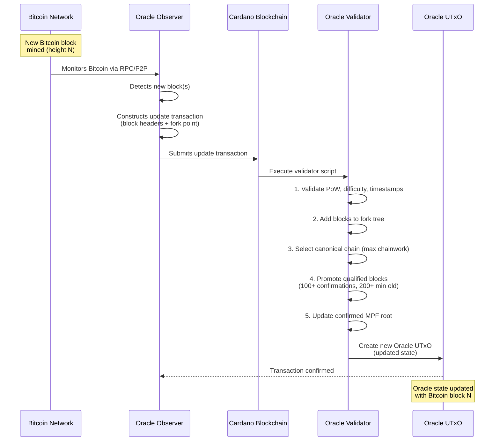
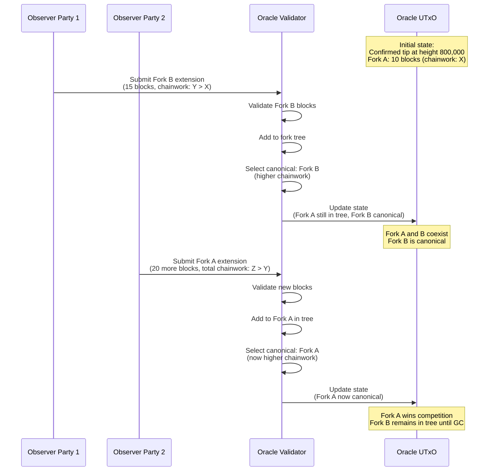
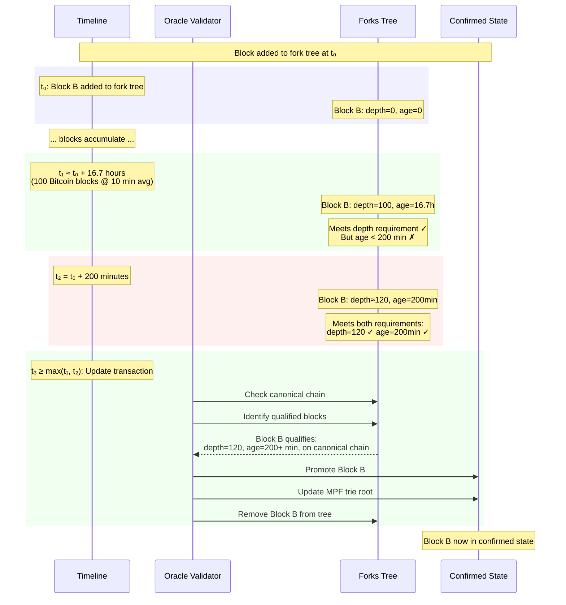
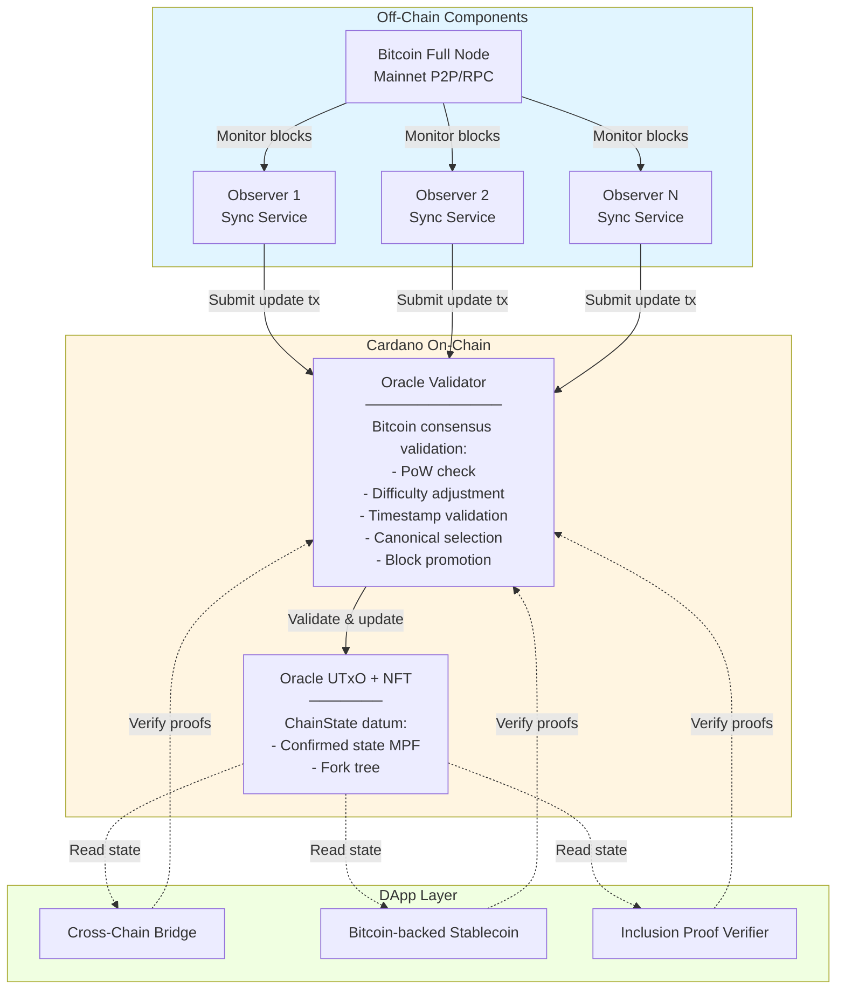
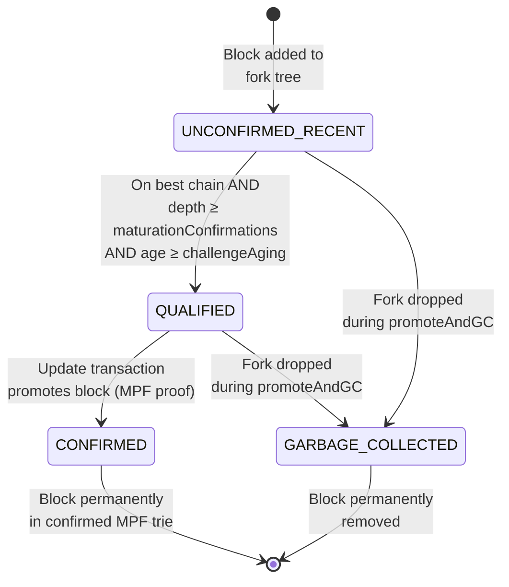

# Binocular: A Decentralized Bitcoin Oracle on Cardano

Alexander Nemish @ Lantr (<alex@lantr.io>)

Draft v0.4

## Abstract

Binocular is a Bitcoin oracle for Cardano that enables smart contracts to access and verify Bitcoin
blockchain state. The protocol allows anyone to submit Bitcoin block headers to a single on-chain
Oracle UTxO without registration or bonding requirements. All blocks are validated against Bitcoin
consensus rules (proof-of-work, difficulty adjustment, timestamp constraints) enforced by a Plutus
smart contract. The Oracle maintains a binary tree of competing forks and automatically selects the
canonical chain using Bitcoin's chainwork calculation. Blocks achieving 100+ confirmations and 200+
minutes of on-chain aging are promoted to the confirmed state, stored via Merkle Patricia Forestry
(MPF) to enable transaction inclusion proofs. The Oracle UTxO is identified by an NFT minted
through a one-shot minting policy. A companion TransactionVerifier contract enables on-chain
verification of Bitcoin transaction inclusion proofs against the Oracle's confirmed state. Security
relies on a 1-honest-party assumption and Bitcoin's proof-of-work security, with economic analysis
showing that mining 100 Bitcoin blocks costs significantly more than any potential oracle
manipulation reward.

## Introduction

Cross-chain interoperability requires reliable access to external blockchain state. Cardano smart
contracts currently cannot directly observe or verify Bitcoin transactions, limiting potential
applications like cross-chain bridges, Bitcoin-backed stablecoins, and decentralized exchanges.
Binocular addresses this by implementing a Bitcoin oracle that validates block headers on-chain
using Cardano's extended UTxO model.

### Problem

Existing cross-chain oracles typically rely on trusted intermediaries, multi-signature committees,
or external validators. These approaches introduce additional trust assumptions beyond the security
of the underlying blockchains. A Bitcoin oracle should ideally inherit Bitcoin's security properties
while operating within Cardano's smart contract environment.

### Contribution

Binocular makes the following contributions:

1. **On-chain Bitcoin Validation**: Complete implementation of Bitcoin consensus validation (
   proof-of-work, difficulty adjustment, median-time-past, timestamp validation) in Plutus using
   Scalus, enabling Cardano smart contracts to verify Bitcoin block headers without external trust.

2. **Permissionless Participation**: Anyone can submit Bitcoin blocks to the Oracle without
   registration, bonding, or special privileges. The validator contract enforces all validation
   rules, rejecting invalid blocks automatically.

3. **Simplified Single-UTxO Architecture**: A single Oracle UTxO, identified by an NFT, contains
   both the confirmed state (MPF trie of blocks with 100+ confirmations) and a binary tree of
   competing unconfirmed forks. Updates atomically select the canonical chain and promote qualified
   blocks.

4. **Challenge Period Mechanism**: Blocks must exist on-chain for 200 minutes before promotion to
   confirmed state, providing time for honest parties to counter pre-computed attacks while
   maintaining liveness.

5. **Security Analysis**: Formal proofs of safety and liveness properties, along with quantitative
   economic analysis demonstrating attack infeasibility.

The protocol operates under a 1-honest-party assumption: at least one participant monitors the
Bitcoin network and submits valid blocks to the Oracle. This assumption is minimal - requiring only
that someone, somewhere, runs the freely available software.

### Reading Guide

- **Overview** (Section 2): Architecture, data flow, and protocol operation — start here
- **Protocol Specification** (Section 3): Complete data structures, algorithms, and validation
  rules — reference for implementors
- **Communication Protocols** (Section 4): Sequence diagrams illustrating key interactions
- **Formal State Machine** (Section 5): Block lifecycle states and transition rules
- **Security Analysis** (Section 6): Threat model, formal proofs, and attack scenarios
- **Design Decisions** (Section 7): Rationale for key architectural choices

## Overview

### Architecture

The Binocular Oracle uses a single UTxO, identified by an NFT minted through a one-shot minting
policy. The UTxO contains the complete protocol state:

**Oracle UTxO State**:

```
ChainState {
  confirmedBlocksRoot,  // MPF trie root of confirmed block hashes
  ctx: TraversalCtx,    // Accumulated context from confirmed chain tip
  forkTree: ForkTree    // Binary tree of unconfirmed block segments
}
```

The `TraversalCtx` carries the accumulated state needed for validating new blocks:

```
TraversalCtx {
  timestamps[11],              // Recent timestamps (newest first)
  height,                      // Current confirmed block height
  currentBits,                 // Difficulty target (compact bits)
  prevDiffAdjTimestamp,        // For difficulty retarget calculations
  lastBlockHash                // Hash of last confirmed block
}
```

The `ForkTree` is a recursive binary enum:

```
ForkTree = Blocks(blocks, chainwork, next: ForkTree)
         | Fork(left: ForkTree, right: ForkTree)
         | End
```

### Protocol Operation

**0. Oracle Initialization**

The Oracle must be initialized with a starting Bitcoin block (checkpoint) before it can begin
accepting updates. Initialization creates the initial Oracle UTxO with a valid `ChainState`.

**Checkpoint Selection:**

The Oracle can start from any valid Bitcoin block, but practical deployments typically choose:

- **Recent checkpoint**: A block from the past few months (e.g., block 800,000+)
- **Deep confirmations**: Choose a block with thousands of confirmations to ensure finality
- **Known valid state**: Use a well-known Bitcoin block to simplify verification

**Initial ChainState:**

Given a starting block at height $h$ (e.g., $h = 800000$):

```
ChainState {
  confirmedBlocksRoot = mpfRootForSingleBlock(hash(block_h)),  // MPF trie with single block
  ctx = TraversalCtx {
    timestamps = [block_h, block_{h-1}, ..., block_{h-10}].timestamps,  // Last 11 timestamps
    height = h,
    currentBits = block_h.bits,
    prevDiffAdjTimestamp = block_{adj}.timestamp,
    lastBlockHash = hash(block_h)
  },
  forkTree = End  // Empty fork tree
}
```

where $\text{block}_{adj}$ is the most recent difficulty adjustment block at or before height $h$
(i.e., $adj = h - (h \bmod 2016)$), and `mpfRootForSingleBlock` creates an MPF trie containing a
single entry where both key and value are the block hash.

**Rationale:**

1. **Single confirmed block**: The checkpoint block is the only confirmed block initially. The
   `confirmedBlocksRoot` is the MPF trie root containing just this block's hash.

2. **Empty fork tree**: No unconfirmed blocks exist yet. All subsequent Bitcoin blocks will be
   added to the fork tree and promoted to confirmed state once they meet criteria.

3. **Difficulty state**: The checkpoint block's difficulty parameters and timestamp from the last
   difficulty adjustment block enable proper validation of subsequent blocks.

4. **11 timestamps**: The `timestamps` list must be initialized with 11 timestamps (from blocks
   $h$ through $h-10$, newest first) because `validateBlock` computes the median-time-past by
   sorting the list and accessing element at index 5. Fewer than 11 timestamps would cause an
   index-out-of-bounds failure.

**Deployment Process:**

1. Select checkpoint block height $h$ from Bitcoin blockchain
2. Retrieve block headers for blocks $h$ through $h-10$ (for timestamps) and adjustment block
3. Construct initial `ChainState` as specified above
4. Deploy Oracle validator script to Cardano with `BitcoinValidatorParams`
5. Mint the Oracle NFT by consuming the one-shot UTxO
6. Create initial Oracle UTxO with `ChainState` as inline datum and NFT
7. Oracle is now operational and ready to accept block submissions

**Example:**

Starting at Bitcoin block 800,000 (height as of August 2023):

```
ChainState {
  confirmedBlocksRoot: <MPF root for single block 0x000...a054>
  ctx: TraversalCtx {
    timestamps: [1691064786, 1691063498, ..., 1691055321]  // 11 timestamps from blocks 800,000-799,990
    height: 800000
    currentBits: 0x17053894
    prevDiffAdjTimestamp: 1690396653 (from block 797,184)
    lastBlockHash: 0x00000000000000000002a7c4c1e48d76c5a37902165a270156b7a8d72728a054
  }
  forkTree: End
}
```

After initialization, observers can begin submitting Bitcoin blocks starting from height 800,001 and
onward.

**Oracle Identification:**

Each Oracle instance is uniquely identified by an **NFT** minted through a one-shot minting policy.
The NFT's policy ID equals the validator script hash because Plutus V3 uses a single script for
both spending and minting — the same script that validates `UpdateOracle`/`CloseOracle` also serves
as the minting policy. This policy ID serves as a unique on-chain identifier for the Oracle UTxO.

**NFT-Based Identification:**

The Oracle NFT provides:

1. **Unique Identity**: The one-shot minting policy ensures exactly one NFT can be minted per
   deployment (tied to a specific UTxO consumption). This makes each Oracle instance globally unique.

2. **Continuity Guarantee**: Every `UpdateOracle` transaction must produce a continuing output
   containing the same NFT, ensuring the Oracle UTxO chain is unbroken.

3. **On-Chain Discoverability**: Applications can find the Oracle by searching for the known NFT
   policy ID, without needing to track UTxO references.

**Bitcoin State Verification:**

Additionally, any Oracle can be verified off-chain by comparing `ctx.lastBlockHash` and
`ctx.height` against a Bitcoin full node. Since there is exactly one valid Bitcoin block at each
height, any correctly-tracking Oracle must agree with the canonical chain. This provides **objective
verifiability** without trusting any centralized authority. Even if Oracles diverge temporarily
(different forks in `forkTree`), valid Oracles will converge to the same confirmed state after 100+
confirmations.

**1. Submitting Blocks**

Anyone can submit an `UpdateOracle` transaction containing:

- New Bitcoin block header(s) (oldest first)
- A **parent path** specifying where in the fork tree the new blocks extend from
- Optional MPF insertion proofs (for promoting blocks to confirmed state)

The on-chain validator performs atomic operations:

- Navigates the fork tree using the parent path
- Validates each block against Bitcoin consensus rules (PoW, difficulty, timestamps, header length)
- Inserts valid blocks into the fork tree
- If MPF proofs are provided: selects the canonical chain (highest chainwork), promotes eligible
  blocks, garbage-collects dead forks, and updates the confirmed MPF root

**Path-Based Insertion:**

The `parentPath` in the `UpdateOracle` redeemer specifies the insertion point:

- **Empty path** (`[]`): New blocks extend the confirmed tip directly. The fork tree root is the
  insertion point.
- **Path elements at `Blocks` nodes**: An index into the block list. If the index equals the
  block count, traversal passes through to the subtree. Otherwise, the block at that index is
  the parent.
- **Path elements at `Fork` nodes**: 0 = left branch, 1 = right branch.

This enables single-traversal validation and insertion — the tree is navigated once, accumulating
the traversal context as blocks are passed, then new blocks are validated against the accumulated
context and inserted at the target location.

**Duplicate Block Prevention:**

Duplicate detection is enforced at each insertion point using `existsAsChild`, which checks if the
first new block's hash matches the first block of any existing branch at that fork point. This
prevents the same block from being added twice at the same parent.

**Fork Creation:**

When new blocks fork off an existing chain (i.e., the insertion point is in the middle of a
`Blocks` node), the node is split:

```
Before: Blocks([A, B, C, D, E], cw, End), insert at index 2 (parent = C)
After:  Blocks([A, B, C], prefixCw,
            Fork(
                Blocks([D, E], cw - prefixCw, End),  // existing (left)
                Blocks([H1, H2], newCw, End)          // new branch (right)
            ))
```

The existing branch always goes left and the new branch right (Fork ordering invariant).

**2. Fork Competition**

Multiple competing forks coexist in the binary fork tree. The canonical chain is determined by:

- Cumulative chainwork calculation (sum of block proof-of-work values, where each block's work =
  2^256 / (target + 1))
- Follows Bitcoin's longest chain rule (most accumulated work, not most blocks)
- Tie-breaking: the left (existing/older) branch wins, matching Bitcoin Core's first-seen preference
- Selection happens when MPF proofs are provided (triggering promotion and garbage collection)

**3. Block Promotion (Maturation)**

Blocks are promoted when they satisfy both criteria:

- **Confirmation Depth**: 100+ blocks deep in the canonical chain (configurable via
  `maturationConfirmations` parameter)
- **On-chain Aging**: 200+ minutes since the block was added to the fork tree (configurable via
  `challengeAging` parameter)

Promotion is triggered when the submitter provides MPF insertion proofs (non-membership proofs that
demonstrate the block hash was not already in the confirmed trie). The number of proofs determines
how many blocks are promoted. Along with promotion, **garbage collection** drops all forks that are
not on the best chain path, keeping the fork tree compact.

The 200-minute requirement prevents pre-computed attacks: an attacker cannot mine 100+ blocks
offline and immediately promote them, as they must first exist on-chain for the challenge period.

## Protocol Specification

This section provides complete technical specifications for all data structures and algorithms
implemented in the Binocular Oracle.

### Data Structures

**Type Aliases:**

For semantic clarity and type safety, the implementation uses the following type aliases:

```scala
type BlockHash = ByteString         // 32-byte SHA256d hash of block header
type TxHash = ByteString            // 32-byte SHA256d hash of transaction
type MerkleRoot = ByteString        // 32-byte Merkle tree root hash
type CompactBits = ByteString       // 4-byte compact difficulty target representation
type BlockHeaderBytes = ByteString  // 80-byte raw Bitcoin block header
type PosixTimeSeconds = BigInt      // Unix timestamp in seconds
type DeltaSeconds = BigInt          // Time difference in seconds
type Chainwork = BigInt             // Cumulative proof-of-work
type MPFRoot = ByteString           // 32-byte Merkle Patricia Forestry root
```

The Oracle maintains a single UTxO with the following datum structure:

```scala
case class ChainState(
    confirmedBlocksRoot: MPFRoot,  // MPF trie root of confirmed block hashes
    ctx: TraversalCtx,             // Accumulated context from confirmed chain tip
    forkTree: ForkTree             // Binary tree of unconfirmed block segments
)
```

**TraversalCtx** carries the accumulated state from the confirmed chain tip, enabling
validation of new blocks without storing per-block height, chainwork, or difficulty:

```scala
case class TraversalCtx(
    timestamps: List[PosixTimeSeconds],  // Last 11 timestamps (newest first)
    height: BigInt,                      // Current confirmed block height
    currentBits: CompactBits,            // Current difficulty target (compact bits)
    prevDiffAdjTimestamp: PosixTimeSeconds, // For difficulty retarget calculations
    lastBlockHash: BlockHash             // Hash of last confirmed block
)
```

**BlockSummary** stores only essential per-block data. Height, chainwork, and difficulty are
not stored per block — they are derived from the `TraversalCtx` during tree traversal:

```scala
case class BlockSummary(
    hash: BlockHash,               // Block hash
    timestamp: PosixTimeSeconds,   // Bitcoin block timestamp (for MTP calculation)
    addedTimeDelta: DeltaSeconds   // currentTime - timestamp at submission (for aging)
)
```

**ForkTree** is a recursive binary enum representing the tree of unconfirmed block segments:

```scala
enum ForkTree {
    case Blocks(
        blocks: List[BlockSummary],  // Non-empty list of consecutive blocks (oldest first)
        chainwork: Chainwork,        // Cumulative chainwork of this segment
        next: ForkTree               // Subtree after last block
    )
    case Fork(left: ForkTree, right: ForkTree)  // Binary fork point
    case End                                     // Leaf (no more blocks)
}
```

**Fork ordering invariant:** `Fork(left = existing, right = new)`. Every fork-creating operation
places the pre-existing subtree on the left and the newly submitted branch on the right. This
mirrors Bitcoin Core's first-seen preference: `CBlockIndexWorkComparator` breaks equal-chainwork
ties by `nSequenceId`, favoring whichever chain tip was received first. Since `bestChainPath` uses
`>=` when comparing left vs right chainwork, the left (existing/older) branch wins ties.

**BlockHeader** wraps the raw 80-byte Bitcoin block header:

```scala
case class BlockHeader(bytes: BlockHeaderBytes)  // Raw 80-byte header
```

**BlockHeader Fields** (extracted from `bytes`):

- `version` (bytes 0-3): Block version
- `prevBlockHash` (bytes 4-35): BlockHash - Hash of previous block
- `merkleRoot` (bytes 36-67): MerkleRoot - Merkle root of transactions
- `timestamp` (bytes 68-71): Block timestamp (Unix epoch seconds)
- `bits` (bytes 72-75): CompactBits - Difficulty target (compact format)
- `nonce` (bytes 76-79): Proof-of-work nonce

**OracleAction** defines the redeemer for the Oracle validator:

```scala
enum OracleAction {
    case UpdateOracle(
        blockHeaders: List[BlockHeader],    // New Bitcoin block headers to validate
        parentPath: Path,                    // Navigation path to parent block in tree
        mpfInsertProofs: List[List[ProofStep]] // MPF non-membership proofs for promoted blocks
    )
    case CloseOracle  // Close stale Oracle and burn NFT
}
```

**BitcoinValidatorParams** configures the parameterized validator:

```scala
case class BitcoinValidatorParams(
    maturationConfirmations: BigInt,  // Blocks needed for promotion (e.g. 100)
    challengeAging: BigInt,          // On-chain aging in seconds (e.g. 12000)
    oneShotTxOutRef: TxOutRef,       // UTxO consumed to mint Oracle NFT
    closureTimeout: BigInt,          // Staleness threshold for CloseOracle (seconds)
    owner: PubKeyHash,               // Owner authorized to close Oracle
    powLimit: BigInt,                 // Proof-of-work limit (mainnet vs testnet)
    maxBlocksInForkTree: BigInt,     // Maximum blocks allowed in fork tree (e.g. 256)
    testingMode: Boolean             // If true, skip PoW validation (for testing)
)
```

**Path Types:**

Two path types are used for tree navigation, both represented as `List[BigInt]`:

- **Path** (insertion path): Navigates to a specific block within the fork tree. At `Blocks` nodes,
  the element is a 0-based index into the block list. At `Fork` nodes, 0 = left, 1 = right. An
  empty path means the parent is the confirmed tip.

- **BestPath** (best-chain path): Navigates through fork nodes to identify the winning chain.
  Elements are produced/consumed only at `Fork` nodes (0 = left, 1 = right). `Blocks` nodes do not
  consume path elements.

**Path Example:**

Consider this fork tree (confirmed tip at height 100):

```
Blocks([A, B, C], cw1,             ← indices 0, 1, 2
  Fork(                              ← 0=left, 1=right
    Blocks([D, E], cw2, End),        ← left branch (indices 0, 1)
    Blocks([F], cw3, End)            ← right branch (index 0)
  ))
```

| Action | Path | Meaning |
|--------|------|---------|
| Extend after E | `[3, 0, 1]` | Pass through A,B,C (index 3=length), go left at Fork, E is parent (index 1) |
| Fork at B | `[1]` | B is parent (index 1), new blocks branch off after B |
| Extend from confirmed tip | `[]` | Empty path, attach at tree root |
| Extend after F | `[3, 1, 0]` | Pass through A,B,C, go right at Fork, F is parent (index 0) |

The **BestPath** for this tree (assuming `cw1+cw2 > cw1+cw3`) would be `[0]` — just the Fork
direction (left). `Blocks` nodes don't consume BestPath elements.

### Bitcoin Consensus Constants

The following constants match Bitcoin Core's `chainparams.cpp` and `validation.cpp`:

```scala
UnixEpoch: BigInt = 1231006505 // Bitcoin genesis block timestamp
TargetBlockTime: BigInt = 600 // 10 minutes (nPowTargetSpacing)
DifficultyAdjustmentInterval: BigInt = 2016 // Retarget every 2016 blocks
MaxFutureBlockTime: BigInt = 7200 // 2 hours (MAX_FUTURE_BLOCK_TIME)
MedianTimeSpan: BigInt = 11 // For median-time-past (CBlockIndex::nMedianTimeSpan)
PowLimit: BigInt = 0x00000000ffffffffffffffffffffffffffffffffffffffffffffffffffffffff
TwoTo256: BigInt = 115792089237316195423570985008687907853269984665640564039457584007913129639936 // 2^256 for chainwork calculation
MaturationConfirmations: BigInt = 100 // Blocks needed for promotion
ChallengeAging: BigInt = 200 * 60 // 200 minutes in seconds
```

### Core Algorithms

This section documents all validation and state transition algorithms implemented in the on-chain
validator (BitcoinValidator.scala).

#### Algorithm 1: Compact Bits to Target Conversion

Converts Bitcoin's 4-byte compact "bits" representation to a 256-bit target value. Matches
`arith_uint256::SetCompact()` in Bitcoin Core's `arith_uint256.cpp`.

**Mathematical Specification:**

Given compact bits $c$ as 4 bytes $[c_0, c_1, c_2, c_3]$ (little-endian):

- Exponent: $e = c_3$
- Coefficient: $m = c_0 + c_1 \cdot 256 + c_2 \cdot 256^2$

Target value:
$$
T = \begin{cases}
m / 256^{3-e} & \text{if } e < 3 \\
m \cdot 256^{e-3} & \text{if } e \geq 3
\end{cases}
$$

With overflow checks: $m \leq 0x007fffff$ and $T \leq \text{PowLimit}$.

**Pseudocode:**

```
Function compactBitsToTarget(compact: CompactBits) → BigInt:
  Input: 4-byte compact bits (little-endian)
  Output: 256-bit target value

  exponent ← compact[3]
  coefficient ← LE_to_int(compact[0:3])

  require coefficient ≤ 0x007fffff, "Negative bits"

  if exponent < 3 then
    target ← coefficient / 256^(3 - exponent)
  else
    // Check overflow: exponent too large for coefficient size
    if coefficient ≠ 0 and (
       exponent > 34 or
       (coefficient > 0xff and exponent > 33) or
       (coefficient > 0xffff and exponent > 32)
    ) then
      fail "Bits overflow"

    target ← coefficient × 256^(exponent - 3)

  require target ≤ PowLimit, "Bits over PowLimit"
  return target
```

**Implementation Reference:** See `compactBitsToTarget` in `BitcoinHelpers.scala`

#### Algorithm 2: Target to Compact Bits Conversion

Inverse operation: converts 256-bit target to 4-byte compact representation. Matches
`arith_uint256::GetCompact()` in `arith_uint256.cpp`.

**Mathematical Specification:**

Given target $T$, find exponent $e$ and coefficient $m$ such that:
$$
T \approx m \cdot 256^{e-3}
$$

where $m$ fits in 3 bytes and the most significant bit of $m$ is 0 (positive number encoding).

**Pseudocode:**

```
Function targetToCompactBits(target: BigInt) → CompactBits:
  Input: 256-bit target value
  Output: 4-byte compact bits

  if target = 0 then return 0

  // Convert to 32-byte array to find significant bytes
  targetBytes ← toBigEndianBytes(target, 32)

  // Find number of significant bytes (from MSB)
  nSize ← findMostSignificantByteIndex(targetBytes) + 1

  // Extract compact representation
  if nSize ≤ 3 then
    nCompact ← target × 256^(3 - nSize)
  else
    nCompact ← target / 256^(nSize - 3)

  // Ensure positive encoding (MSB = 0)
  if nCompact ≥ 0x800000 then
    nCompact ← nCompact / 256
    nSize ← nSize + 1

  // Pack: [3-byte coefficient][1-byte exponent]
  return intToBytes(nCompact + nSize × 0x1000000, 4)
```

**Implementation Reference:** See `targetToCompactBits` and `targetToCompactBitsV2` (using
`findFirstSetBit` builtin) in `BitcoinHelpers.scala`

#### Algorithm 3: Block Header Hash

Computes double SHA-256 hash of block header. Matches `CBlockHeader::GetHash()` in Bitcoin Core's
`primitives/block.h`.

**Mathematical Specification:**

$$
H = \text{SHA256}(\text{SHA256}(\text{header\_bytes}))
$$

**Pseudocode:**

```
Function blockHeaderHash(header: BlockHeader) → BlockHash:
  return SHA256(SHA256(header.bytes))
```

**Implementation Reference:** See `blockHeaderHash` in `BitcoinHelpers.scala`

#### Algorithm 4: Proof-of-Work Validation

Validates that block header hash meets the difficulty target. Matches `CheckProofOfWork()` in
`pow.cpp:140-163`.

**Mathematical Specification:**

Given block header $h$ with difficulty bits $d$:
$$
\text{PoW is valid} \iff \text{Hash}(h) \leq \text{compactBitsToTarget}(d)
$$

where hash is interpreted as a little-endian 256-bit integer.

**Pseudocode:**

```
Function validateProofOfWork(header: BlockHeader, targetBits: CompactBits) → Bool:
  hash ← blockHeaderHash(header)
  hashInt ← LE_to_BigInt(hash)
  target ← compactBitsToTarget(targetBits)
  return hashInt ≤ target
```

**Implementation Reference:** PoW check is part of `validateBlock` in `BitcoinValidator.scala`

#### Algorithm 4a: Block Proof Calculation (Chainwork)

Calculates the proof-of-work value for a block, representing the expected number of hashes required to find a valid block at the given difficulty. This is used to compute cumulative chainwork for canonical chain selection. Matches `GetBlockProof()` in Bitcoin Core's `chain.cpp`.

**Mathematical Specification:**

Given difficulty target $t$, the proof-of-work (work) for a block is:
$$
\text{work}(t) = \frac{2^{256}}{t + 1}
$$

The cumulative chainwork for a chain is the sum of work values for all blocks:
$$
\text{chainwork}(h) = \sum_{i=0}^{h} \text{work}(t_i)
$$

where $h$ is the block height and $t_i$ is the target at height $i$.

**Note on Bitcoin Core Implementation:**

Bitcoin Core uses an algebraic equivalent to avoid overflow when computing $2^{256}$:
$$
\frac{2^{256}}{t + 1} = \frac{\sim t}{t + 1} + 1
$$

where $\sim t = (2^{256} - 1) - t$ is the bitwise NOT of $t$. However, for our implementation we use a precomputed constant for $2^{256}$.

**Pseudocode:**

```
Constant: TwoTo256 = 115792089237316195423570985008687907853269984665640564039457584007913129639936

Function calculateBlockProof(target: BigInt) → BigInt:
  // Matches GetBlockProof() in Bitcoin Core's chain.cpp
  return TwoTo256 / (target + 1)
```

**Implementation Reference:** See `calculateBlockProof` in `BitcoinHelpers.scala`

#### Algorithm 5: Median Time Past

Computes median of last 11 block timestamps for timestamp validation. Matches
`CBlockIndex::GetMedianTimePast()` in `chain.h:278-290`.

**Mathematical Specification:**

Given timestamp list $[t_1, t_2, \ldots, t_n]$ where $n \leq 11$:

1. Sort timestamps in ascending order
2. Return the element at index $\lfloor n/2 \rfloor$

$$
\text{MedianTimePast}(T) = \text{sort}(T)[\lfloor n/2 \rfloor]
$$

**Implementation Details:**

Bitcoin Core collects up to 11 timestamps, sorts them ascending, and returns the middle element.
The on-chain implementation uses insertion sort (`insertionSort` / `insertAscending`) which is
efficient for the fixed-size 11-element list. The timestamps are taken from the traversal context
(`ctx.timestamps.take(11)`), sorted ascending, and the element at index 5 (for a full 11-element
list) is returned.

**Pseudocode:**

```
Function insertAscending(x: BigInt, sorted: List[BigInt]) → List[BigInt]:
  if sorted.isEmpty then [x]
  else if x ≤ sorted.head then x :: sorted
  else sorted.head :: insertAscending(x, sorted.tail)

Function insertionSort(xs: List[BigInt]) → List[BigInt]:
  xs.foldLeft([])((sorted, x) → insertAscending(x, sorted))

// Used in validateBlock:
sortedTimestamps ← insertionSort(ctx.timestamps.take(11))
medianTimePast ← sortedTimestamps[5]
```

**Implementation Reference:** See `insertionSort` and `insertAscending` in
`BitcoinValidator.scala`

#### Algorithm 6: Difficulty Adjustment

Calculates new difficulty target every 2016 blocks. Matches `GetNextWorkRequired()` and
`CalculateNextWorkRequired()` in `pow.cpp:14-84`.

**Mathematical Specification:**

Difficulty retargets every 2016 blocks. Given:

- $T_{\text{current}}$: current target
- $t_{\text{last}}$: timestamp of last block in period
- $t_{\text{first}}$: timestamp of first block in period

Calculate actual timespan:
$$
\Delta t_{\text{actual}} = t_{\text{last}} - t_{\text{first}}
$$

Clamp to prevent extreme adjustments:
$$
\Delta t_{\text{clamped}} = \min\left(\max\left(\Delta t_{\text{actual}}, \frac{\Delta t_{\text{target}}}{4}\right), \Delta t_{\text{target}} \times 4\right)
$$

where $\Delta t_{\text{target}} = 2016 \times 600 = 1209600$ seconds (2 weeks).

New target:
$$
T_{\text{new}} = \min\left(\frac{T_{\text{current}} \times \Delta t_{\text{clamped}}}{\Delta t_{\text{target}}}, \text{PowLimit}\right)
$$

**Pseudocode:**

```
Function getNextWorkRequired(
  height: BigInt,
  currentTarget: CompactBits,
  blockTime: BigInt,
  firstBlockTime: BigInt
) → CompactBits:

  // Only adjust every 2016 blocks
  if (height + 1) mod 2016 ≠ 0 then
    return currentTarget

  // Calculate actual timespan
  PowTargetTimespan ← 2016 × 600  // 2 weeks
  actualTimespan ← blockTime - firstBlockTime

  // Clamp adjustment (Bitcoin Core pow.cpp:55-60)
  clampedTimespan ← min(
    max(actualTimespan, PowTargetTimespan / 4),
    PowTargetTimespan × 4
  )

  // Adjust target
  currentTargetInt ← compactBitsToTarget(currentTarget)
  newTarget ← (currentTargetInt × clampedTimespan) / PowTargetTimespan
  newTarget ← min(newTarget, PowLimit)

  return targetToCompactBits(newTarget)
```

**Implementation Reference:** See `getNextWorkRequired` and `calculateNextWorkRequired` in
`BitcoinHelpers.scala`

#### Algorithm 7: Timestamp Validation

Validates block timestamp against median-time-past and future time limits. Matches
`ContextualCheckBlockHeader()` in `validation.cpp`.

**Validation Rules:**

\begin{align*}
\text{MedianTimePast}(T_{\text{recent}}) &< t_{\text{block}} \\
t_{\text{block}} &\leq t_{\text{current}} + 7200
\end{align*}

Where $T_{\text{recent}}$ are the last 11 block timestamps and $t_{\text{current}}$ is the current
time derived from the transaction's validity interval **end** (`tx.validRange.to / 1000`). Using
the upper bound rather than the lower bound widens our futurity tolerance by up to
`MaxValidityWindow` (10 min) so that blocks at the upper edge of Bitcoin Core's
`MAX_FUTURE_BLOCK_TIME = 7200s` window (e.g. fresh testnet4 blocks deliberately stamped into the
future to trigger the 20-minute min-difficulty rule) are accepted by the validator within the same
real-time window in which Bitcoin Core itself accepts them.

**Implementation Reference:** Timestamp checks are part of `validateBlock` in
`BitcoinValidator.scala`

#### Algorithm 8: Block Validation and Context Accumulation

The implementation separates block validation from context accumulation. Two key functions handle
this:

**8a: `accumulateBlock` — Context Accumulation Without Re-validation**

Replays difficulty computation for an already-validated block without re-checking PoW or timestamps.
Used when walking existing blocks in the tree (e.g., building context before validating new headers,
or computing chainwork for a prefix during splits).

```
Function accumulateBlock(ctx: TraversalCtx, block: BlockSummary, powLimit: BigInt) → TraversalCtx:
  newHeight ← ctx.height + 1
  newTimestamps ← block.timestamp :: ctx.timestamps

  if newHeight mod 2016 = 0 then
    // Retarget boundary — compute new difficulty
    newTarget ← calculateNextWorkRequired(
      ctx.currentBits,
      ctx.timestamps.head,      // pindexLast->GetBlockTime()
      ctx.prevDiffAdjTimestamp,  // nFirstBlockTime
      powLimit
    )
    newBits ← targetToCompactByteString(newTarget)
    return TraversalCtx(newTimestamps, newHeight, newBits,
                        block.timestamp, block.hash)  // timestamp becomes nFirstBlockTime
  else
    return ctx.copy(timestamps = newTimestamps, height = newHeight,
                    lastBlockHash = block.hash)
```

**8b: `validateBlock` — Full Validation + Accumulation**

Validates a single new block header against all Bitcoin consensus rules and accumulates it into the
traversal context.

```
Function validateBlock(
  header: BlockHeader, ctx: TraversalCtx,
  currentTime: PosixTimeSeconds, params: BitcoinValidatorParams
) → (BlockSummary, TraversalCtx, BlockProof):

  // 1. Header length check (prevents mining shorter/longer payloads)
  require header.bytes.length = 80

  // 2. Compute block hash
  hash ← blockHeaderHash(header)
  hashInt ← LE_to_BigInt(hash)

  // 3. Difficulty — derive expected bits from context
  bits ← getNextWorkRequired(ctx.height, ctx.currentBits,
                              ctx.timestamps.head, ctx.prevDiffAdjTimestamp, params.powLimit)

  // 4. Explicit bits check (bad-diffbits) — header must encode correct difficulty
  require header.bits = bits

  // 5. PoW validation
  target ← compactBitsToTarget(header.bits)
  if not params.testingMode then
    require hashInt ≤ target
    require target ≤ params.powLimit

  // 6. MTP validation — insertion sort of last 11 timestamps
  sortedTimestamps ← insertionSort(ctx.timestamps.take(11))
  medianTimePast ← sortedTimestamps[5]
  require header.timestamp > medianTimePast

  // 7. Future time validation
  require header.timestamp ≤ currentTime + MaxFutureBlockTime

  // 8. Chain continuity
  require header.prevBlockHash = ctx.lastBlockHash

  // 9. Create summary and accumulate context
  summary ← BlockSummary(hash, header.timestamp, currentTime - header.timestamp)
  newCtx ← accumulateBlock(ctx, summary, params.powLimit)
  blockProof ← calculateBlockProof(target)

  return (summary, newCtx, blockProof)
```

**8c: `validateAndCollectBlocks` — Batch Validation**

Validates a list of headers (oldest-first), returning validated summaries and total segment
chainwork:

```
Function validateAndCollectBlocks(
  headers: List[BlockHeader], ctx: TraversalCtx,
  currentTime: BigInt, chainwork: BigInt,
  acc: List[BlockSummary], params: BitcoinValidatorParams
) → (List[BlockSummary], Chainwork):

  if headers.isEmpty then return (acc.reverse, chainwork)
  (summary, newCtx, blockProof) ← validateBlock(headers.head, ctx, currentTime, params)
  return validateAndCollectBlocks(headers.tail, newCtx, currentTime,
                                  chainwork + blockProof, summary :: acc, params)
```

**Implementation Reference:** See `accumulateBlock`, `validateBlock`, and
`validateAndCollectBlocks` in `BitcoinValidator.scala`

#### Algorithm 9: Canonical Chain Selection (`bestChainPath`)

Finds the best (highest cumulative chainwork) chain path through the binary fork tree. Returns a
triple `(chainwork, depth, bestPath)` where the path enables subsequent operations (promotion, GC)
to follow the winning chain.

**Mathematical Specification:**

Given fork tree $T$, find the path to the tip with highest cumulative chainwork:
$$
\text{path}^* = \arg\max_{\text{path} \in \text{Paths}(T)} \text{chainwork}(\text{path})
$$

with tie-breaking: the left (existing/older) branch wins (`>=`), matching Bitcoin Core's first-seen
preference.

**Pseudocode:**

```
Function bestChainPath(tree: ForkTree, height: BigInt, chainwork: BigInt)
    → (Chainwork, Depth, BestPath):

  match tree:
    case Blocks(blocks, cw, next):
      // Accumulate segment chainwork and block count, recurse into subtree
      return bestChainPath(next, height + blocks.length, chainwork + cw)

    case Fork(left, right):
      // Recurse both branches, pick higher chainwork
      (leftWork, leftDepth, leftPath) ← bestChainPath(left, height, chainwork)
      (rightWork, rightDepth, rightPath) ← bestChainPath(right, height, chainwork)
      // >= means left (existing) wins ties
      if leftWork ≥ rightWork then
        return (leftWork, leftDepth, 0 :: leftPath)
      else
        return (rightWork, rightDepth, 1 :: rightPath)

    case End:
      return (chainwork, height, [])
```

**Key Properties:**

- Single full tree traversal: O(n) where n is total blocks in tree
- BestPath contains one element per Fork node (0=left, 1=right)
- Blocks nodes pass through without consuming path elements

**Implementation Reference:** See `bestChainPath` in `BitcoinValidator.scala`

#### Algorithm 10: Block Promotion and Garbage Collection

Promotion is a three-step process: split promotable blocks, promote and garbage-collect along the
best path, and apply promotions to confirmed state.

**Promotion Criteria:**

Block $b$ on the best chain can be promoted if:

\begin{align*}
\text{bestDepth} - \text{blockHeight}(b) &\geq \text{maturationConfirmations} \\
t_{\text{current}} - b.\text{timestamp} - b.\text{addedTimeDelta} &\geq \text{challengeAging}
\end{align*}

**Aging derivation:** The second criterion measures wall-clock time since the block was submitted
to the Oracle. At submission time, `addedTimeDelta` is set to `submitTime - block.timestamp`.
Substituting:

$$
t_{\text{current}} - b.\text{timestamp} - (\text{submitTime} - b.\text{timestamp}) = t_{\text{current}} - \text{submitTime}
$$

So the aging check reduces to: $t_{\text{current}} - \text{submitTime} \geq \text{challengeAging}$
(time elapsed since the block appeared on-chain).

**10a: `splitPromotable` — Identify Promotable Blocks**

Walks oldest→newest through a block list. Stops at the first ineligible block (blocks are ordered,
so all subsequent blocks will also be ineligible). The number of promotions is bounded by the
number of MPF proofs provided by the submitter.

```
Function splitPromotable(blocks, ctx, bestDepth, currentTime, maxPromotions, params)
    → (promoted, remaining, newCtx):

  if blocks.isEmpty or maxPromotions ≤ 0 then return ([], blocks, ctx)

  block ← blocks.head
  blockHeight ← ctx.height + 1
  depth ← bestDepth - blockHeight
  age ← currentTime - block.timestamp - block.addedTimeDelta

  if depth ≥ params.maturationConfirmations and age ≥ params.challengeAging then
    newCtx ← accumulateBlock(ctx, block, params.powLimit)
    (more, rest, finalCtx) ← splitPromotable(blocks.tail, newCtx, bestDepth,
                                              currentTime, maxPromotions - 1, params)
    return (block :: more, rest, finalCtx)
  else
    return ([], blocks, ctx)
```

**10b: `promoteAndGC` — Promote and Garbage-Collect Along Best Path**

Walks the tree following the `bestPath` from `bestChainPath`. At each node:

- **Blocks**: Tries to promote eligible blocks, then recurses into subtree
- **Fork**: Follows the best branch (per `bestPath`), **drops the other branch entirely** (GC).
  The Fork node is eliminated — the surviving branch replaces it.
- **End**: Leaf, nothing to do

```
Function promoteAndGC(tree, ctx, bestPath, bestDepth, currentTime, numPromotions, params)
    → (promoted, cleanedTree):

  match tree:
    case Blocks(blocks, cw, next):
      (promoted, remaining, newCtx) ← splitPromotable(blocks, ctx, bestDepth,
                                                       currentTime, numPromotions, params)
      if promoted.isEmpty then
        // No promotion — accumulate all blocks, recurse for GC
        fullCtx ← blocks.foldLeft(ctx)(accumulateBlock)
        (nextPromoted, cleanedNext) ← promoteAndGC(next, fullCtx, bestPath, ...)
        return (nextPromoted, Blocks(blocks, cw, cleanedNext))
      else if remaining.isEmpty then
        // All promoted — consume node, recurse for more
        (nextPromoted, cleanedNext) ← promoteAndGC(next, newCtx, bestPath, ...)
        return (promoted ++ nextPromoted, cleanedNext)
      else
        // Partial — promoted blocks removed, rest stays
        promotedCw ← computeChainwork(promoted, ctx, 0, params.powLimit)
        return (promoted, Blocks(remaining, cw - promotedCw, next))

    case Fork(left, right):
      // GC: follow best branch, DROP the other entirely
      direction ← bestPath.head
      if direction = 0 then
        (promoted, cleaned) ← promoteAndGC(left, ctx, bestPath.tail, ...)
        return (promoted, cleaned)  // right branch dropped
      else
        (promoted, cleaned) ← promoteAndGC(right, ctx, bestPath.tail, ...)
        return (promoted, cleaned)  // left branch dropped

    case End:
      return ([], End)
```

**10c: `applyPromotions` — Update Confirmed State**

Applies promoted blocks to the MPF trie using the provided non-membership proofs:

```
Function applyPromotions(state, promoted, mpfProofs, ctx0, cleanedTree, powLimit) → ChainState:
  (finalCtx, finalRoot) ← loop over (promoted, mpfProofs):
    for each (block, proof):
      newCtx ← accumulateBlock(ctx, block, powLimit)
      newRoot ← MPF(mpfRoot).insert(block.hash, block.hash, proof)
    return (newCtx, newRoot)

  return ChainState(
    confirmedBlocksRoot = finalRoot,
    ctx = finalCtx.copy(timestamps = finalCtx.timestamps.take(11)),
    forkTree = cleanedTree
  )
```

**Implementation Reference:** See `splitPromotable`, `promoteAndGC`, and `applyPromotions` in
`BitcoinValidator.scala`

#### Algorithm 11: `validateAndInsert` — Single-Traversal Tree Navigation + Validation + Insertion

Navigates the fork tree along the `parentPath`, validates new block headers against the accumulated
traversal context, and inserts the resulting block summaries — all in a single traversal.

```
Function validateAndInsert(tree, path, headers, ctx, currentTime, params) → ForkTree:

  match path:
    case []:
      // Parent is confirmed tip — validate and attach at tree root
      (newBlocks, newCw) ← validateAndCollectBlocks(headers, ctx, currentTime, 0, [], params)
      newBranch ← Blocks(newBlocks, newCw, End)
      match tree:
        case End → newBranch
        case existing →
          require not existsAsChild(existing, newBlocks.head.hash)
          Fork(existing, newBranch)  // existing left, new right

    case pathHead :: pathTail:
      match tree:
        case Blocks(blocks, cw, next):
          // Walk blocks list, accumulating ctx, to index pathHead:

          if pathHead = blocks.length then
            // Pass-through: all blocks consumed, recurse into subtree
            Blocks(blocks, cw,
              validateAndInsert(next, pathTail, headers, accCtx, currentTime, params))

          else  // pathHead < blocks.length: block[pathHead] is the parent
            parentCtx ← accumulate blocks[0..pathHead] into ctx
            (newBlocks, newCw) ← validateAndCollectBlocks(headers, parentCtx, ...)

            if pathHead = blocks.length - 1 and next = End then
              // Append: parent is last block, no subtree
              Blocks(blocks ++ newBlocks, cw + newCw, End)

            else if pathHead = blocks.length - 1 then
              // Fork at end: parent is last block, subtree exists
              require not existsAsChild(next, newBlocks.head.hash)
              Blocks(blocks, prefixCw, Fork(next, Blocks(newBlocks, newCw, End)))

            else
              // Mid-split: split Blocks node at pathHead
              prefix ← blocks[0..pathHead]
              suffix ← blocks[pathHead+1..]
              require suffix.head.hash ≠ newBlocks.head.hash
              prefixCw ← computeChainwork(prefix, ctx)
              Blocks(prefix, prefixCw,
                Fork(Blocks(suffix, cw - prefixCw, next),   // existing left
                     Blocks(newBlocks, newCw, End)))          // new right

        case Fork(left, right):
          // 0 → recurse left, 1 → recurse right
          if pathHead = 0 then Fork(validateAndInsert(left, pathTail, ...), right)
          else Fork(left, validateAndInsert(right, pathTail, ...))

        case End → fail("Path leads to End")
```

**Implementation Reference:** See `validateAndInsert` and `validateAndInsertInPath` in
`BitcoinValidator.scala`

#### Algorithm 12: `computeUpdate` — Four-Phase Orchestrator

The main entry point for computing the new `ChainState` after an `UpdateOracle` action:

```
Function computeUpdate(state, blockHeaders, parentPath, mpfInsertProofs,
                        currentTime, params) → ChainState:

  // Phase 1: Insert — validate and insert new blocks into tree
  newTree ← if blockHeaders.isEmpty then state.forkTree
             else validateAndInsert(state.forkTree, parentPath, blockHeaders,
                                    state.ctx, currentTime, params)
  require forkTreeBlockCount(newTree) ≤ params.maxBlocksInForkTree

  numProofs ← mpfInsertProofs.length
  if numProofs > 0 then
    // Phase 2: Best chain — find highest-chainwork path
    (_, bestDepth, bestPath) ← bestChainPath(newTree, state.ctx.height, 0)

    // Phase 3: Promote + GC — promote eligible blocks, drop dead forks
    (promoted, cleanedTree) ← promoteAndGC(newTree, state.ctx, bestPath,
                                           bestDepth, currentTime, numProofs, params)
    require promoted.length = numProofs

    // Phase 4: Apply — update confirmed state with MPF proofs
    return applyPromotions(state, promoted, mpfInsertProofs,
                           state.ctx, cleanedTree, params.powLimit)
  else
    // Header-only submission — skip promotion and GC
    return state.copy(forkTree = newTree)
```

**Key Design Insight:** Steps 2-4 are skipped when no MPF proofs are provided. This enables
"header-only" submissions where blocks are added to the tree without triggering promotion or
garbage collection, allowing efficient batching.

**Implementation Reference:** See `computeUpdate` in `BitcoinValidator.scala`

### Validation Rules Summary

The on-chain validator enforces the following rules:

**Transaction-Level Validation** (enforced on the entire `UpdateOracle` transaction):

1. **Validity Interval**: Transaction validity interval ≤ 10 minutes (`MaxValidityWindow = 600,000
   ms`), ensuring `validFrom` is close to wall-clock time
2. **NFT Continuity**: Continuing output must contain the Oracle NFT at the same script address
3. **Value Preservation**: Non-ADA tokens must be preserved; ADA value can only increase
4. **Fork Tree Capacity**: Total blocks in fork tree ≤ `maxBlocksInForkTree` parameter
5. **No Duplicates**: Duplicate detection via `existsAsChild` at insertion points

**Per-Block Validation** (enforced for every block added to the fork tree):

6. **Header Length**: Block header must be exactly 80 bytes
7. **Proof-of-Work**: Block hash ≤ target derived from bits field (unless `testingMode`)
8. **Difficulty Bits Match**: Header's `bits` field must match expected difficulty from context
   (`bad-diffbits` check)
9. **Difficulty Adjustment**: At retarget boundaries (every 2016 blocks), new target is computed
   via `getNextWorkRequired` / `calculateNextWorkRequired`
10. **Timestamps**: Block time > median of last 11 blocks (MTP), ≤ current time + 2 hours
11. **Chain Continuity**: `prevBlockHash` must match `ctx.lastBlockHash` (the accumulated tip)

**Promotion Criteria**:

12. **Maturation**: `maturationConfirmations`+ confirmations (e.g. 100) AND `challengeAging`+
    seconds on-chain aging (e.g. 200 minutes)
13. **MPF Proof Count**: Number of promoted blocks must exactly match number of MPF proofs provided

**Security Note**: These validations prevent spam attacks. An attacker cannot submit fake blocks
without performing valid proof-of-work. Each block must meet Bitcoin's difficulty requirement and
have a valid hash, making it computationally expensive to create even a single invalid fork. This
ensures the fork tree only contains blocks that could plausibly be part of the actual Bitcoin
blockchain. The validity interval constraint ensures that `addedTimeDelta` values are trustworthy
for the challenge aging check, preventing manipulation of block ages.

### NFT-Based Oracle Identity

The Oracle UTxO is identified by an NFT minted through a **one-shot minting policy**. The
validator script serves both as the spending validator (for `UpdateOracle` / `CloseOracle`) and as
the minting policy (for NFT mint/burn).

**One-Shot Minting Policy:**

The `oneShotTxOutRef` in `BitcoinValidatorParams` specifies a UTxO that must be consumed to mint the
NFT. Since UTxOs can only be consumed once, this ensures exactly one NFT can ever be minted per
Oracle deployment.

**Mint (NFT Creation):**

```
Function mint(params, redeemer, policyId, tx):
  minted ← tx.mint.tokens(policyId)

  if minted = {empty_token_name: 1} then
    // Minting: consume the one-shot UTxO
    require tx.inputs contains params.oneShotTxOutRef
    // Verify oracle output contains exactly the NFT
    oracleOutput ← tx.outputs[redeemer.to[BigInt]]
    require oracleOutput.value.withoutLovelace = {policyId: {empty: 1}}
    // Verify output goes to script address
    require oracleOutput.address = ScriptCredential(policyId)
  else
    // Burning: allowed unconditionally (used by CloseOracle)
    require minted = {empty_token_name: -1}
```

**NFT in UpdateOracle:**

Every `UpdateOracle` transaction must produce a continuing output containing the Oracle NFT:

```
continuingOutput ← find output where:
  address matches ownInput.address AND
  value.quantityOf(policyId, empty_token_name) = 1
require ownInput.value.withoutLovelace = continuingOutput.value.withoutLovelace
require continuingOutput.value.lovelaceAmount ≥ ownInput.value.lovelaceAmount
```

**Implementation Reference:** See `mint` and `spend` (UpdateOracle branch) in
`BitcoinValidator.scala`

### Oracle Closure

The `CloseOracle` action allows the Oracle owner to close a stale Oracle and recover the ADA locked
in the Oracle UTxO. This is a safety mechanism — if the Oracle becomes permanently stale (no one
submits updates), the owner can reclaim the funds.

**Closure Requirements:**

1. **Staleness Check**: The Oracle must be stale — the most recent confirmed block timestamp must
   be older than `closureTimeout` seconds:
   ```
   require currentTime - ctx.timestamps.head > params.closureTimeout
   ```

2. **Owner Authorization**: The transaction must be signed by `params.owner`:
   ```
   require tx.isSignedBy(params.owner)
   ```

3. **NFT Burn**: The Oracle NFT must be burned:
   ```
   require tx.mint.tokens(policyId) = {empty_token_name: -1}
   ```

**Rationale:**

- The staleness check prevents premature closure of an active Oracle
- Owner authorization prevents unauthorized closure
- NFT burning ensures the Oracle identity is permanently retired
- Together, these prevent the owner from griefing active users while providing a recovery mechanism

**Implementation Reference:** See `spend` (CloseOracle branch) in `BitcoinValidator.scala`

### Parameterized Validator

The Oracle validator is parameterized via `BitcoinValidatorParams`, which is passed as a `Data`
parameter to the script. This enables:

- **Multiple Oracle Configurations**: Different deployments can use different parameters (e.g.,
  different `maturationConfirmations` for different risk profiles)
- **Testnet Compatibility**: `testingMode` skips PoW validation, and `powLimit` can be set to
  regtest values
- **Configurable Limits**: `maxBlocksInForkTree` controls datum size bounds

The parameters are immutable once the Oracle is deployed — they are baked into the script address
via the parameterized validator pattern.

**Parameter Descriptions:**

| Parameter | Description |
|-----------|-------------|
| `maturationConfirmations` | Blocks needed for promotion (e.g. 100) |
| `challengeAging` | On-chain aging in seconds (e.g. 12000 = 200 min) |
| `oneShotTxOutRef` | UTxO consumed to mint Oracle NFT |
| `closureTimeout` | Staleness threshold for CloseOracle (seconds) |
| `owner` | PubKeyHash authorized to close Oracle |
| `powLimit` | Proof-of-work limit (mainnet vs regtest) |
| `maxBlocksInForkTree` | Maximum blocks in fork tree (e.g. 256) |
| `testingMode` | Skip PoW validation (for testing) |

**Implementation Reference:** See `BitcoinValidatorParams` in `BitcoinValidator.scala`

### Validity Interval Constraint

The Oracle validator enforces a maximum transaction validity interval of 10 minutes:

$$
\text{validTo} - \text{validFrom} \leq 600{,}000 \text{ ms}
$$

**Purpose:**

The validator uses the **end** of the validity interval as its notion of "current time":

$$
t_{\text{current}} = \text{tx.validRange.to} / 1000
$$

The `addedTimeDelta` for each submitted block is then computed as:

$$
\text{addedTimeDelta} = t_{\text{current}} - \text{block.timestamp}
$$

If the validity interval were too wide, $t_{\text{current}}$ could be far from the actual
wall-clock time, making `addedTimeDelta` unreliable. This would undermine the challenge aging
check (which relies on `addedTimeDelta` to determine how long a block has been on-chain).

By constraining the interval to 10 minutes, we ensure $t_{\text{current}}$ (and therefore
`addedTimeDelta`) is within 10 minutes of wall-clock time — sufficient for the 200-minute challenge
period.

**Why `validRange.to` and not `validRange.from`:** Using the interval upper bound widens the
Bitcoin futurity check (`block.timestamp ≤ currentTime + 7200`) by up to `MaxValidityWindow`
relative to $t_{\text{wall}} - 5\text{ min}$ (the conservative `validFrom` set off-chain to guard
against Cardano clock skew). This is the slack required to accept Bitcoin blocks that are at the
upper edge of Bitcoin Core's own `MAX_FUTURE_BLOCK_TIME = 7200s` tolerance. Aging is reference-
invariant — `addedTimeDelta` is recorded with the same $t_{\text{current}}$, so the
challenge-aging check `currentTime - block.timestamp - addedTimeDelta` reduces to pure elapsed
wall-clock time regardless of whether $t_{\text{current}}$ tracks `validFrom` or `validTo`, as
long as the choice is consistent. Consensus impact is bounded above by `MaxValidityWindow` and
the only blocks affected are those bitcoind itself will accept within the next few minutes
(`BLOCK_TIME_FUTURE` is treated as transient by Bitcoin Core).

**Implementation Reference:** See `MaxValidityWindow` and the validity interval check in `spend` in
`BitcoinValidator.scala`

### Transaction Verifier Validator

The **TransactionVerifierValidator** is a separate Plutus contract that enables on-chain verification
of Bitcoin transaction inclusion proofs against the Binocular Oracle's confirmed state. This enables
applications to lock funds that can only be spent when a specific Bitcoin transaction is proven to
exist.

**Data Structures:**

```scala
case class TxVerifierDatum(
    expectedTxHash: TxHash,          // Bitcoin tx hash to prove
    expectedBlockHash: BlockHash,    // Block containing the tx
    oracleScriptHash: ByteString     // Script hash of Oracle validator
)

case class TxVerifierRedeemer(
    txIndex: BigInt,                 // Index of tx in block (0-based)
    txMerkleProof: List[TxHash],     // Merkle proof from tx to block's merkle root
    blockMpfProof: List[ProofStep],  // MPF membership proof for block in Oracle
    blockHeader: BlockHeader         // 80-byte Bitcoin block header
)
```

**Verification Steps:**

1. **Find Oracle**: Locate Oracle UTxO in reference inputs by `oracleScriptHash`
2. **Read Oracle State**: Extract `ChainState` from Oracle's inline datum
3. **Verify Block Confirmed**: Verify `expectedBlockHash` is in Oracle's `confirmedBlocksRoot`
   via MPF membership proof
4. **Verify Block Header**: Compute `blockHeaderHash(blockHeader)` and verify it matches
   `expectedBlockHash`
5. **Extract Merkle Root**: Get the transaction merkle root from the block header
6. **Verify Transaction**: Compute merkle root from `txMerkleProof` starting at `expectedTxHash`
   with `txIndex`, verify it matches the block's merkle root

**Security Properties:**

- Requires the Oracle UTxO as a **reference input** (not consumed), so the Oracle state is
  read-only and cannot be modified
- The MPF membership proof ensures the block is genuinely confirmed by the Oracle
- Block header hash verification prevents forged headers with arbitrary merkle roots
- The standard Bitcoin merkle proof ensures the transaction is actually in the block

**Implementation Reference:** See `TransactionVerifierValidator.scala`

## Communication Protocols

This section describes the key interaction flows and system architecture through sequence and
architecture diagrams.

### Diagram 1: Oracle Update Flow

This sequence diagram shows how anyone can submit Bitcoin blocks to update the Oracle state.


```mermaid
sequenceDiagram
    participant BTC as Bitcoin Network
    participant Observer as Oracle Observer
    participant Cardano as Cardano Blockchain
    participant Validator as Oracle Validator
    participant UTxO as Oracle UTxO

    Note over BTC: New Bitcoin block<br/>mined (height N)

    BTC->>Observer: Monitors Bitcoin via RPC/P2P
    Observer->>Observer: Detects new block(s)
    Observer->>Observer: Constructs update transaction<br/>(block headers + fork point)

    Observer->>Cardano: Submits update transaction

    Cardano->>Validator: Execute validator script
    Validator->>Validator: 1. Validate PoW, difficulty, timestamps
    Validator->>Validator: 2. Add blocks to fork tree
    Validator->>Validator: 3. Select canonical chain (max chainwork)
    Validator->>Validator: 4. Promote qualified blocks<br/>(100+ confirmations, 200+ min old)
    Validator->>Validator: 5. Update confirmed MPF root

    Validator->>UTxO: Create new Oracle UTxO<br/>(updated state)
    UTxO-->>Observer: Transaction confirmed

    Note over UTxO: Oracle state updated<br/>with Bitcoin block N
```

**Key Points:**

- Permissionless: Any observer can submit updates
- Atomic: All validation and state updates happen in one transaction
- Automatic: Canonical selection and block promotion are deterministic

### Diagram 2: Fork Competition Resolution

Shows how multiple competing forks coexist and resolve through chainwork comparison.


```mermaid
sequenceDiagram
    participant Party1 as Observer Party 1
    participant Party2 as Observer Party 2
    participant Validator as Oracle Validator
    participant UTxO as Oracle UTxO

    Note over UTxO: Initial state:<br/>Confirmed tip at height 800,000<br/>Fork A: 10 blocks (chainwork: X)

    Party1->>Validator: Submit Fork B extension<br/>(15 blocks, chainwork: Y > X)
    Validator->>Validator: Validate Fork B blocks
    Validator->>Validator: Add to fork tree
    Validator->>Validator: Select canonical: Fork B<br/>(higher chainwork)
    Validator->>UTxO: Update state<br/>(Fork A still in tree, Fork B canonical)

    Note over UTxO: Fork A and B coexist<br/>Fork B is canonical

    Party2->>Validator: Submit Fork A extension<br/>(20 more blocks, total chainwork: Z > Y)
    Validator->>Validator: Validate new blocks
    Validator->>Validator: Add to Fork A in tree
    Validator->>Validator: Select canonical: Fork A<br/>(now higher chainwork)
    Validator->>UTxO: Update state<br/>(Fork A now canonical)

    Note over UTxO: Fork A wins competition<br/>Fork B remains in tree until GC
```

**Key Points:**

- Multiple forks coexist in the binary tree until promotion triggers garbage collection
- Canonical selection happens automatically on each update (highest chainwork)
- Dead forks are dropped entirely during `promoteAndGC` (not preserved)
- Follows Bitcoin's longest chain (most chainwork) rule

### Diagram 3: Block Promotion Process

Detailed timeline showing how blocks move from fork tree to confirmed state.


```mermaid
sequenceDiagram
    participant Time as Timeline
    participant Validator as Oracle Validator
    participant Forks as Forks Tree
    participant Confirmed as Confirmed State

    Note over Time,Confirmed: Block added to fork tree at t₀

    rect rgb(240, 240, 255)
        Note over Time: t₀: Block B added to fork tree
        Note over Forks: Block B: depth=0, age=0
    end

    Note over Time: ... blocks accumulate ...

    rect rgb(240, 255, 240)
        Note over Time: t₁ ≈ t₀ + 16.7 hours<br/>(100 Bitcoin blocks @ 10 min avg)
        Note over Forks: Block B: depth=100, age=16.7h
        Note over Forks: Meets depth requirement ✓<br/>But age < 200 min ✗
    end

    rect rgb(255, 240, 240)
        Note over Time: t₂ = t₀ + 200 minutes
        Note over Forks: Block B: depth≈120, age=200min
        Note over Forks: Meets both requirements:<br/>depth=120 ✓ age=200min ✓
    end

    rect rgb(240, 255, 240)
        Note over Time: t₃ ≥ max(t₁, t₂): Update transaction
        Validator->>Forks: Check canonical chain
        Validator->>Forks: Identify qualified blocks
        Forks-->>Validator: Block B qualifies:<br/>depth=120, age=200+ min, on canonical chain
        Validator->>Confirmed: Promote Block B
        Validator->>Confirmed: Update MPF trie root
        Validator->>Forks: Remove Block B from tree
    end

    Note over Confirmed: Block B now in confirmed state
```

**Key Points:**

- Both criteria must be met: 100+ confirmations AND 200+ minutes on-chain
- 200-minute requirement prevents pre-computed attacks
- Promotion happens atomically during any update transaction
- Multiple blocks can be promoted in one transaction

### Diagram 4: System Architecture

Overall system architecture showing on-chain and off-chain components.


```mermaid
graph TB
    subgraph Off-Chain["Off-Chain Components"]
        BTC[Bitcoin Full Node<br/>Mainnet P2P/RPC]
        Obs1[Observer 1<br/>Sync Service]
        Obs2[Observer 2<br/>Sync Service]
        ObsN[Observer N<br/>Sync Service]
    end

    subgraph On-Chain["Cardano On-Chain"]
        UTxO["Oracle UTxO + NFT<br/>───────<br/>ChainState datum:<br/>- Confirmed state MPF<br/>- Fork tree"]
        Validator["Oracle Validator<br/>─────────────<br/>Bitcoin consensus validation:<br/>- PoW check<br/>- Difficulty adjustment<br/>- Timestamp validation<br/>- Canonical selection<br/>- Block promotion"]
    end

    subgraph Applications["DApp Layer"]
        App1[Cross-Chain Bridge]
        App2[Bitcoin-backed Stablecoin]
        App3[Inclusion Proof Verifier]
    end

    BTC -->|Monitor blocks| Obs1
    BTC -->|Monitor blocks| Obs2
    BTC -->|Monitor blocks| ObsN

    Obs1 -->|Submit update tx| Validator
    Obs2 -->|Submit update tx| Validator
    ObsN -->|Submit update tx| Validator

    Validator -->|Validate & update| UTxO

    UTxO -.->|Read state| App1
    UTxO -.->|Read state| App2
    UTxO -.->|Read state| App3

    App1 -.->|Verify proofs| Validator
    App2 -.->|Verify proofs| Validator
    App3 -.->|Verify proofs| Validator

    style Off-Chain fill:#e1f5ff
    style On-Chain fill:#fff5e1
    style Applications fill:#f0ffe1
```

**Key Points:**

- **Off-chain**: Multiple independent observers monitor Bitcoin
- **On-chain**: Single Oracle UTxO + Validator enforcing all rules
- **Permissionless**: Anyone can run an observer and submit updates
- **Applications**: Use Oracle UTxO as reference input for proofs

## Formal State Machine

This section formally specifies the states and transitions of blocks within the Oracle system.

### State Definitions

The Oracle system has two levels of state:

**1. Oracle-Level State:**

```
OracleState ∈ { OPERATIONAL, CLOSED }
```

- **OPERATIONAL**: The Oracle UTxO accepts `UpdateOracle` transactions from any party.
- **CLOSED**: The Oracle has been closed via `CloseOracle` (NFT burned, UTxO consumed). This is a
  terminal state — the Oracle cannot be reactivated.

**2. Block-Level States (within fork tree):**

A block in the fork tree can be in one of the following states:

```
BlockState ∈ {
  UNCONFIRMED_RECENT,    // Recent, not yet qualified for promotion
  QUALIFIED,             // Meets promotion criteria, awaiting transaction
  CONFIRMED,             // Promoted to confirmed MPF trie
  GARBAGE_COLLECTED      // Dropped during GC (dead fork)
}
```

**State Descriptions:**

- **UNCONFIRMED_RECENT**: Block has been added to fork tree but does not yet meet both promotion
  criteria (depth ≥ `maturationConfirmations` AND age ≥ `challengeAging`).

- **QUALIFIED**: Block is on the best chain (highest chainwork path) and satisfies both promotion
  criteria. Block is eligible for promotion in the next update transaction that provides MPF proofs.

- **CONFIRMED**: Block has been promoted to the confirmed state. Its hash is now part of the
  confirmed blocks MPF trie and it has been removed from the fork tree.

- **GARBAGE_COLLECTED**: Block was on a non-best fork that was dropped during `promoteAndGC`. The
  block is permanently removed from the fork tree. This differs from the old "ORPHANED" state —
  in the current design, dead forks are not preserved but are entirely dropped during GC.

### State Transition Diagram


```mermaid
stateDiagram-v2
    [*] --> UNCONFIRMED_RECENT: Block added to<br/>fork tree

    UNCONFIRMED_RECENT --> QUALIFIED: On best chain AND<br/>depth ≥ maturationConfirmations<br/>AND age ≥ challengeAging

    UNCONFIRMED_RECENT --> GARBAGE_COLLECTED: Fork dropped<br/>during promoteAndGC

    QUALIFIED --> CONFIRMED: Update transaction<br/>promotes block (MPF proof)

    QUALIFIED --> GARBAGE_COLLECTED: Fork dropped<br/>during promoteAndGC

    CONFIRMED --> [*]: Block permanently<br/>in confirmed MPF trie

    GARBAGE_COLLECTED --> [*]: Block permanently<br/>removed
```

### Transition Rules

**Transition 1: Add Block**

```
Precondition: Valid block header with valid PoW, difficulty, timestamps
Trigger: UpdateOracle transaction includes new block header(s)
Guard:
  - Header length = 80 bytes
  - prevBlockHash matches accumulated ctx.lastBlockHash
  - header.bits matches expected difficulty from getNextWorkRequired
  - PoW: hash(header) ≤ compactBitsToTarget(header.bits)
  - Timestamp > MTP (median of last 11 sorted timestamps)
  - Timestamp ≤ currentTime + MaxFutureBlockTime
  - No duplicate at insertion point (existsAsChild check)
  - forkTreeBlockCount ≤ maxBlocksInForkTree
Actions:
  - Navigate tree via parentPath, accumulating TraversalCtx
  - Validate header against accumulated context
  - Create BlockSummary(hash, timestamp, addedTimeDelta)
  - Insert into tree (append, split, or new branch)
Next State: UNCONFIRMED_RECENT
```

**Transition 2: Qualify for Promotion**

```
Precondition: Block in UNCONFIRMED_RECENT state
Trigger: Sufficient time/depth accumulated on the best chain
Guard:
  - Block is on best chain path (bestChainPath)
  - bestDepth - blockHeight ≥ params.maturationConfirmations
  - currentTime - block.timestamp - block.addedTimeDelta ≥ params.challengeAging
Actions:
  - splitPromotable identifies block as eligible
Next State: QUALIFIED
```

**Transition 3: Promote to Confirmed**

```
Precondition: Block in QUALIFIED state
Trigger: UpdateOracle with MPF insertion proofs
Guard:
  - Block on best chain, meets promotion criteria
  - MPF non-membership proof provided for block hash
Actions:
  - Insert block hash into confirmed MPF trie
  - Update TraversalCtx (height, timestamps, difficulty, lastBlockHash)
  - Remove block from fork tree
Next State: CONFIRMED (permanent)
```

**Transition 4: Garbage Collection**

```
Precondition: Block in UNCONFIRMED_RECENT or QUALIFIED state
Trigger: promoteAndGC encounters Fork node on best path
Guard:
  - Block is NOT on the best chain path
Actions:
  - Entire non-best branch is dropped (Fork node eliminated)
  - Block is permanently removed from fork tree
Next State: GARBAGE_COLLECTED (permanent)
```

**Note:** Unlike the old "ORPHANED" state where blocks remained in the tree and could potentially
regain canonical status, garbage-collected blocks are permanently removed. Forks that lose to the
best chain are dropped entirely during `promoteAndGC`. Binocular can not handle re-organizations
of confirmed blocks.

### Invariants

The following properties hold at all times:

1. **Confirmed Validity**: All blocks in CONFIRMED state have been validated against Bitcoin
   consensus rules.

2. **Canonical Uniqueness**: At any time, exactly one path through the fork tree has the highest
   chainwork (the best chain), with ties broken in favor of the left (existing) branch.

3. **Promotion Monotonicity**: Confirmed block height is monotonically increasing. Once a block is
   CONFIRMED, it never returns to any other state.

4. **Aging Monotonicity**: A block's `addedTimeDelta` never changes once set. Age only increases.

5. **Depth Consistency**: Depth calculation matches the best chain at time of evaluation.

6. **Challenge Period**: No block transitions UNCONFIRMED_RECENT → QUALIFIED → CONFIRMED in less
   than `challengeAging` seconds from initial addition.

7. **Fork Ordering**: In every `Fork` node, the left child is the pre-existing branch and the
   right child is the newly submitted branch.

8. **Capacity Bound**: The total number of blocks in the fork tree never exceeds
   `maxBlocksInForkTree`.

9. **NFT Continuity**: The Oracle NFT is preserved across all `UpdateOracle` transactions and
   burned only during `CloseOracle`.

## Security Analysis

This section provides formal security analysis including threat model, security theorems with
proofs, and attack scenario analysis.

### Threat Model

**Adversary Capabilities:**

- Computational: Attacker may control significant Bitcoin mining hashrate (up to <51%)
- Financial: Attacker has access to Cardano ADA for transaction fees
- Network: Attacker can submit transactions to Cardano blockchain
- Information: Attacker observes all on-chain state

**Adversary Limitations:**

- Cannot forge Bitcoin proof-of-work (computational hardness)
- Cannot censor Cardano transactions (Cardano's censorship resistance)
- Cannot modify on-chain validator logic
- Limited by Bitcoin's 51% attack economics

**Honest Party Assumptions:**

- At least one honest party monitors the Bitcoin network
- Honest parties have access to canonical Bitcoin blockchain data
- Honest parties can submit transactions to Cardano within 200 minutes
- Honest party monitoring frequency: reasonable (e.g., hourly checks)

**Network Model:**

- Partial synchrony: Messages delivered within bounded time
- Cardano finality: Transactions final after confirmation
- Bitcoin confirmation: Standard 10-minute average block time

### Security Theorems

#### Theorem 1: Safety (Confirmed State Validity)

**Statement**: The confirmed state never contains a block that violates Bitcoin consensus rules.

**Formal**:
$$
\forall b \in \text{ConfirmedState}: \text{ValidBitcoinBlock}(b) = \text{true}
$$

**Proof**:

By induction on confirmed state transitions:

*Base case*: Genesis block is valid by definition.

*Inductive step*: Assume all blocks in confirmed state up to height $n$ are valid. Consider
block $b_{n+1}$ being promoted.

For $b_{n+1}$ to be promoted:

1. Must exist in fork tree → passed initial validation via `validateBlock`
2. Initial validation checks:
    - Header length: 80 bytes ✓
    - PoW: $\text{Hash}(b_{n+1}) \leq \text{target}$ ✓
    - Difficulty bits match: `header.bits == bits` ✓
    - Difficulty: Matches expected retarget via `getNextWorkRequired` ✓
    - Timestamps: > median-time-past, < current + 2h ✓
    - Chain continuity: Links to valid chain ✓
3. Must be on best chain (highest chainwork via `bestChainPath`)
4. Best chain contains only validated blocks

Therefore $b_{n+1}$ is valid.

By induction, all confirmed blocks are valid. ∎

#### Theorem 2: Liveness (Progress)

**Statement**: Under the 1-honest-party assumption, the confirmed state eventually includes all
Bitcoin blocks (with at most 100-block lag plus 200-minute delay).

**Formal**:
$$
\exists \Delta t: \forall b \in \text{BitcoinChain}, \quad b \in \text{ConfirmedState} \text{ after time } \Delta t(b)
$$

where $\Delta t(b) = t_{\text{Bitcoin}}(b) + 1000 \text{ min} + 200 \text{ min} + \delta$

**Proof**:

Given: At least one honest party $H$ monitors Bitcoin.

1. **Block Detection**: Honest party $H$ observes Bitcoin block $b$ within monitoring
   interval $\tau$ (assume $\tau \leq 20$ minutes).

2. **Submission**: $H$ constructs and submits update transaction to Cardano. Transaction confirmed
   within Cardano finality period ($\approx$ 5 minutes).

3. **Validation**: On-chain validator validates $b$ against Bitcoin rules. Since $b$ is from
   canonical Bitcoin chain, validation succeeds.

4. **Addition to Fork Tree**: Block $b$ added to fork tree at time $t_0$ with:
    - `addedTimeDelta = t_0 - block.timestamp`
    - On canonical chain (honest $H$ submits real Bitcoin blocks)

5. **Accumulation**: After 100 more Bitcoin blocks, $b$ has depth ≥ 100.
    - Time for 100 blocks: $\approx 1000$ minutes (16.7 hours)

6. **Aging**: At $t_0 + 200$ minutes, aging requirement satisfied.

7. **Qualification**: Block $b$ qualifies when:
    - $\max(\text{100 Bitcoin blocks time}, 200 \text{ min})$
    - $\approx 1000$ minutes (100 blocks takes longer)

8. **Promotion**: On next update transaction (submitted by anyone, including $H$), block $b$
   automatically promoted.

**Total latency**: $\Delta t \leq \tau + 1000 + \max(200-1000, 0) + 5 \approx 1025$ minutes

Therefore, confirmed state progresses within bounded time. ∎

#### Theorem 3: Economic Security (Attack Infeasibility)

**Statement**: The cost of successfully attacking the Oracle (causing it to confirm invalid Bitcoin
blocks) exceeds any realistic financial benefit.

**Quantitative Analysis**:

To attack the Oracle, adversary must:

1. Mine 100+ Bitcoin blocks forming alternative history
2. Have these blocks promoted to confirmed state

**Attack Cost Calculation**:

Current Bitcoin parameters (2026 estimates):

- Network hashrate: $H \approx 600$ EH/s
- Block reward: $R = 3.125$ BTC (post-2024 halving)
- Bitcoin price: $P \approx \$100,000$ USD/BTC
- Electricity cost: $E \approx \$0.05$ USD/kWh
- Mining efficiency: $\approx 30$ J/TH (modern ASICs)

**Scenario 1: 51% Attack (Rent Hashrate)**

Required hashrate for >50%: $H_{attack} > 600$ EH/s

Time to mine 100 blocks: $t \approx 100 \times 10 \text{ min} = 1000 \text{ min}$

Energy consumption:
$$
\text{Energy} = 600 \times 10^{18} \times 30 \times 10^{-12} \times \frac{1000}{60} \text{ kWh} = 300,000,000 \text{ kWh}
$$

Cost: \$300M kWh × \$0.05 = \$15,000,000 USD

Opportunity cost (lost block rewards from honest mining):
$$
100 \text{ blocks} \times 3.125 \text{ BTC} \times \$100,000 \approx \$31,250,000 \text{ USD}
$$

**Total direct cost**: \$15M + \$31M = **\$46 million USD**

**Scenario 2: Pre-compute Attack (Buy Hardware)**

ASIC cost: $\approx \$30$/TH

Required hashrate: 600 EH/s = 600,000,000 TH/s

Hardware cost: \$600M TH × \$30 = **\$18 billion USD**

Plus energy cost (\$15M) and opportunity cost (can't resell ASICs after attack).

**Realistic Attack Rewards**:

- Oracle manipulation for DApp exploit: < \$10M realistic
- Market manipulation: Hard to monetize, likely < \$100M
- Attacks destroy Bitcoin value, making reward worthless

**Conclusion**: Attack cost (\$46M - \$18B) >> Attack reward (< \$100M)

Therefore, economic attack is infeasible. ∎

#### Theorem 4: Challenge Period Sufficiency

**Statement**: The 200-minute on-chain aging requirement provides sufficient time for honest parties
to detect and counter pre-computed attacks.

**Formal**:

Given:

- Adversary $A$ pre-computes 100-block Bitcoin fork offline
- $A$ publishes fork to fork tree at time $t_0$
- Fork cannot be promoted until $t_0 + 200$ minutes

Honest party $H$ monitoring interval: $\tau$ minutes

**Proof**:

1. **Attack Timeline**:
    - $t_0$: Attacker publishes pre-computed fork on-chain
    - $t_0 + 200$ min: Earliest fork can be promoted

2. **Detection Window**:
    - Honest party $H$ checks Oracle state every $\tau$ minutes
    - $H$ detects attack fork at latest by $t_0 + \tau$

3. **Response Time**:
    - $H$ observes attack fork is not canonical Bitcoin chain
    - $H$ submits correct Bitcoin blocks to fork tree
    - Cardano transaction finality: $\approx 5$ minutes
    - Correct fork added to tree by: $t_0 + \tau + 5$

4. **Canonical Selection**:
    - Correct Bitcoin fork has higher chainwork (real PoW vs pre-computed)
    - Oracle automatically selects correct fork as canonical
    - Attack fork is garbage-collected when the honest chain triggers promotion

5. **Required Condition**:
   For attack to succeed: $\tau + 5 > 200$ (honest party responds after aging period)

This requires: $\tau > 195$ minutes (check less than once per 3.25 hours)

**Realistic Monitoring**:

- Automated systems: $\tau \approx 5-15$ minutes
- Manual monitoring: $\tau \approx 60$ minutes
- Conservative estimate: $\tau \leq 60$ minutes

**Response Window**: $200 - 60 - 5 = 135$ minutes to spare

Therefore, 200-minute challenge period is sufficient for honest parties to respond. ∎

### Attack Scenarios

#### Attack 1: Pre-computed Fork Attack

**Scenario**: Attacker mines 100+ block Bitcoin fork offline (taking weeks/months), then publishes
to Oracle hoping to immediately promote malicious blocks.

**Mitigation**:

- 200-minute on-chain aging prevents immediate promotion
- Honest parties have 200 minutes to submit real Bitcoin chain
- Canonical selection prefers real chain (higher chainwork continuing from real Bitcoin)

**Outcome**: Attack fails. Attacker wastes mining resources.

#### Attack 2: 51% Bitcoin Hashrate Attack

**Scenario**: Attacker controls >50% of Bitcoin hashrate, mines alternative Bitcoin history,
attempts to get Oracle to confirm it.

**Mitigation**:

- Economic infeasibility (Theorem 3): Cost \$46M+ exceeds rewards
- Attack affects Bitcoin itself, not just Oracle
- Honest parties would create social recovery if Bitcoin is compromised

**Outcome**: Economically irrational. Would destroy Bitcoin value, making attack self-defeating.

#### Attack 3: Spam Fork Tree

**Scenario**: Attacker floods Oracle with many fake fork branches to bloat datum size, hoping to
cause denial-of-service or prevent legitimate updates.

**Mitigation**:

- All blocks must pass validation (PoW, difficulty, timestamps, 80-byte length)
- Invalid blocks rejected by validator
- Creating many valid forks requires mining many blocks (expensive)
- `maxBlocksInForkTree` parameter provides explicit configurable capacity limit
- Garbage collection during promotion drops non-best forks, freeing space automatically
- Validity interval constraint (≤ 10 min) prevents manipulation of block ages

**Outcome**: Attack fails. Cannot spam with invalid blocks, and creating valid blocks is expensive.
The `maxBlocksInForkTree` limit prevents unbounded growth even from valid fork submissions.

#### Attack 4: Censor Oracle Updates

**Scenario**: Attacker tries to prevent honest parties from submitting updates to Oracle.

**Mitigation**:

- Cardano's censorship resistance: No single party can censor transactions
- Multiple honest parties can submit updates
- Permissionless participation: Anyone can submit

**Outcome**: Attack fails due to Cardano's decentralization.

#### Attack 5: Oracle State Staleness

**Scenario**: No honest party submits updates, Oracle state becomes stale.

**Impact**: Oracle stops progressing, but does not confirm invalid state.

**Mitigation**:

- 1-honest-party assumption: Requires only one participant
- Economic incentive: Applications depending on Oracle incentivize updates
- Low barrier: Any party can run observer software

**Likelihood**: Low. Multiple parties likely interested in Oracle freshness.

## Design Decisions

This section explains key design choices and parameter selections.

### Single UTxO vs Multiple Fork UTxOs

**Decision**: Use a single Oracle UTxO, identified by an NFT, containing both confirmed state and
fork tree, rather than separate UTxOs for each fork.

**Rationale**:

*Advantages*:

1. **Simpler State Management**: One UTxO to track instead of potentially unbounded fork UTxOs
2. **Atomic Updates**: All operations (validation, canonical selection, promotion) happen in single
   transaction
3. **Automatic Resolution**: Fork competition resolves through chainwork comparison in same
   validator execution
4. **No Coordination**: Don't need to coordinate between multiple UTxOs or manage UTxO lifecycle
5. **Predictable Costs**: Transaction costs more predictable with single UTxO
6. **NFT Identity**: The Oracle NFT provides unique on-chain identification and enables
   cross-contract references (e.g., TransactionVerifier finds the Oracle via its script hash)

*Trade-offs*:

1. **Datum Size**: Fork tree limited by Cardano datum size constraints (mitigated by
   `maxBlocksInForkTree` parameter)
2. **Contention**: Multiple parties updating same UTxO may cause occasional transaction conflicts (
   resolved by retry)

**Analysis**: The benefits of simplicity and atomic operations outweigh the trade-offs. The
`maxBlocksInForkTree` parameter provides explicit control over datum size. Transaction contention is
rare in practice and easily handled by retry logic.

### Confirmed State: MPF Trie

**Decision**: Use Merkle Patricia Forestry (MPF) trie for confirmed blocks, rather than a simple
Merkle tree or Non-Interactive Proofs of Proof-of-Work (NIPoPoWs).

**Why MPF Trie Was Chosen Over NIPoPoWs**:

NIPoPoWs [9] enable efficient proofs that a block is part of a blockchain using "superblock"
structures, without providing all intermediate blocks. However:

1. **Script Size Constraints**: NIPoPoW verification requires complex on-chain logic (superblock
   validation, interlink pointer verification, variable-length proof handling)
2. **Current Use Cases**: Transaction inclusion proofs need block membership verification, not
   compressed history
3. **Tool Support**: NIPoPoW verification is not available in Plutus/Scalus tooling

| Aspect               | MPF Trie                      | NIPoPoW                         |
|----------------------|-------------------------------|---------------------------------|
| On-chain complexity  | Simple (hash operations)      | Complex (superblock validation) |
| Script size          | Small (~1-2 KB)               | Large (~5-10 KB estimated)      |
| Proof size (client)  | O(log n)                      | O(log n) (similar)              |
| Light client support | Requires confirmed list query | Native                          |
| Current tool support | Excellent (Plutus, Scalus)    | Limited                         |

**Why MPF Trie Was Chosen Over a Simple Merkle Tree**:

1. **Incremental Updates**: MPF supports insertion with non-membership proofs, enabling the Oracle
   to add confirmed blocks one at a time without rebuilding the entire tree
2. **Key-Value Store**: MPF maps block hash → block hash, enabling direct lookup
3. **Efficient Membership Proofs**: O(log n) membership proofs suitable for on-chain verification
   (used by TransactionVerifier)
4. **Library Support**: Available as `MerklePatriciaForestry` in the Scalus library

### Minimal BlockSummary (3-Field Design)

**Decision**: Store only `hash`, `timestamp`, and `addedTimeDelta` per block in the fork tree. Other
fields (height, chainwork, difficulty) are derived from the `TraversalCtx` during tree traversal.

**Rationale**:

*Why More Fields Were Considered*:

- Storing `height`, `chainwork`, `bits` per block avoids re-computation during traversal
- Convenient access to all block metadata without context accumulation
- Simpler promotion logic (direct field access)

*Why Minimal Storage Was Chosen*:

1. **Context Accumulation**: The `TraversalCtx` carries height, difficulty, and timestamps. As the
   tree is traversed, `accumulateBlock` updates the context for each block. This avoids storing
   redundant per-block state.

2. **Datum Size Efficiency**: 3-field `BlockSummary` (~45 bytes) vs 6-field (~88 bytes) nearly
   doubles fork tree capacity (~275 blocks vs ~172 blocks).

3. **Chainwork Storage**: Chainwork is stored per `Blocks` segment (not per block), which is more
   space-efficient since chainwork only changes at difficulty retarget boundaries.

4. **Validation Workflow**: Block headers are validated on submission; after validation, only the
   hash, timestamp, and age delta are needed for promotion checks.

*Storage Comparison*:

| Approach            | Per-Block Storage | Capacity (16 KB tx) |
|---------------------|-------------------|---------------------|
| Full headers        | ~152 bytes        | ~98 blocks          |
| 6-field BlockSummary| ~88 bytes         | ~172 blocks         |
| **3-field (current)**| **~45 bytes**    | **~275 blocks**     |

**Implementation Notes**:

The validation workflow:

1. Receive full block header in update transaction
2. Navigate tree via `parentPath`, accumulating `TraversalCtx` along the way
3. Validate header against accumulated context (PoW, difficulty, timestamps)
4. Store minimal `BlockSummary(hash, timestamp, addedTimeDelta)`
5. Discard full header after validation

### Binary ForkTree vs Flat List[ForkBranch]

**Decision**: Use a recursive binary `ForkTree` enum instead of a flat `List[ForkBranch]`.

**Rationale**:

*Why Flat List Was Considered*:

- Simple data structure, easy to reason about
- O(1) append for new branches
- Direct mapping to "list of competing chains"

*Why Binary Tree Was Chosen*:

1. **Natural Fork Representation**: Bitcoin forks naturally form a tree (blocks share common
   prefixes). A binary tree captures this structure precisely, while a flat list loses the prefix
   relationship between branches.

2. **Shared Prefix Optimization**: Blocks on the common prefix of two forks are stored once in a
   shared `Blocks` node, not duplicated across branches.

3. **Single-Traversal Operations**: Path-based navigation enables validate-and-insert in a single
   traversal. The path specifies exactly where in the tree the new blocks attach.

4. **Efficient Promotion + GC**: `promoteAndGC` follows the best path and drops entire non-best
   subtrees in one pass, without iterating through all branches.

5. **Fork Ordering Invariant**: The left/right convention (existing=left, new=right) enables
   deterministic tie-breaking matching Bitcoin Core's first-seen preference.

### Path-Based Navigation vs Map-Based Lookup

**Decision**: Use explicit path elements for tree navigation instead of hash-based map lookups.

**Rationale**:

1. **Single Traversal**: Path-based navigation enables validate-and-insert in one tree traversal
   (no separate lookup + modify steps)
2. **Context Accumulation**: The path traversal naturally accumulates the `TraversalCtx` needed for
   validation
3. **Deterministic**: Paths are computed off-chain and verified on-chain, avoiding on-chain search
4. **No Map Overhead**: Avoids the overhead of storing a `Map[BlockHash, ...]` on-chain

### Parameter Justification

#### 100-Block Confirmation Requirement

**Decision**: Blocks must have 100+ confirmations before promotion to confirmed state.

**Rationale**:

1. **Bitcoin Standard**: Matches Bitcoin's coinbase maturity rule (100 confirmations)
2. **Economic Security**: Mining 100 blocks costs \$46M+ (Theorem 3)
3. **Reorganization Depth**: Bitcoin reorganizations >100 blocks have never occurred in mainnet
   history
4. **Application Safety**: Provides high confidence blocks won't be reversed

*Alternative Considered*:

- 6 confirmations (Bitcoin "standard"): Too shallow, reorg possible
- 50 confirmations: Half the security, not standard
- 144 confirmations (1 day): Higher latency without significant security benefit

**Trade-off Analysis**:

| Confirmations | Reorg Cost | Latency         | Historical Safety  |
|---------------|------------|-----------------|--------------------|
| 6             | ~\$2.8M     | ~1 hour         | Reorgs occurred    |
| 50            | ~\$23M      | ~8.3 hours      | Very rare          |
| **100**       | **~\$46M**  | **~16.7 hours** | **Never occurred** |
| 144           | ~\$66M      | ~24 hours       | Never occurred     |

**Selection**: 100 blocks provides optimal balance of security and latency.

#### 200-Minute Challenge Period

**Decision**: Blocks must exist on-chain for 200 minutes before promotion.

**Rationale**:

1. **Pre-computed Attack Prevention** (Theorem 4): Provides challenge window for honest parties
2. **Response Time**: Sufficient for automated systems to detect and counter (140+ minute buffer)
3. **Faster Than Bitcoin**: 200 min < 1000 min (100 blocks), doesn't add latency
4. **Cardano Slot Duration**: Well-aligned with Cardano's ~20-second slots

*Alternative Considered*:

- No aging requirement: Vulnerable to pre-computed attacks
- 60 minutes: Insufficient buffer for reliable response
- 500 minutes: Adds unnecessary latency (longer than 100-block wait)

**Trade-off Analysis**:

| Aging Period | Attack Window | Honest Response | Latency Impact |
|--------------|---------------|-----------------|----------------|
| None         | Immediate     | No defense      | None           |
| 60 min       | 60 min        | Tight (risky)   | None           |
| **200 min**  | **200 min**   | **Comfortable** | **None**       |
| 500 min      | 500 min       | Excessive       | +5 hours       |

**Selection**: 200 minutes is minimum period providing robust defense without adding latency (100
blocks takes ~1000 minutes, >> 200 minutes).

#### Parameter Summary Table

| Parameter           | Value       | Primary Rationale                   | Security Benefit                  |
|---------------------|-------------|-------------------------------------|-----------------------------------|
| Confirmation depth  | 100 blocks  | Bitcoin standard, historical safety | \$46M attack cost                  |
| Challenge period    | 200 minutes | Pre-computed attack defense         | 135+ min response window          |
| Median timespan     | 11 blocks   | Bitcoin consensus rule              | Timestamp manipulation resistance |
| Future block time   | 2 hours     | Bitcoin validation rule             | Clock skew tolerance              |
| Difficulty interval | 2016 blocks | Bitcoin consensus rule              | Predictable retarget              |

## Limitations & Future Work

### Current Limitations

**1. Participation Incentives**

The current design relies on honest parties voluntarily submitting updates without explicit economic
rewards. While applications depending on the Oracle have natural incentives to ensure its freshness,
and transaction fees are minimal, explicit incentivization mechanisms could strengthen participation
guarantees.

**2. Datum Size Constraints**

The fork tree is limited by Cardano's maximum datum size. The `maxBlocksInForkTree` parameter
provides an explicit configurable limit (e.g. 256 blocks). This naturally prevents spam and
accommodates typical Bitcoin fork scenarios.

**Capacity Analysis:**

Cardano imposes a maximum transaction size of 16,384 bytes (16 KB) according to current protocol
parameters. This limit applies to the **entire transaction**, not just the datum.

*Transaction Overhead:*

An Oracle update transaction consists of:

- **Transaction structure**: ~50-100 bytes (inputs count, outputs count, fee, validity interval)
- **Input (Oracle UTxO)**: ~40 bytes (transaction hash + output index)
- **Output (new Oracle UTxO)**: ~60-80 bytes (address + value + datum hash/inline marker)
- **Redeemer**: Variable size, contains Bitcoin block headers + parent path + MPF proofs
  - Per block header: 80 bytes (raw Bitcoin header)
  - Parent path: ~10-50 bytes (list of BigInts)
  - MPF proofs: variable (per promoted block)
  - Typical update (1-10 blocks): ~100-1,000 bytes
- **Script reference**: 0 bytes (using reference script stored elsewhere)
- **Witnesses/signatures**: ~100-150 bytes

**Assuming reference script usage** (best practice for large validators):

Conservative estimate: **~500-1,000 bytes transaction overhead**

*Datum Storage Breakdown:*

ChainState fixed overhead:

- confirmedBlocksRoot (MPF root): 32 bytes
- TraversalCtx:
  - timestamps (11 × ~5 bytes + list overhead): ~70 bytes
  - height: ~5 bytes
  - currentBits: 4 bytes
  - prevDiffAdjTimestamp: ~5 bytes
  - lastBlockHash: 32 bytes
- CBOR structure overhead: ~20 bytes
- **Total ChainState overhead**: ~170 bytes

Fork tree per-block storage (`BlockSummary`):

- BlockSummary.hash: 32 bytes
- BlockSummary.timestamp: ~5 bytes
- BlockSummary.addedTimeDelta: ~3 bytes (delta is typically 60-60,000 seconds)
- CBOR overhead per block: ~5 bytes
- **Total per block**: ~45 bytes

Fork tree structural overhead:

- `Blocks` node: list overhead + chainwork (~8 bytes) + enum tag (~3 bytes): ~15 bytes per node
- `Fork` node: enum tag + two child pointers: ~5 bytes per fork
- `End` node: ~3 bytes

*Capacity Calculation:*

Total transaction size budget: 16,384 bytes

Transaction overhead (conservative): 1,000 bytes

Available for datum: 16,384 - 1,000 = 15,384 bytes

ChainState overhead: 170 bytes

Available for fork tree: 15,384 - 170 = 15,214 bytes

Per-block cost (BlockSummary + structural): ~50-60 bytes

Maximum blocks: 15,214 / 55 ≈ **275 blocks**

This is significantly higher than the old design (~172 blocks) because `BlockSummary` was reduced
from 6 fields (~88 bytes) to 3 fields (~45 bytes). The `maxBlocksInForkTree` parameter (default
256) provides an explicit limit well within the datum capacity.

*Historical Analysis:*

Bitcoin fork scenarios provide context for capacity requirements:

- **Typical forks**: 1-6 blocks deep, resolve within ~1 hour
- **Deep forks**: Rarely exceed 10 blocks (e.g., 2013 fork: 24 blocks, 2015 BIP66: 6 blocks)
- **Multiple simultaneous forks**: Extremely rare; typically one active fork at a time
- **Garbage collection**: Dead forks are dropped during promotion, freeing space automatically

With ~275 block capacity and a configurable `maxBlocksInForkTree` limit, the Oracle can accommodate:

- One deep fork of 100+ blocks (pending promotion)
- Multiple smaller competing forks simultaneously
- All historical Bitcoin fork scenarios with substantial margin

**Conclusion**: The smaller `BlockSummary` (3 fields instead of 6) combined with the binary tree
structure provides ample capacity for all realistic scenarios. The `maxBlocksInForkTree` parameter
gives deployments explicit control over the trade-off between fork tree capacity and datum size.

**3. Historical Query Efficiency**

Applications needing to verify historical Bitcoin transactions can use the confirmed blocks MPF
trie. The TransactionVerifier contract enables on-chain verification of Bitcoin transaction
inclusion proofs by reading the Oracle UTxO as a reference input and verifying MPF membership
proofs for confirmed blocks.

### Future Enhancements

**Incentive Layer**

Design explicit economic incentives for Oracle maintenance:

- **Update Rewards**: Small ADA rewards for submitting valid updates
- **Liveness Bonds**: Optional bonding mechanism where participants stake ADA and earn rewards for
  consistent updates
- **Treasury Funding**: Potential integration with Cardano Treasury for sustainable funding
- **Application Fees**: DApps using the Oracle could contribute to maintenance fund

**Tree Pruning Strategies**

The current implementation includes automatic garbage collection (dead forks are dropped during
`promoteAndGC`) and a configurable `maxBlocksInForkTree` limit. Future enhancements could include:

- More granular pruning strategies (e.g., pruning old forks even without promotion)
- Adaptive limits based on observed fork patterns

**Enhanced Monitoring Infrastructure**

Build open-source Oracle observer infrastructure:

- Reference implementation for running Oracle observers
- Monitoring dashboards showing Oracle state and health
- Alert systems for detecting Oracle staleness or potential attacks
- Multi-platform support (Docker, cloud services, etc.)

### BiFROST Protocol Integration

**Binocular will be further developed and integrated into the BiFROST cross-chain bridge protocol**.
BiFROST aims to provide secure, decentralized asset bridges between Bitcoin and Cardano, leveraging
Binocular's trustless Bitcoin state verification as a foundational component.

Potential BiFROST enhancements to Binocular:

- Optimized for high-frequency bridge operations
- Enhanced transaction inclusion proof capabilities
- Integration with Bitcoin Script verification for complex bridge contracts
- Coordination with Cardano-side bridge contracts

The current Binocular design provides a solid foundation for BiFROST while being useful as a
standalone Oracle for various applications.

## Conclusion

Binocular provides a Bitcoin oracle for Cardano that validates block headers on-chain using Bitcoin
consensus rules. The protocol's key contributions include:

1. **Complete On-chain Validation**: Implementation of Bitcoin proof-of-work, difficulty adjustment,
   and timestamp validation in Plutus using Scalus, enabling Cardano smart contracts to verify
   Bitcoin blocks without external trust.

2. **Efficient Architecture**: Single Oracle UTxO identified by an NFT, with a binary `ForkTree`
   for unconfirmed blocks and Merkle Patricia Forestry (MPF) for confirmed blocks. Minimal 3-field
   `BlockSummary` maximizes fork tree capacity.

3. **Permissionless Participation**: Anyone can submit updates without registration or bonding
   requirements, with all validation enforced by the on-chain validator.

4. **Configurable Parameters**: The parameterized validator supports different deployment
   configurations (maturation depth, challenge period, capacity limits, testnet mode).

5. **Security Guarantees**: Formal proofs of safety and liveness properties, combined with
   quantitative economic analysis demonstrating that attack costs ($46M - $18B) far exceed realistic
   rewards. Validity interval constraints ensure trustworthy block aging.

6. **Challenge Period Defense**: Configurable on-chain aging requirement (default 200 minutes)
   prevents pre-computed attacks while maintaining liveness under minimal 1-honest-party assumption.

7. **Transaction Inclusion Proofs**: The companion TransactionVerifier contract enables on-chain
   verification of Bitcoin transaction inclusion against the Oracle's confirmed state.

8. **Oracle Lifecycle**: NFT-based identity with one-shot minting, plus a closure mechanism for
   recovering funds from stale Oracles.

The protocol enables applications to verify Bitcoin transaction inclusion proofs, supporting use
cases including cross-chain bridges, Bitcoin-backed stablecoins, and decentralized exchanges. By
inheriting Bitcoin's proof-of-work security and operating within Cardano's smart contract
environment, Binocular provides a foundation for secure cross-chain interoperability.

Future development will focus on explicit participation incentives, enhanced tooling, and
integration into the BiFROST cross-chain bridge protocol.

\newpage

## References

### Bitcoin Core

1. Satoshi Nakamoto, "Bitcoin: A Peer-to-Peer Electronic Cash System,"
   2008. https://bitcoin.org/bitcoin.pdf

2. Bitcoin Core Source Code. https://github.com/bitcoin/bitcoin
    - `src/arith_uint256.cpp`: Compact bits conversion (SetCompact, GetCompact)
    - `src/pow.cpp`: Proof-of-work validation and difficulty adjustment
    - `src/validation.cpp`: Block header validation (ContextualCheckBlockHeader)
    - `src/chain.h`: Median-time-past calculation
    - `src/chainparams.cpp`: Consensus parameters

3. Learn Me a Bitcoin. "Technical Bitcoin Resources." https://learnmeabitcoin.com/

4. Bitcoin Developer Guide. https://developer.bitcoin.org/

### Cardano & Scalus

5. Cardano Documentation. https://docs.cardano.org/

6. Scalus: Scala to Plutus Compiler. https://scalus.org

7. Plutus: Cardano Smart Contract Platform. https://plutus.cardano.intersectmbo.org/

### Cross-Chain Security & Oracles

8. Kiayias, A., Zindros, D., "Proof-of-Work Sidechains," *Financial Cryptography and Data Security
   2019*. https://eprint.iacr.org/2018/1048.pdf

9. Kiayias, A., Miller, A., Zindros, D., "Non-Interactive Proofs of Proof-of-Work," *Financial
   Cryptography and Data Security 2020*. https://eprint.iacr.org/2017/963.pdf

10. "Security of Cross-chain Bridges: Attack Surfaces, Defenses, and Open Problems," *Proceedings of
    the 27th International Symposium on Research in Attacks, Intrusions and Defenses*,
    2024. https://dl.acm.org/doi/10.1145/3678890.3678894

11. "Blockchain Cross-Chain Bridge Security: Challenges, Solutions, and Future Outlook,"
    *Distributed Ledger Technologies: Research and Practice*,
    2024. https://dl.acm.org/doi/10.1145/3696429

12. Lys, L., Potop-Butucaru, M., "Distributed Blockchain Price Oracle," *IACR Cryptology ePrint
    Archive*, 2022. https://eprint.iacr.org/2022/603.pdf

13. UMA Protocol. "Optimistic Oracle." https://docs.uma.xyz/

### Bitcoin Economic Security

14. Budish, E., "The Economic Limits of Bitcoin and the Blockchain," *NBER Working Paper No. 24717*,
    2018. https://www.nber.org/papers/w24717

15. Carlsten, M., Kalodner, H., Weinberg, S. M., Narayanan, A., "On the Instability of Bitcoin
    Without the Block Reward," *ACM CCS
    2016*.  https://www.cs.princeton.edu/~arvindn/publications/mining_CCS.pdf

16. Grunspan, C., Perez-Marco, R., "The Economic Dependency of Bitcoin Security," *Annals of
    Financial Economics*, 2021. https://www.tandfonline.com/doi/full/10.1080/00036846.2021.1931003

17. Fidelity Digital Assets. "The Economics of a Bitcoin Halving: A Miner's Perspective,"
    2024. https://www.fidelitydigitalassets.com/research-and-insights/economics-bitcoin-halvinga-miners-perspective

18. "An Empirical Analysis of Chain Reorganizations and Double-Spend Attacks on Proof-of-Work
    Cryptocurrencies," *MIT Thesis*, 2019. https://dspace.mit.edu/handle/1721.1/127476

### Blockchain Security & Formal Methods

19. Lamport, L., "Safety and Liveness Properties," *Concurrency: The Works of Leslie Lamport*,
    2019. https://lamport.azurewebsites.net/pubs/pubs.html

20. "Safety and Liveness — Blockchain in the Point of View of FLP Impossibility," *Medium*,
    2018. https://medium.com/codechain/safety-and-liveness-blockchain-in-the-point-of-view-of-flp-impossibility-182e33927ce6

21. "A Practical Notion of Liveness in Smart Contract Applications," *KIT Scientific Publishing*,
    2023. https://publikationen.bibliothek.kit.edu/1000171834

22. Atzei, N., Bartoletti, M., Cimoli, T., "A Survey of Attacks on Ethereum Smart Contracts,"
    *Principles of Security and Trust 2017*. https://arxiv.org/pdf/2008.02712